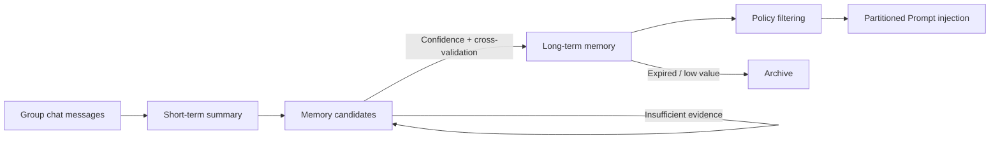

<div align="center">

.jpg)


# 🌟 Stella

**A QQ group-chat bot for human-like conversation powered by a memory system**

*-- Designed for an 8K context window, with support for both local small models and online APIs*

[](https://github.com/Eternal-Wanderer-Vegetable/Stella_project/actions/workflows/ci.yml)
[](LICENSE)
[](https://www.python.org/)
[](https://nonebot.dev/)
[](https://onebot.dev/)
[](https://www.rust-lang.org/)
[](https://tauri.app/)

[中文](README.md) | English

</div>

---

> Note: This version of the document was translated from the Chinese version by GPT-5.6 luna.

Stella does more than send messages to a large model and return a reply. It turns scattered information from group chats into **searchable, verifiable, and forgetful memories**, and proactively speaks up to learn about you at the right time.

Stella is designed around a small context window: the baseline limit is **8192 tokens**. Personality, memories, conversation history, and tool results all have to coexist within that small budget, so simply piling on prompts is not viable. The budget is therefore divided: memories are filtered in the database before being injected, tools run outside the chat context and return only a single conclusion, and conversations that roll out of the window are automatically compressed into a recap. **No matter how many plugins you install, they do not consume the conversation window.** A small window works, and a larger one naturally gives you more room; the reverse is not true: an architecture that assumes an unlimited window will fall apart on 8K.

You decide where the models come from.
- **All local**: the chat model runs on your GPU and a small model handles memory consolidation on your CPU. They do not compete for resources, and no group-chat content leaves your machine.
- **All online**: provide an OpenAI-compatible API and run without a graphics card.
- **Hybrid**: delegate conversation generation to an online model, keep frequent, low-difficulty work such as memory consolidation and session compression local, and send only the step requiring strong reasoning online.

> Note: With the all-local deployment mode, the data truly stays off the network. Networked tools (such as weather and anime lookups) send requests and return actual data themselves, while deciding whether to use a tool, compressing its result into a summary, and rendering plugin cards as images all happen locally.

## 🔌 Three Deployment Modes

| Mode | Chat model | Memory consolidation | Best for |
|---|---|---|---|
| **All local** | Local (LM Studio, etc.) | Local | Users with a graphics card who care about privacy and do not want to pay |
| **Hybrid** (recommended) | Online API | Local | Users who want better conversation quality without paying for tokens for frequent small tasks (the machine must still be able to run a small model) |
| **All online** | Online API | Online API | Users without a graphics card, lightweight servers, or anyone who wants to get it running quickly to see how it works |

- All three modes share the same memory, personality, and plugin configuration. Switching modes only changes configuration and does not lose data. The configuration UI provides one-click presets for all three modes (`纯本地` / `混合（对话在线 · 整合本地）` / `纯在线（双 key）`); one click configures all six roles, after which they can still be fine-tuned individually.

- When using online models, **conversation generation and memory consolidation each use an independent API key**. Their prefix caches do not evict each other, and capability routing follows the chat endpoint and reuses the same prefix.

- Vector search (embedding) always runs locally and is not part of the mode switch. Changing the embedding model means changing the vector dimensions, so every vector in the database must be recalculated; it cannot drift with a decision such as "use online today." When it is not enabled, search falls back to SQLite full-text indexing.

- If you choose an online model, the chat content for that step will be sent to the service provider you select. Note that **Stella is zero-network only when both the chat and memory sides use local models.**

## ✨ Features

### Works within an **8192-token** context budget

- **🧰 Capabilities are decoupled from personality** -- The Router first determines what capability a message needs. Tools execute **outside the chat context** and return only one compressed conclusion to Stella. Tool descriptions and raw results never enter the personality prompt, so installing more plugins cannot crowd out the conversation window.

- **🗜 Long conversations stay connected** -- Earlier conversations that roll out of the context window are automatically compressed into a recap. The three context layers (session summary / raw tail / topic summary) are divided by message ID and never overlap, with independently adjustable budgets.

- **🎯 Memories are injected by partition** -- Chat material and behavioral constraints are strictly separated. Sensitive information (boundaries, dietary restrictions, conflicts) is never brought up as a chat topic. Only the filtered memories are injected; the entire memory store is not dumped into the prompt.

- **🧠 Two-layer memory filtering** -- Capture is permissive (uncertain information may enter the candidate pool), while promotion is strict (confidence tiers + cross-validation + per-user quotas). Filtering happens at the data-backed, auditable, and reversible layer rather than in the prompt: only after filtering in the database does it consume context, and candidates and confidence do not use the conversation budget.

- **🔄 Models are replaceable** -- You can independently choose endpoints for the six roles: conversation, capability routing, plugin borrowing, session compression, memory consolidation, and memory extraction. Local and online endpoints can be combined freely; vector search remains local. Changing models does not touch memories, and changing modes does not require rebuilding the database.

- **💰 Spending is visible** -- Online token usage is logged daily by role, endpoint, and model. The GUI and `deploy status` show today's usage, **the provider's prefix-cache hit rate** (the only way to verify that the money-saving measure is actually working), and remaining budget. You can set a daily budget; when it is exceeded, memory consolidation is paused by default while **the bot keeps talking in the group as usual**.

### Memory System

- **🔍 Memories need evidence** -- Confidence accumulates only when the same fact is mentioned repeatedly. Statements a user says directly to the Bot count as high-density evidence and can be accepted after a single occurrence. Candidates without new evidence for a long time are automatically discarded.

- **💬 Proactively gather information** -- Information passively ingested from group chats has very low density, so Stella proactively @mentions active users to start a conversation or confirm a memory. Daily quotas, per-user cooldowns, and protection that backs off after consecutive non-responses are provided.

- **🏠 Shared spaces across groups** -- Multiple QQ groups can belong to one space and share user profiles, long-term memories, and personality. Message tails, topic state, and mute switches remain isolated per group, so Stella will not answer a conversation from group B in group A.

- **🔎 Hybrid search** -- SQLite FTS5 full-text indexing plus multidimensionally weighted ranking, with optional local embedding semantic search and automatic fallback when the service is unavailable.

- **♻️ It forgets** -- Lifetimes are configured by memory type, low-value memories are automatically archived, and long memories are split into atomic facts.

### Engineering

- **🔗 AstrBot plugin compatibility** -- Existing AstrBot plugins can run by placing them in `data/plugins/`, without changing their source code. Plugin card templates are rendered by **local Chromium**, with no external rendering service required.

- **🔌 Extensible** -- Pipeline pre- and post-processing Hooks, with automatic loading from the extension directory.

- **🧪 Verifiable** -- 1450+ unit tests cover memory promotion, cross-user isolation, two-layer ownership, anti-fabrication safeguards, routing fallback, and tool isolation. After connecting an online endpoint, there is also a layer of **vendor-neutral contract tests** (an extra field in the request body fails the test; parameter differences may adapt only to error wording and may not use a vendor whitelist) and a prefix-cache guard. Probe scripts also perform regression checks against real models (including a case specifically reproducing "missing information in a noisy environment"), along with a benchmark quantifying four types of routing errors.

## 🚀 Quick Start

### 📦 Download & Install (regular users)

- Step 1: Download the following required dependencies:

  - [NapCatQQ Desktop](https://github.com/NapNeko/NapCatQQ-Desktop), and configure the **reverse websocket connection** according to its instructions. Record the port you configure and open the link.
  - [LM Studio](https://lmstudio.ai/). After installation, download the required models inside the software (see [Local models used in development](#local-models-used-in-development)), load the models, and open LM Studio's remote service port.

> Note: Even when using an all-online model setup, you still need to download LM Studio to load the local embedding model. (This is required for tool calls, and even the 0.6B-parameter embedding model runs smoothly on most computers without a graphics card.)

- Step 2: Download the latest `Stella-*-win64.zip` from [Releases](https://github.com/Eternal-Wanderer-Vegetable/Stella_project/releases). After extracting it, there are two ways to start it:

  - **Graphical interface (recommended)**: Double-click `Stella.exe`. On the first run, it automatically downloads about 100 MB of embedded Python and installs dependencies. On subsequent launches, it automatically runs an environment check: if not configured, it opens the Configuration page; if there are blocking issues, it opens the Environment Check page; if everything is normal, it goes directly to the Run Status page.
  - **Command line**: Double-click `start.bat`. It likewise downloads Python and installs dependencies automatically, then opens the configuration wizard and starts the Bot.

> **Tip**: The first run downloads and executes Python. Your computer's security software may report this as suspicious activity and block it; add it to the trusted list if necessary.

- Step 3:
  - 1. After opening `Stella.exe` for the first time, the configuration UI appears. First fill in the **listening port** (the reverse WS port configured in NapCat in Step 1) and the **group number** that Stella should join.
  - 2. Scroll down to the Model Services section, choose a **one-click preset** according to your deployment mode, and fill in the corresponding endpoint cards:
    - **All local** -> Click `纯本地`, then fill in the LM Studio address and model ID in the Local LM Studio card. The Test Connection button on the card (or Read LM Studio Models at the bottom) reads back the list of loaded models directly.
    - **All online / Hybrid** -> Click `纯在线（双 key）` or `混合（对话在线 · 整合本地）`, then fill in the provider address, API key, and model ID once in each of the two online cards. **The two keys must be different**; see [Three Deployment Modes](#-three-deployment-modes) for why.
  - 3. After configuration is complete, click "Save and Check". The program automatically switches to the Run Status page. Click "Start".

> Have a problem? Join the developer's QQ group: 263402786, and @ the (currently sole) developer Eternal-Wanderer-Vegetable in the group.

### ⬆️ Upgrading from an older version

1. Run `stop.bat` to stop the program.
2. Extract the new version into a new directory.
3. Double-click `Stella.exe` (or `start.bat`) -> confirm "Import Configuration".

Configuration, memories, personality, space settings, and installed plugins are moved automatically; the database is upgraded automatically, and `runtime/` is reused automatically (saving one approximately 100 MB download). The old directory is **read-only throughout**. Regardless of success or failure, the old installation remains runnable in place, so you can safely retry. The import report is written to `migration_report.md`. Command-line equivalents:

```bash
python -m deploy migrate --dry-run   # Preview first (runs once on a database copy)
python -m deploy migrate             # Execute
```

Upgrading from 2.x also does not require losing memories: the old database is migrated automatically (columns are renamed, records are reassigned by shared space, and each user profile is placed in the space containing the most of that user's messages). A fresh installation stores user data in `StellaData/`, **at the same level as** the program directory:

```text
D:\your-directory\
  Stella-v3.1.0-win64\   <- Program (replace the whole directory when upgrading; safe to delete)
  StellaData\            <- Your data (untouched during upgrades)
```

After that, upgrading only requires replacing the program directory; the data does not need to be touched. Cleaning up old version folders will not affect the data.
To make the program and data self-contained (for copying the whole setup to a USB drive), manually create a `StellaData\` subdirectory in the program directory. The program will prefer it, but the cost is that it will be replaced or deleted along with the program directory; import or back up your data before upgrading.
Use `python -m deploy paths` to see the actual data directory and which rule selected it.

### Developer Testing

```bash
git clone https://github.com/Eternal-Wanderer-Vegetable/Stella_project.git
cd Stella_project
pip install -r requirements.txt
```

### Requirements

| Component | Requirement |
|---|---|
| Python | 3.10+ (the Release package includes embedded Python; no separate installation is needed) |
| Framework | [NoneBot 2](https://nonebot.dev/) |
| QQ protocol endpoint | [NapCat](https://github.com/NapNeko/NapCatQQ) or another OneBot V11 implementation (installing and logging in with [NapCatQQ Desktop](https://github.com/NapNeko/NapCatQQ-Desktop) is recommended) |
| Model service | Local [LM Studio](https://lmstudio.ai/), or any OpenAI-compatible online API (just provide the address + API key); the two can be mixed |

### Configuration

It is recommended to make changes through the built-in Advanced Options form in `Stella.exe`. **Manually editing .env is not recommended.**

See the **[Configuration Documentation](docs/configuration.en.md)** for all configuration options and their descriptions.

### Starting

**Regular users**: Click "Start" on the Run Status page in `Stella.exe` (it first runs the doctor check), or double-click `start.bat` to use the command-line flow.

**Developers**:

```bash
# 1. Install dependencies
pip install -r requirements.txt
# 2. Generate configuration
python -m deploy init
# 3. Use NapCatQQ Desktop to install and log in to NapCat (QR scanning is required and must be done manually),
#    then add a "WebSocket client" in NapCat WebUI's network settings pointing to the Bot (reverse WS):
#    ws://127.0.0.1:8080/onebot/v11/ws
#    (For forward WS, configure ONEBOT_WS_URLS in .env instead.)
# 4. Start Stella (it first runs the doctor check)
python -m deploy start
```

@ the Bot in a group to start a conversation.

### 🔗 Installing plugins (optional)

Stella can run plugins from the [AstrBot](https://github.com/AstrBotDevs/AstrBot) ecosystem directly, **without changing plugin source code**:

```
Place the entire plugin directory in  data/plugins/<plugin-name>/
If the plugin includes requirements.txt, install its dependencies
Restart Stella
```

The directory name does not need to be changed: an `xxx-master` / `xxx-main` suffix extracted by GitHub's "Download ZIP" works as-is. However, **the archive itself must be extracted first**; `.zip` files under `data/plugins/` will not be loaded.

After startup, check `logs/boot_debug.log`. It records which plugins were found, whether loading succeeded or failed, and the reason for any failure.

Plugin `@command` commands (default prefix `/`) work immediately after installation. However, function tools registered by a plugin with `@llm_tool` require one more step: add a capability declaration for it in `config/capabilities/<domain>.toml` so Stella can proactively call it in chat. The repository contains a real example (`config/capabilities/entertainment.toml`) that you can copy; see `config/capabilities/information.toml.example` for the format.

> Why is this extra step necessary? A plugin's tool description is an instruction sentence for a decision-maker that chooses while looking at all tools, whereas Stella's router calculates semantic similarity between it and the user's **question**. The two purposes require different text forms, and using the description directly makes similar tools compete with one another. See [Capability System](docs/capability-system.en.md#declaration-priority-why-automatically-derived-capabilities-do-not-participate-in-routing) for measured data and the trade-offs.

Plugin cards are rendered by local Chromium. **The first time an image is needed, it automatically downloads about 270 MB of browser engine in the background**; the plugin continues to return plain text during the download, and takes effect automatically once installation finishes without requiring a restart.

### 🔍 Where to look when something goes wrong

All runtime logs are in `logs/`:

| Symptom | Check this |
|---|---|
| The reply content is wrong | `logs/stella_thought_logs.md` (complete prompt, raw output, routing decisions, and tool results) |
| A plugin did not load / a tool is never called | `logs/boot_debug.log` |
| No memories are generated | `logs/memory_consolidation_log.md` |
| It is unclear what is broken | `python -m deploy doctor` |

## 📖 Documentation

| Document | Contents |
|---|---|
| [Architecture](docs/architecture.en.md) | Directory structure, message-processing flow, module responsibilities, and the AstrBot compatibility layer |
| [Memory System](docs/memory-system.en.md) | Rationale for two-layer filtering, promotion rules, and search strategy |
| [Capability System](docs/capability-system.en.md) | Capability Router and Comes: how tools execute outside the chat context |
| [Configuration Reference](docs/configuration.en.md) | Two-layer endpoint x role model configuration, all configuration options, and tuning recommendations |
| [Development Guide](docs/development.en.md) | Tests, probe scripts, CI, and contribution workflow |

> Design process records (specification drafts, checkpoints, defect reports, and test checklists) are in [`design_docs/`](design_docs/).

## 🧠 Memory Formation Flow



Three design principles:

1. **Capture broadly, promote strictly.** Allow uncertain information to enter the candidate pool first and label its confidence honestly, but only information confirmed by repetition or high-density evidence becomes long-term memory. Filtering in the prompt is unauditable, leaves no data behind, and cannot be improved. Small models also overreact to positive and negative prompts set by filtering requirements, making this approach of no practical value.
2. **Valuable information will not be abundant.** Each user's long-term memories have a clear, adjustable quantity limit. Once it is reached, a new memory must displace the weakest one.
3. **Relevant does not mean it should be used.** Retrieved memories must also pass three layers of filtering -- pattern matching, purpose compatibility, and visibility -- before entering a reply.

Consolidation runs in two stages, each using a suitable model:

| Stage | Task | Role | All-local model |
|---|---|---|---|
| Stage 1 | Short-term summary + user profile + determining whether "this batch contains self-disclosure" | `CONSOLIDATION` | Small model on the CPU |
| Stage 2 | Precise extraction of memory candidates | `EXTRACT` | Main chat model on the GPU |

Both roles can independently point to online endpoints (Stage 2 is especially suitable for switching to a stronger model), at the cost of sending the original group-chat text for this step to the service provider.

Stage 2 is awakened only when Stage 1 determines that self-disclosure is present. Routine message flooding and small talk therefore consume neither GPU resources nor online tokens. This split exists because a small model can summarize a topic but may return an empty candidate array when extracting candidates in a noisy environment (in testing, information clearly appeared in the summary it had written itself, but the candidate result was empty).

> See the [Memory System Documentation](docs/memory-system.en.md) for details.

## 🛠 Technology Stack

**Bot backend**: `NoneBot 2` · `OneBot V11` · `SQLite (FTS5)` · `LM Studio` / any OpenAI-compatible API · `APScheduler` · `httpx`

**Plugin compatibility and rendering**: `Jinja2` · `Playwright` (local Chromium, used only to render plugin cards as images)

**Desktop installer**: `Tauri 2` · `Rust` (`stella-installer/`, native HTML/JS frontend, with no frontend build step)

**Development and verification**: `pytest` · `ruff` · `pyright`

### Local Models Used in Development

- Language models: `google/gemma-4-26b-a4b-qat` (chat, running on the GPU), `google/gemma-4-e4b` (memory consolidation, running on the CPU)
- Vector model: `text-embedding-qwen3-embedding-0.6b`

The key is **division of labor and deployment**: set GPU Offload = 0 for the consolidation model to use pure CPU inference, while the chat/extraction model exclusively uses the GPU. Both remain resident simultaneously without competing for VRAM, so memory consolidation and chat can truly run in parallel. This is the prerequisite that makes the two-stage approach viable.

The application layer gives each model a serial gate (LM Studio itself does not limit concurrency; multiple simultaneous requests to the same model only slow one another down).

> The configuration above is based on the developer's own hardware and is provided only as supplemental context for understanding the codebase; it **does not constitute a configuration recommendation**. If you discover a better approach, PRs and issues are welcome.
>
> Models used for testing during development may change; specific changes will be noted in release descriptions.

## 🤝 Contributing

Issues and PRs are welcome. Before submitting, please confirm:

```bash
python -m pytest tests -q
ruff check .
```

> See the [Development Guide](docs/development.en.md) for details.

## 📄 License

This project is released under the **[GNU Affero General Public License v3.0](LICENSE)** (AGPL v3.0). See the LICENSE file and the copyright notices at the tops of the source files for details.

## 💛 Acknowledgements

This project received encouragement and support from many people and organizations during development:

- My parents provided the most important financial support. Without them, none of this could have begun.
- The inspiration came from discussions with [@t1mb2rg](https://github.com/t1mb2rg) and arguments with [@CST-Cat](https://github.com/CST-Cat). Thank you for contributing your own ideas.
- The [Lumi_Nox](https://github.com/MIO-456/Lumi_Nox) project developed by [@MIO-456](https://github.com/MIO-456) inspired the development of this project.
- Thanks to [@qian-o](https://github.com/qian-o) and their companions, as well as [@MIO-456](https://github.com/MIO-456) and their companions. Without their encouragement, there would have been no motivation to start developing this project.
- Thanks to the Bilibili video creator [Ruuuuusty](https://space.bilibili.com/650991829) for turning my and chat-GPT's ideas about the Stella logo into reality.
- This project received support from the following organizations during development:
  - **Model providers**: Deepseek, OpenAI (ChatGPT), Google (Gemini, Gemma), Tongyi Qianwen (text-embedding-qwen3-embedding-0.6b), and ~~Anthropic~~. This project could not have been created without their excellent models as a foundation.
  - **Coding Agent**: [Opencode](https://github.com/anomalyco/opencode), thank you to Opencode for its tremendous support of this project.
  - **Open-source repositories**: [nonebot2](https://github.com/nonebot/nonebot2), [NapCatQQ](https://github.com/NapNeko/NapCatQQ), and all third-party libraries referenced in the source code. Salute to all developers and maintainers involved. This project also aims to follow in the footsteps of [AstrBot](https://github.com/AstrBotDevs/AstrBot) and [MaiBot](https://github.com/Mai-with-u/MaiBot), creating a genuine AI friend that can complete the entire loop locally without handing over group-chat information and personal privacy.
  - **Developer community**: [Linux Do](https://linux.do)
- Special thanks to Freya; this work is dedicated to you. My journey of exploration began with your gift, and it is time to offer an imperfect return gift.

## ⚠️ Disclaimer

**When using part or all of this project's code, please comply with the applicable laws in your country/region and the relevant terms in the user agreements of the platforms you connect to. None of the developers can or has any obligation to be responsible for any direct or indirect consequences caused by a user's use of this project** (including, but not limited to, account bans, any direct or indirect financial losses, and any civil or criminal liability).
