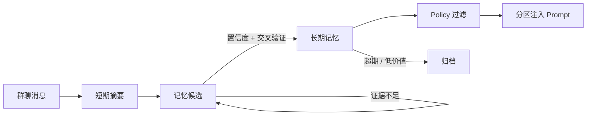

<div align="center">

# 🌟 Stella

**一个依托记忆系统进行拟人化聊天的 QQ 群聊机器人 —— 完全本地运行，不外传任何聊天内容**

[](https://github.com/Eternal-Wanderer-Vegetable/Stella_project/actions/workflows/ci.yml)
[](LICENSE)
[](https://www.python.org/)
[](https://nonebot.dev/)
[](https://onebot.dev/)

</div>

---

Stella 不只是把消息丢给大模型换一句回复。它把群聊里零散的信息**沉淀成可检索、可验证、会遗忘的记忆**，并在合适的时机主动开口了解你。

全部推理在本机完成 —— 聊天用 GPU 上的大模型，记忆整理用 CPU 上的小模型，互不抢占资源。**没有任何一条群聊内容离开你的机器。**

## ✨ 特性

- **🧠 两层记忆过滤** —— 捕获宽松（允许不确定信息进入候选），晋升严格（置信度分档 + 交叉验证 + 每用户配额）。过滤发生在有数据、可审计、可回滚的那一层，而不是 prompt 里
- **🔍 记忆需要证据** —— 同一件事被反复提到才会累积置信度；用户直接对 Bot 说的话视为高密度证据，单次即可采信；长期无新证据的候选自动淘汰
- **💬 主动获取信息** —— 群聊被动摄入的信息密度极低，因此 Stella 会主动 @ 活跃用户搭话或确认记忆。有每日配额、用户级冷却与「连续无回应即退避」保护
- **🎯 记忆分区注入** —— 聊天素材与行为约束严格分离，敏感信息（边界、忌口、冲突）永不作为聊天话题被提起
- **🔎 混合检索** —— SQLite FTS5 全文索引 + 多维加权排序，可选接入本地 embedding 语义检索，服务不可用时自动降级
- **♻️ 会遗忘** —— 按记忆类型设定生命周期，低价值记忆自动归档，长记忆拆分为原子事实
- **🔌 可扩展** —— Pipeline 前后置 Hook 机制，扩展目录自动加载
- **🧪 可验证** —— 200+ 单元测试覆盖记忆晋升、跨用户隔离、防编造护栏；另有探针脚本对真实模型做回归验证

## 🚀 快速开始

### 环境要求

| 组件 | 要求 |
|---|---|
| Python | 3.10+ |
| 框架 | [NoneBot 2](https://nonebot.dev/) |
| QQ 协议端 | [NapCat](https://github.com/NapNeko/NapCatQQ) 或其他 OneBot V11 实现 |
| 模型服务 | [LM Studio](https://lmstudio.ai/)（需 OpenAI 兼容接口） |

### 安装

```bash
git clone https://github.com/Eternal-Wanderer-Vegetable/Stella_project.git
cd Stella_project
pip install -r requirements.txt
```

### 配置

```bash
cp .env.example .env
```

至少需要填写这几项：

```env
ALLOWED_GROUPS=123456789          # 允许响应的群号，多个用逗号分隔
LM_STUDIO_BASE_URL=http://127.0.0.1:1234
LM_STUDIO_MODEL=your-chat-model    # 主聊天模型
CONSOLIDATION_LM_STUDIO_MODEL=your-small-model  # 记忆整理模型（建议 CPU 推理）
```

完整配置项见 **[配置文档](docs/configuration.md)**。

### 启动

```bash
# 1. 启动 LM Studio，确认 /v1/chat/completions 可访问
# 2. 启动 NapCat 并完成 QQ 登录
# 3. 启动 Stella
python bot.py
```

在群里 @ 机器人即可开始对话。

## 📖 文档

| 文档 | 内容 |
|---|---|
| [架构说明](docs/architecture.md) | 目录结构、消息处理流程、模块职责 |
| [记忆系统](docs/memory-system.md) | 两层过滤的设计理由、晋升规则、检索策略 |
| [配置参考](docs/configuration.md) | 全部配置项与调参建议 |
| [开发指南](docs/development.md) | 测试、探针脚本、CI、贡献流程 |

> 设计过程记录（规范草案、检查点、缺陷报告）在 [`design_docs/`](design_docs/)。

## 🧠 记忆是怎么形成的



三条设计原则：

1. **捕获宽，晋升严。** 允许不确定的信息先进入候选并如实标注置信度，但只有经过复现或高密度证据确认的才成为长期记忆。在 prompt 里做过滤不可审计、不留数据、无法改进
2. **有价值的信息不会很多。** 每个用户的长期记忆有数量上限，到顶后新记忆必须挤掉最弱的一条
3. **相关 ≠ 应该使用。** 检索到的记忆还要经过模式匹配、用途兼容、可见性三层过滤才能进入回复

细节见 [记忆系统文档](docs/memory-system.md)。

## 🛠 技术栈

`NoneBot 2` · `OneBot V11` · `SQLite (FTS5)` · `LM Studio` · `APScheduler` · `httpx` · `pytest` · `ruff`

### 开发中使用的本地模型

- 语言模型：`google/gemma-4-26b-a4b-qat`（聊天，GPU）、`google/gemma-4-e4b`（记忆整理，CPU）
- 向量模型：`text-embedding-qwen3-embedding-0.6b`

> 以上是开发者基于自身设备的配置，仅作为理解代码库的补充，**不构成配置建议**。如果你探索出了更好的方案，欢迎提交 PR 和 issue。
>
> 开发过程中测试用模型可能变更，具体会在 release 说明中标注。

## 🤝 贡献

欢迎 issue 与 PR。提交前请确认：

```bash
python -m pytest tests -q
ruff check .
```

详见 [开发指南](docs/development.md)。

## 📄 License

本项目基于 **[GNU Affero General Public License v3.0](LICENSE)** 发布。详见 LICENSE 文件与各源文件头部的版权声明。

## 💛 致谢

本项目在开发过程中得到了很多人和组织的鼓励和支持：

- 我的父母给予了最重要的经济支持。没有他们，这一切都无从开始。
- 灵感来源于和 [@t1mb2rg](https://github.com/t1mb2rg) 的讨论和 [@CST-Cat](https://github.com/CST-Cat) 的争执中。感谢他们贡献了属于自己的想法。
- [@MIO-456](https://github.com/MIO-456) 开发的 [Lumi_Nox](https://github.com/MIO-456/Lumi_Nox) 项目激励了本项目的开发。
- 感谢 [@qian-o](https://github.com/qian-o) 和他的伙伴们，以及 [@MIO-456](https://github.com/MIO-456) 和他的伙伴们。没有他们的鼓励，就没有最初开发这个项目的动力。
- 本项目开发中得到了来自如下组织的支持：
  - **模型提供商**：Deepseek，OpenAI（ChatGPT），Google（Gemini，Gemma）和通义千问（text-embedding-qwen3-embedding-0.6b）。没有他们的优秀模型作为基础，这个项目不可能诞生。
  - **Coding Agent**：[Opencode](https://github.com/anomalyco/opencode)，感谢 Opencode Zen 对本项目的大力支持。
  - **开源代码库**：[nonebot2](https://github.com/nonebot/nonebot2)，[NapCatQQ](https://github.com/NapNeko/NapCatQQ)，以及源代码中引用的所有第三方库。向与之相关的所有开发与维护者致敬。此外本项目也是为了向 [AstrBot](https://github.com/AstrBotDevs/AstrBot) 与 [MaiBot](https://github.com/Mai-with-u/MaiBot) 两位前辈看齐，创造一个真正的、能够完整本地循环、不泄露任何群聊信息和个人隐私的 AI 朋友。
  - **开发者社区**：[Linux Do](https://linux.do)
- 特别致谢 Freya，这是献给你的作品。我的探索之旅因你的馈赠而起，是时候交出一份并不完美的回礼了。

## ⚠️ 免责声明

**在使用本项目的部分或者全部代码时，请遵守您所在国家/地区的相关法律和您所接入相关平台的用户协议中的相关条款。全体开发者无法且没有任何义务承担使用者使用该项目所造成的任何直接/间接后果**（包括但不限于账号封禁，任何的民事/刑事责任等）。
