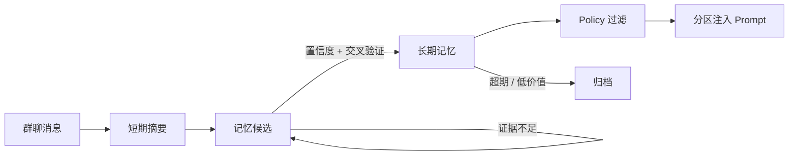

<div align="center">

# 🌟 Stella

*一个依托记忆系统进行拟人化聊天的 QQ 群聊机器人*
*——为 8K 上下文窗口而设计，本地小模型与在线 API 均可兼容*

[](https://github.com/Eternal-Wanderer-Vegetable/Stella_project/actions/workflows/ci.yml)
[](LICENSE)
[](https://www.python.org/)
[](https://nonebot.dev/)
[](https://onebot.dev/)
[](https://www.rust-lang.org/)
[](https://tauri.app/)

</div>

---

Stella 不只是把消息丢给大模型换一句回复。它把群聊里零散的信息**沉淀成可检索、可验证、会遗忘的记忆**，并在合适的时机主动开口了解你。

Stella 的设计前提是上下文窗口很小 —— 基准是 **8192 tokens**。人格、记忆、历史对话、工具结果要在这么小的预算里共存，靠堆 prompt 是不可能的。所以这个预算被拆开了：记忆在库里筛完才注入，工具在聊天上下文之外执行、只交回一句结论，滚出窗口的对话自动压缩成回顾。**插件装再多，占的也不是对话窗口。** 小窗口能跑，大窗口自然更宽裕；但反过来不成立——假设窗口无限的架构，换到 8K 上会直接失控。

模型从哪里来由你定。
- **全本地**：聊天用 GPU 上的模型，记忆整理用 CPU 上的小模型，互不抢占资源，没有任何一条群聊内容离开你的机器。
- **全在线**：填一个 OpenAI 兼容的 API 就能跑，不需要显卡。
- **混合**：把对话生成交给在线模型，记忆整合、会话压缩这类高频低难度的活留在本地，只有需要强推理的那一步出网。
选全本地时，不出网是彻底的：需要联网的工具（查天气、查番剧）由插件自己发请求，而判断该不该用工具、把结果压缩成一句话、把插件卡片渲染成图片，全部在本地完成。

## 🔌 三种部署模式

| 模式 | 聊天模型 | 记忆整理 | 适合谁 |
|---|---|---|---|
| **全本地** | 本地（LM Studio 等） | 本地 | 有显卡、在意隐私、不想付费 |
| **混合**（推荐） | 在线 API | 本地 | 想要更好的对话质量，但不想把高频小任务的 token 钱也付出去（本机仍要跑得动小模型） |
| **全在线** | 在线 API | 在线 API | 没有显卡 / 轻量服务器 / 想尽快跑起来看看效果 |

- 三种模式共用同一套记忆、人格与插件配置，换模式只是改配置，不丢数据。配置界面里三种模式各有一个一键预设（`纯本地` / `混合（对话在线 · 整合本地）` / `纯在线（双 key）`），点一下把六个角色一起配好，之后还能逐个微调。

- 用在线模型时，**对话生成与记忆整理各用一个独立的 API key**，两边的前缀缓存互不冲刷；能力路由跟着聊天端点走，复用同一份前缀。

- 向量检索（embedding）恒定跑在本机，不参与模式切换——换 embedding 模型等于换向量维度，整库向量都要重算，不能随「今天用在线」这种决定漂。没启用它时检索退回 SQLite 全文索引。

- 选了在线模型，就意味着对应那一步的聊天内容会发给你选定的服务商。这是你自己的选择，但我们写清楚：**仅当聊天与记忆两侧都用本地模型时，Stella 才是零出网的。**

## ✨ 特性

### 在 8K 预算里干活

- **🧰 工具能力与人格解耦** —— Router 先判断这句话需要什么能力，工具在**聊天上下文之外**执行，只把压缩后的一句结论交回给 Stella。工具描述与原始返回都不进人格 prompt，插件装再多也挤不掉对话窗口

- **🗜 长对话不断线** —— 滚出上下文窗口的早期对话自动压缩成回顾，三层上下文（会话摘要 / 原始尾巴 / 话题摘要）按消息 id 划分绝不重叠，且各自的预算分开可调

- **🎯 记忆分区注入** —— 聊天素材与行为约束严格分离，敏感信息（边界、忌口、冲突）永不作为聊天话题被提起。只注入筛过的那几条，不把全部记忆倒进 prompt

- **🧠 两层记忆过滤** —— 捕获宽松（允许不确定信息进入候选），晋升严格（置信度分档 + 交叉验证 + 每用户配额）。过滤发生在有数据、可审计、可回滚的那一层，而不是 prompt 里——在库里筛完才花窗口，候选与置信度不占对话预算

- **🔄 模型可替换** —— 对话、能力路由、插件借用、会话压缩、记忆整合、记忆提取六个角色各自指定用哪个端点，本地与在线任意搭配；向量检索固定在本机。换模型不动记忆，换模式也不用重建库

### 记忆系统

- **🔍 记忆需要证据** —— 同一件事被反复提到才会累积置信度；用户直接对 Bot 说的话视为高密度证据，单次即可采信；长期无新证据的候选自动淘汰

- **💬 主动获取信息** —— 群聊被动摄入的信息密度极低，因此 Stella 会主动 @ 活跃用户搭话或确认记忆。有每日配额、用户级冷却与「连续无回应即退避」保护

- **🏠 多群共享空间** —— 多个 QQ 群可归入同一空间，共享用户画像、长期记忆与人格；而消息尾巴、话题状态、静音开关仍按群隔离，不会在 A 群回应 B 群的对话

- **🔎 混合检索** —— SQLite FTS5 全文索引 + 多维加权排序，可选接入本地 embedding 语义检索，服务不可用时自动降级

- **♻️ 会遗忘** —— 按记忆类型设定生命周期，低价值记忆自动归档，长记忆拆分为原子事实

### 工程

- **🔗 兼容 AstrBot 插件** —— 现成的 AstrBot 插件放进 `data/plugins/` 就能跑，不改源码。插件的卡片模板由**本地 Chromium** 出图，不依赖外部渲染服务

- **🔌 可扩展** —— Pipeline 前后置 Hook 机制，扩展目录自动加载

- **🧪 可验证** —— 1300+ 单元测试覆盖记忆晋升、跨用户隔离、两层归属、防编造护栏、路由降级与工具隔离；接在线端点后还多一层**厂商中立契约测试**（请求体多带一个字段就红、参数差异只许按错误措辞自适应而不许写厂商白名单）与前缀缓存守卫；另有探针脚本对真实模型做回归验证（含一个专门复现「噪音环境下漏掉信息」的用例），以及一份量化四类路由错误的基准

## 🚀 快速开始

### 📦 下载 & 安装（普通用户）

- 第一步：下载如下必须依赖：

  - [NapCatQQ Desktop](https://github.com/NapNeko/NapCatQQ-Desktop)，并按照其中的指示配置**反向websocket链接**。记录下您配置的端口号并打开链接。
  - [LM Studio](https://lmstudio.ai/)，安装后在软件内部下载必须模型（见[开发中使用的本地模型](#开发中使用的本地模型)）并加载模型，且打开LM Studio的远程服务端口。

> 注：如果使用全部在线的方案，也需要下载LM Studio来加载本地embedding模型。

- 第二步：到 [Releases](https://github.com/Eternal-Wanderer-Vegetable/Stella_project/releases) 下载最新的 `Stella-*-win64.zip`，解压后有两种启动方式：

  - **图形界面（推荐）**：双击 `Stella.exe` ，首次运行会自动下载约 100MB 的嵌入式 Python 并安装依赖；之后每次启动自动跑一遍环境自检——尚未配置会打开「配置」页，有阻塞问题会打开「环境自检」页，一切正常则直接进入「运行状态」页。
  - **命令行**：双击 `start.bat`，同样会自动下载 Python 并安装依赖，然后进入配置向导并启动 Bot。

> **小提示**：首次运行会下载并运行 Python，此行为可能会被您电脑上的安全防护软件报告为可疑操作并拦截，需加入信任列表。

- 第三步：
  - 1.首次打开 `Stella.exe` 后会出现配置界面。先填**监听端口**（就是第一步在 NapCat 里配的反向 WS 端口）与要让 Stella 进的**群号**。
  - 2.往下到「模型服务」分区，按你的部署方式点一个**一键预设**，再把对应的端点卡片填完：
    - **全本地** → 点「纯本地」，在「本机 LM Studio」卡片里填 LM Studio 的地址与模型 ID。点卡片上的「测试连接」（或底部的「读取 LM Studio 模型」）可以直接把已加载的模型列表读回来。
    - **全在线 / 混合** → 点「纯在线（双 key）」或「混合（对话在线 · 整合本地）」，在两张在线卡片里各填一次服务商地址、API key 与模型 ID。**两把 key 要填不同的**，原因见[三种部署模式](#-三种部署模式)。
  - 3.配置完成后，单击“保存并检查”，程序会自动跳转至“运行状态”界面。单击“启动”即可。

> 遇到了问题？你可以加入开发者所在的QQ群：263402786，在群里@（目前唯一的）开发者Eternal-Wanderer-Vegetable。

### ⬆️ 从旧版本升级

1. 运行 `stop.bat` 停止程序
2. 把新版本解压到一个新目录
3. 双击 `Stella.exe`（或 `start.bat`）→ 确认「配置导入」

配置、记忆、人格、空间设置与已装插件会自动搬过来，数据库自动升级，`runtime/` 自动复用（省一次
约 100MB 的下载）。全程**只读旧目录**——无论成败旧安装都还在原地能跑，可以放心重试；导入报告
写在 `migration_report.md`。命令行等价操作：

```bash
python -m deploy migrate --dry-run   # 先看预览（会在数据库副本上真跑一遍）
python -m deploy migrate             # 执行
```

从 2.x 升级也不需要丢记忆：旧库会自动迁移（列改名、按共享空间重新归属、用户画像归入其消息
最多的那个空间）。全新安装会把用户数据放在程序目录**同级**的 `StellaData/`：

```text
D:\你的目录\
  Stella-v3.1.0-win64\   ← 程序（升级时整个换掉，可以放心删）
  StellaData\            ← 你的数据（升级时一动不动）
```

此后升级只需替换程序目录，数据不用动；清理旧的版本文件夹不会碰到数据。
想让程序与数据自包含（整体拷进 U 盘），在程序目录里手工建一个 `StellaData\` 子目录即可，
程序会优先用它——代价是它会跟着程序目录一起被替换或删除，升级前务必先导入或备份。
用 `python -m deploy paths` 可以查看数据目录的实际位置与命中的是哪条规则。

### 开发者测试

```bash
git clone https://github.com/Eternal-Wanderer-Vegetable/Stella_project.git
cd Stella_project
pip install -r requirements.txt
```

### 环境要求

| 组件 | 要求 |
|---|---|
| Python | 3.10+（Release 包内置嵌入式 Python，无需自装） |
| 框架 | [NoneBot 2](https://nonebot.dev/) |
| QQ 协议端 | [NapCat](https://github.com/NapNeko/NapCatQQ) 或其他 OneBot V11 实现（推荐用 [NapCatQQ Desktop](https://github.com/NapNeko/NapCatQQ-Desktop) 安装并登录） |
| 模型服务 | 本地 [LM Studio](https://lmstudio.ai/)，或任意 OpenAI 兼容的在线 API（填地址 + API key 即可），两者可混用 |

### 配置

建议使用 `Stella.exe` 中内置的“高级选项”表单来进行修改。**不建议手动修改.env。**

完整配置项及其说明见 **[配置文档](docs/configuration.md)**。

### 启动

**普通用户**：在 `Stella.exe` 的「运行状态」页点「启动」（会先跑一遍 doctor 自检）；或双击 `start.bat` 走命令行流程。

**开发者**：

```bash
# 1. 安装依赖
pip install -r requirements.txt
# 2. 生成配置
python -m deploy init
# 3. 用 NapCatQQ Desktop 安装并登录 NapCat（需扫码，必须人工），
#    在 NapCat WebUI 的网络配置里添加「WebSocket 客户端」指向 Bot（反向 WS）：
#    ws://127.0.0.1:8080/onebot/v11/ws
#    （若用正向 WS 则改在 .env 里配 ONEBOT_WS_URLS）
# 4. 启动 Stella（会先跑一遍 doctor 自检）
python -m deploy start
```

在群里 @ 机器人即可开始对话。

### 🔗 装插件（可选）

Stella 能直接跑 [AstrBot](https://github.com/AstrBotDevs/AstrBot) 生态的插件，**不用改插件源码**：

```
把插件目录整个放进  data/plugins/<插件名>/
如果插件带 requirements.txt，装一下它的依赖
重启 Stella
```

目录名不用改：GitHub「Download ZIP」解出来的 `xxx-master` / `xxx-main` 后缀照样能装。但**压缩包本身要先解压**——`data/plugins/` 下的 `.zip` 不会被加载。

启动后看 `logs/boot_debug.log`，里面会写清发现了哪些插件、加载成功还是失败、失败原因。

插件的 `@command` 指令（默认前缀 `/`）装完就能用。但插件用 `@llm_tool` 注册的**函数工具**还需要一步：在 `config/capabilities/<域名>.toml` 里给它写一条能力声明，Stella 才会在聊天里主动调用它。仓库里有一份真实样例（`config/capabilities/entertainment.toml`）可以照抄，格式说明见 `config/capabilities/information.toml.example`。

> 为什么要多写这一步：插件的工具描述是写给「看着全部工具做选择」的决策器的指令句，而 Stella 的路由是拿它和用户的**问句**算语义相似度——两种用途要求的文本形态不同，直接拿来用会让同类工具互相抢。实测数据与取舍见 [能力系统](docs/capability-system.md#声明优先为什么自动派生不参与路由)。

插件的卡片图由本地 Chromium 渲染，**首次需要出图时会自动后台下载约 270MB 的浏览器内核**，期间插件照常回纯文本，装好后自动生效、不用重启。

### 🔍 出问题先看哪里

所有运行期日志都在 `logs/`：

| 现象 | 看这个 |
|---|---|
| 回复内容不对 | `logs/stella_thought_logs.md`（完整 prompt、原始输出、路由判定、工具结果） |
| 插件没加载 / 工具从不被调用 | `logs/boot_debug.log` |
| 记忆没生成 | `logs/memory_consolidation_log.md` |
| 说不清哪里坏了 | `python -m deploy doctor` |

## 📖 文档

| 文档 | 内容 |
|---|---|
| [架构说明](docs/architecture.md) | 目录结构、消息处理流程、模块职责、AstrBot 兼容层 |
| [记忆系统](docs/memory-system.md) | 两层过滤的设计理由、晋升规则、检索策略 |
| [能力系统](docs/capability-system.md) | Capability Router 与 Comes：工具如何在聊天上下文之外执行 |
| [配置参考](docs/configuration.md) | 端点 × 角色两层模型配置、全部配置项与调参建议 |
| [开发指南](docs/development.md) | 测试、探针脚本、CI、贡献流程 |

> 设计过程记录（规范草案、检查点、缺陷报告、测试清单）在 [`design_docs/`](design_docs/)。

## 🧠 记忆形成流程



三条设计原则：

1. **捕获宽，晋升严。** 允许不确定的信息先进入候选并如实标注置信度，但只有经过复现或高密度证据确认的才成为长期记忆。在 prompt 里做过滤不可审计、不留数据、无法改进。且小模型会根据过滤要求设定的正面提示词/负面提示词做出过度反应，不具备任何实用价值。
2. **有价值的信息不会很多。** 每个用户的长期记忆有明确且可调整的数量上限，到顶后新记忆必须挤掉最弱的一条。
3. **相关 ≠ 应该使用。** 检索到的记忆还要经过模式匹配、用途兼容、可见性三层过滤才能进入回复。

整合分两阶段执行，各用适合的模型：

| 阶段 | 任务 | 角色 | 全本地时用什么 |
|---|---|---|---|
| 阶段 1 | 短期摘要 + 用户画像 + 「本批是否含自我披露」判断 | `CONSOLIDATION` | CPU 上的小模型 |
| 阶段 2 | 精确提取记忆候选 | `EXTRACT` | GPU 上的主聊天模型 |

两个角色都可以单独指到在线端点（阶段 2 尤其适合换强模型），代价是这一步的群聊原文会发给服务商。

阶段 2 只在阶段 1 判定有自我披露时唤醒 —— 日常刷屏与寒暄既不消耗 GPU，也不花在线 token。这样拆是因为小模型能总结主题，却在噪音环境下会把候选提取判空（实测：信息明确出现在它自己写的摘要里，但候选返回空数组）。

> 细节见 [记忆系统文档](docs/memory-system.md)。

## 🛠 技术栈

**Bot 后端**：`NoneBot 2` · `OneBot V11` · `SQLite (FTS5)` · `LM Studio` / 任意 OpenAI 兼容 API · `APScheduler` · `httpx`

**插件兼容与渲染**：`Jinja2` · `Playwright`（本地 Chromium，仅用于把插件卡片渲染成图片）

**桌面安装器**：`Tauri 2` · `Rust`（`stella-installer/`，原生 HTML/JS 前端，无前端构建步骤）

**开发与验证**：`pytest` · `ruff` · `pyright`

### 开发中使用的本地模型

- 语言模型：`google/gemma-4-26b-a4b-qat`（聊天，GPU）、`google/gemma-4-e4b`（记忆整理，CPU）
- 向量模型：`text-embedding-qwen3-embedding-0.6b`

关键在于**分工与部署**：整合模型设置 GPU Offload = 0 走纯 CPU 推理，聊天/提取模型独占 GPU。两者同时常驻、互不挤显存，因此记忆整理与聊天可以真正并行。这是两阶段方案可行的前提。

应用层为每个模型设了串行闸门（LM Studio 本身不限并发，多请求同时打到同一模型只会互相拖慢）。

> 以上是开发者基于自身设备的配置，仅作为理解代码库的补充，**不构成配置建议**。如果你探索出了更好的方案，欢迎提交 PR 和 issue。
>
> 开发过程中测试用模型可能变更，具体会在 release 说明中标注。

## 🤝 贡献

欢迎 issue 与 PR。提交前请确认：

```bash
python -m pytest tests -q
ruff check .
```

> 详见 [开发指南](docs/development.md)。

## 📄 License

本项目基于 **[GNU Affero General Public License v3.0](LICENSE)** （AGPL v3.0）发布。详见 LICENSE 文件与各源文件头部的版权声明。

## 💛 致谢

本项目在开发过程中得到了很多人和组织的鼓励和支持：

- 我的父母给予了最重要的经济支持。没有他们，这一切都无从开始。
- 灵感来源于和 [@t1mb2rg](https://github.com/t1mb2rg) 的讨论和 [@CST-Cat](https://github.com/CST-Cat) 的争执中。感谢他们贡献了属于自己的想法。
- [@MIO-456](https://github.com/MIO-456) 开发的 [Lumi_Nox](https://github.com/MIO-456/Lumi_Nox) 项目激励了本项目的开发。
- 感谢 [@qian-o](https://github.com/qian-o) 和他的伙伴们，以及 [@MIO-456](https://github.com/MIO-456) 和他的伙伴们。没有他们的鼓励，就没有最初开发这个项目的动力。
- 本项目开发中得到了来自如下组织的支持：
  - **模型提供商**：Deepseek，OpenAI（ChatGPT），Google（Gemini，Gemma），通义千问（text-embedding-qwen3-embedding-0.6b）和~~Anthropic~~。没有他们的优秀模型作为基础，这个项目不可能诞生。
  - **Coding Agent**：[Opencode](https://github.com/anomalyco/opencode)，感谢 Opencode 对本项目的大力支持。
  - **开源代码库**：[nonebot2](https://github.com/nonebot/nonebot2)，[NapCatQQ](https://github.com/NapNeko/NapCatQQ)，以及源代码中引用的所有第三方库。向与之相关的所有开发与维护者致敬。此外本项目也是为了向 [AstrBot](https://github.com/AstrBotDevs/AstrBot) 与 [MaiBot](https://github.com/Mai-with-u/MaiBot) 两位前辈看齐，创造一个真正的、能够完整本地循环、不必把群聊信息和个人隐私交出去的 AI 朋友。
  - **开发者社区**：[Linux Do](https://linux.do)
- 特别致谢 Freya，这是献给你的作品。我的探索之旅因你的馈赠而起，是时候交出一份并不完美的回礼了。

## ⚠️ 免责声明

**在使用本项目的部分或者全部代码时，请遵守您所在国家/地区的相关法律和您所接入相关平台的用户协议中的相关条款。全体开发者无法且没有任何义务为使用者使用该项目所造成的任何直接/间接后果负责**（包括但不限于账号封禁，任何直接/间接的经济损失，任何的民事/刑事责任等）。
