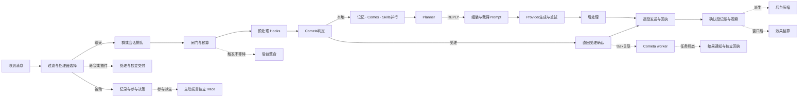

# Stella 消息处理动态流程图：GitNexus 工程实施方案

> Task：在 Dashboard「数据」中完整、动态展示一条消息进入 Stella 后的处理、分支、并行调用、回复发送与关联后台任务，并让流程随源码版本同步。
> Evidence：固定于 `e7cf4f3166d898310279de43cfa89a0c1d0b0aaf`，分支 `feat/cometa-agent-task-layer`；本次先在 Docker 刷新 GitNexus，再做图查询、impact、PDG 与源码核对。本文为方案，没有实现业务变更。
> Evidence provenance schema 2；global dirty digest `ddae2d79e44267d6fd40de31c3f37d8d0f10af2a37e7e7e7753d1c4300704ecf`；45 个排序证据路径见 §11；仅本方案精确路径从 dirty digest 中排除。
> 标记：`[verified]` 当前源码确认；`[graph]` GitNexus 输出；`[inferred]` 证据支持的设计；`[assumed]` 待验证假设。所有「拟新增/拟实现」均为提案。

## 1. Objective

让用户可以回答：这条消息经过了哪些节点，各节点做了什么，为什么没有回复，哪里等待/失败，何时真正发出回复，之后又触发了哪些任务。

1. 源码拓扑覆盖所有消息入口，以及可达项目调用、分支、循环、异常、动态 Hook 与后台工作边界。
2. 单条消息的真实轨迹从入口到明确结束；被动记录、插件接管、过滤和命令即使没有 Turn 也可查询。
3. 动画来自执行事件；历史播放只播放记录，绝不调用 LLM、工具、发送、记忆写入或学习。
4. 源码变化后由生成器和 CI 检查流程漂移；旧记录始终绑定当时的图版本。
5. 不改变回复策略、预算、Hook 顺序、取消、Cometa 权限或发送重试行为。

[inferred] 「每一个节点」采用可检验定义：作用域内每个项目内可达符号，以及符号内影响处理结果的调用点、分支、循环、异常出口、状态写入和异步派生，都具有静态身份和来源；SDK、HTTP、数据库驱动保留调用及结果边界，不伪造外部系统内部实现。节点总数由当前源码闭包生成，不按本文表格行数宣称完整。

[assumed] 默认新增 `/data/flow`「消息流程」页签；保留现有「追踪」。完整交付必须覆盖后台闭环，不能把只画主 LLM 的首版称为完成。

## 2. Current Behaviour

### 2.1 当前界面与已有底座

[verified] `dashboard/src/views/data/DataPage.vue:1–44` 已有统计、会话、日志、追踪；`TracePage.vue:1–141` 主要展示记忆与参与决策列表，没有完整消息拓扑。数据路由见 `dashboard/src/router/index.ts:73–101`。

[verified] 已有 Turn 列表、时间线、Payload 和预算 Replay：`webui/routers/trace.py:51–82`、`webui/services/trace.py:223–275`；已有事件表 `core/observability/turn_trace.py:91–123`。应扩展既有 Trace，而不是另建一套无关联日志。

[verified] Turn 不是收到消息：`list_turns` 排除空 turn_id（`turn_trace.py:229–265`）；QQ 被动记录在 `ai_gateway.py:445–527`，聊天在 `613–805`。插件、命令、日预算阻断可不进入 RuntimeFacade。

### 2.2 实际主链及不应画错的路径

[verified] QQ：matcher 选择 → 被动/命令/插件/聊天 → 群锁 → ChatContext → ReplyGate 元数据 → 可能派生整合 → 日预算 → `_run_turn_via_engine` → Facade → prepare → Provider → finalize → 逐段发送 → 确认段记账/学习/记录 → 异步 compact（`ai_gateway.py:417–805`）。

[verified] WebChat：鉴权/空输入 → SSE started → 外层 `wait_for(run_turn,120s)` → 虚拟空间/记录消息 → 会话锁 → Facade → BOT_SELF 记录 → 可选 `server_emitted` → SSE complete/error。外层 timeout 在 `webui/routers/chat.py:115–144`，和 Provider timeout 作用域不同；不能画成同一个 120 秒计时器。

[verified] Hook 实际按优先级降序：预处理 vision 60、context 50、capability 45；后处理 parse 100、badwords 80、split 60、thought 40（`ai_gateway.py:229–240`、`turn_service.py:243–263,477–479`）。代码注释不能覆盖真实顺序。

[verified] Memory / Comes / Skills 经 gather 并行，异常隔离；Cometa 接管可在此之前直回（`capability/hooks.py:328–400`）。DIRECT/SILENT 在 Facade 中直接结束，跳过 finalize；budget_limited/no_backend fallback 会 finalize（`turn_service.py:273–406`、`facade.py:322–340`）。

[verified] 当前 native Facade 直接调用 `pipeline._llm.generate`，不经过 `TurnService.generate_reply` 的 acquire；不得把 legacy run 的调度器节点套到 native 主生成。Planner/compact 自己的 acquire 是独立真实路径（`facade.py:123–134,245–257`、`planner.py:225–243`、`session_compact.py:195–200`）。

[verified] 日预算阻断在 Facade 前（gateway:681–686）；普通 @ ReplyGate 此处只写 metadata，未按 allowed return。主动路径另有概率、闸门、过期、自然承接和重复输出检查（gateway:2363–2497）。

[verified] 普通聊天 maybe_consolidate 只 spawn 不 await；主动路径 spawn 后仅 sleep 1 秒，也不证明整合成功（gateway:671,2391–2397；`consolidator.py:1379–1402`）。compact、效果窗口结算、Cometa worker 不属于当前回复的同步直线。

[verified] 发送逐段收集回执：无平台 ID 仍可 acknowledged；失败停止后续；取消为 unknown 并抛出，可能跳过聚合 Trace（`core/social/delivery.py:67–153`）。回执落库失败只记错，不自动抹掉适配器已确认事实（同文件:156–186）。acknowledged 不等于用户阅读，Web server_emitted 不等于浏览器已收到。

### 2.3 观测缺口

[verified] Facade 的 time.time 起点被传给按 time.monotonic 计算相对时长的 record_event，时长会不可信（`facade.py:191–217`、`turn_trace.py:159–209`）。新 Span 同进程统一 monotonic，UTC 单独记录。

[verified] `list_turns` 用 MAX(complete) 聚合（turn_trace:243），某事件完整不能证明全链完整；写入失败只记日志；阶段常量不证明各阶段实际均发事件（同文件:50–61,159–209）。缺失不能显示成 skipped/succeeded。

[inferred] 必须一起补入口身份、真实事件、静态拓扑、版本契约。仅用当前 stage 绘图会把缺口可视化为假成功。

## 3. Relevant Architecture

### 3.1 两类事实、四个组件

| 拟组件 | 职责 | 输入 → 输出 |
| --- | --- | --- |
| Source Flow Compiler | 开发/CI 中收集源码节点、分支、注册、覆盖 | AST + Docker GitNexus + 标签 → versioned manifest |
| FlowRecorder / TraceContext | 入口身份、真实 span、关联与结果 | 正在运行的代码 → 元数据事件 |
| Flow Query Service | 持久查询、版本匹配、快照/增量 | trace_id/cursor → snapshot/events |
| Dashboard FlowPage | 分层图、真实状态、历史播放 | manifest + events → 画布/时间线/详情 |

[inferred] GitNexus 只在开发和 CI 使用；生产只加载随包发布的 manifest，无需 Docker、Git 仓库或 GitNexus 安装。

### 3.2 身份与并发边界

拟 `trace_id` 表示一次入口处理，`source_message_key` 关联平台消息，turn/task/attempt/decision/delivery IDs 表示各自业务事实。多个 matcher 共用 root，独立子 span；原消息触发主动发言，后者开新 root，通过 caused_by 关联。

[inferred] 整合和效果观察可消耗多个消息，必须多对多 relation；不能只挂到触发它的最后一条。ContextVar 仅进程内传播，跨 Cometa worker 要显式持久化关联。root 同步结束与后台任务状态独立，允许「已回复，关联任务处理中」。重复调用、循环、段、重试保留 instance_key，不覆盖同 node_id 的前一次事实。

### 3.3 产品展示

拟左侧消息筛选；中央入口/门控/预处理/并行能力/生成/后处理/交付/后台泳道；右侧节点条件、摘要、耗时、实例、来源版本/符号。底部暂停、步进、速度与时点拖动。默认展开实际路径附近，可切「全部可能路径」「源码细节」。业务标签与源码详情分层。

[assumed] Vue Flow + elkjs，懒加载画布，ELK layered 在 Worker 布局；与当前 Vue3/Vuetify/Vite 的版本和体积由 M0 验证。官方依据：[Vue Flow](https://vueflow.dev/)、[ELK layered](https://eclipse.dev/elk/reference/algorithms/org-eclipse-elk-layered.html)。ELK 计算位置，不负责渲染。

## 4. GitNexus Findings

### 4.1 已完成 Docker 刷新

[verified] 使用现有 `stella-gitnexus` 容器（node:22-bookworm），仓库挂载 `/repo`；先启动 Docker Desktop/容器，再执行：

```powershell
docker exec stella-gitnexus sh -lc 'node .gitnexus/run.cjs analyze --index-only --force --pdg'
```

[graph] 成功用时172.5秒；848文件、74,542 graph nodes、179,266 edges、898 clusters、806 flows。nodes 含 PDG Statement，不是业务符号数。刷新 `2026-10-02T01:01:16.997Z`，北京时间09:01:16。

[graph] GitNexus1.6.11，Node22.23.2；`gitnexus status` 的当前/索引 runner identity 一致：artifact SHA256 `c7d271007a9858c4a966a249474aa193a055ec35a7126dc91eea5c806f414f19`，build `9faaea7491d7a9f1955c300305fb7a21a14f44196981c249bf1c9a905083c4bc`，dependency `24135c34df802e81623989801a7b4efd3502c5f296389c328ba309f7c370f158`。Runner `/usr/local/lib/node_modules/gitnexus`。

[graph] Docker 内 LocalBackend 完成 query/context/impact/pdg_query；读取 context/clusters/processes/schema。桥接只在 /tmp；资源列表有上限，不能当全量清单。

### 4.2 查询证据与影响

| 工具与规划问题 | 输出要点 | 结论 |
| --- | --- | --- |
| query(search_query="message ingress processing pipeline trace dashboard") 及入口/Trace概念查询 | 命中 ingress、facade、gateway、trace/tests | [graph] 沿真实入口导航，再读源确认 |
| context(submit_turn,file_path="core/runtime/facade.py") | prepare/provider/finalize | [verified] native 与 legacy run 区分 |
| context(chat,file_path="webui/routers/chat.py") | chat:116–144、stream闭包 | [verified] 路由注册与外层timeout |
| context(_proactive_speak_for_group,file_path="stella_project/plugins/bot_main/ai_gateway.py") | delivery/consolidate/compact/learning | [verified] 被动→参与→主动闭环 |
| context(_tick,file_path="cometa/worker.py")、context(run_attempt,file_path="cometa/executor.py") | worker→executor→backend/stream/finish | [verified] 独立任务泳道 |
| impact(record_event,upstream,maxDepth=3,limit=100) | CRITICAL；direct3；impacted9；5modules、2entry processes | [graph] 共享接口必须兼容；已向用户提示风险 |
| impact(prepare_turn,upstream,maxDepth=3) | LOW；direct2 | [graph] Facade.submit_turn和TurnService.run都回归 |
| impact(submit_turn,upstream,maxDepth=3) | UNKNOWN；direct0 | [verified] 源码确认gateway:299与webui/chat_ingress:99调用；零不证明安全 |
| impact(handle_chat,upstream,maxDepth=3) | UNKNOWN；direct0 | [verified] @chat_handler.handle注册及tests实际使用；动态入口遗漏 |
| impact(deliver_lines,upstream,maxDepth=3) | LOW；direct3；impacted6 | [graph] handle_chat、_proactive_at_user、_proactive_speak_for_group都覆盖 |

[graph] record_event直接依赖：facade._trace、TurnService.prepare_turn、social._trace_delivery；间接包括submit_turn/run/deliver_lines及gateway主动路径。riskSharedAxes LOW 不抵消 CRITICAL。

### 4.3 完整性限制

[graph] 分析报告：773跨语言property sites未关联；Astrbot callback候选33超过32上限；process extraction 2,155/2,355候选未排名，24 depth cap、689 callees dropped、38 walks cut。806flows是导航结果，不是全覆盖证明。

[inferred] AST + runtime registration + 插件边界补全图；unknown保留unresolved及覆盖缺口；核心路径unknown在M0消解。不得直接把GitNexus processes导出称为完整业务流程。

## 5. Statement-Level PDG Findings

[graph] `pdg_query(mode="controls",symbol="handle_chat",file="stella_project/plugins/bot_main/ai_gateway.py",limit=200)` 返回69控制依赖；`pdg_query(mode="controls",file="core/runtime/turn_service.py",limit=200)` 返回92，其中prepare_turn functionLine273有40。无truncated标记只说明该查询完整返回；没有据此宣称全库语义完整。未使用名称歧义的FakePipeline.prepare_turn结果。

| 位置 | 控制/数据与副作用约束 | 图/观测约束 |
| --- | --- | --- |
| gateway:615–620 | plugin handled提前return，之后才群锁 | root在此前；等待与生成分开 |
| gateway:630–648 | Cometa条件origin，ctx含raw平台句柄 | 不存raw bot/event，只存安全关联键 |
| gateway:666–686 | 整合spawn，daily budget提前停 | spawn与blocked并存；不等待整合成功 |
| gateway:690–714 | cancel静默、异常fallback、WAIT静默、空输出fallback | 四条独立条件边和终态 |
| gateway:753–793 | receipts→delivered_texts→仅确认段记账/学习 | 生成、发送、持久、学习分开 |
| prepare:280–299 | prehook reply→DIRECT；Planner WAIT→SILENT | 不继续高亮LLM/posthook |
| prepare:301–313 | no_backend/call预算在prompt前返回 | 后续prompt节点未执行 |
| prepare:315–405 | memory/system/social/tools/skills→fit→pending | 数量/hash/引用，默认不存全prompt |
| facade:245–307 | wait_for围provider；timeout/error fallback；cancel；finally清inflight | 每条异常都闭span，不补执行业务 |
| facade:313–340 | generated先于finalize；DIRECT/SILENT不finalize | generated完成≠后处理完成 |
| delivery:89–120 | interval/stale/send/失败停止，异常跳过聚合 | 逐段实例，未尝试≠失败；finally仅补观测 |

[verified] 上述语义读源确认。主要数据链 `ctx.message→vision/context/capability results→pending prompt→ctx.reply→ctx.lines→receipts→delivered_texts`；跨函数关系来自源码，不声称取得完整interprocedural reaching-def证明。

## 6. Proposed Changes

### 6.1 唯一源码拓扑与自动生成

拟新增 `core/observability/flow_catalog.py` 登记稳定语义ID、业务名、qualified symbol、AST角色、条件、事件要求和边界；`scripts/generate_message_flow.py` 输出 `core/observability/flows/message-flow.<content-hash>.json` 与coverage报告。

1. 显式 roots：QQ matcher/WebChat、关联主动发言、consolidate/compact/effect、Cometa worker/notification。第三方provider/plugin有独立扩展边界。
2. Python AST识别每个symbol内call site、if/match、loop、try/except/finally、return/raise、状态写入、await/create_task；以symbol+语义role+稳定键定位，不用行号当ID。
3. Docker GitNexus symbol/CALLS/IMPORTS/注册关系补闭包；分页读取，有截断继续；动态receiver/闭包/跨语言消歧。图未知不静默忽略。
4. 实际Hook/Comes/Skills/AgentBackend registration清单补优先级、版本、flag；可注册与本次运行已注册分开。
5. 语义埋点节点与源码细节节点分层。所有节点可静态展开；只有有span才显示事实。要显示耗时/执行次数的节点列入instrumentation_required。
6. 条件取值边、终止reason、异常/取消/等待、spawn/join/data/cause显式生成，不能只展示函数CALLS。
7. coverage ledger逐root统计可达symbol/call/branch/loop/spawn、来源、事件映射、边界例外。核心决策/副作用未映射或无解释unresolved则CI失败，外部叶子允许显式opaque。

拟manifest：schema_version、topology_version、source_revision、source_tree_digest、generator_version、roots/nodes/edges/subgraphs、source_manifest、hook_contracts、coverage、annotations_digest。节点有node_id、parent_subgraph、kind、source_ref(file/qualified_symbol/ast_role/body_hash/line_range)、required_events、optional_when；边有condition和condition_source_ref。

[inferred] 内容hash不包含UTC、Git SHA、行号或布局；结构/条件语义变化产生新topology_version，source_revision独立标识每次构建。条件AST归一化hash发现「调用没变但if改了」。rename显式迁移ID；未知Hook、新早退、无事件节点均阻断；只有业务标签/稳定身份/边界需人工标注，不另维护手写Mermaid权威图。

### 6.2 真实事件契约

拟新增 `core/observability/message_flow.py`：FlowRecorder、TraceContext、有界异步writer。现有record_event签名兼容，用桥映射既有粗阶段；新节点用专用事件，不硬塞固定stage枚举。

```text
schema_version, event_id, trace_id, root_trace_id, source_message_key,
turn_id?, task_id?, attempt_id?, decision_id?, delivery_id?,
span_id, parent_span_id?, node_id, instance_key, node_seq,
process_instance_id, topology_version, source_revision,
event_kind(start|finish|decision|link|checkpoint|trace_end),
status, reason_code?, selected_edge_ids?, ts_utc, duration_ms?,
summary, metrics, safe_payload_ref?, complete, dropped_count?
```

node_seq在span内单调；DB event_id用于SSE去重/补漏。duration只由同进程monotonic算，跨进程按causal relation和UTC展示，不能伪造精确全局先后。

拟status：running/waiting/succeeded/skipped/blocked/failed/cancelled/timed_out/unknown；静态状态not_observed/not_instrumented/unmapped。无事件不能判skipped，start无finish重启后是interrupted/unknown。DIRECT/SILENT/WAIT、acknowledged/server_emitted/delivery_unknown保留业务outcome，不与span成功混淆。

入口与传播：QQ用消息preprocessor在规则/过滤之前建shared root并放入state；matcher各自子span，接口顺序M0实测。消息键含实例/平台/bot/scope/msg ID；无ID随机并标无幂等锚。相同ID重投保留独立reception，关联而不抹掉实际处理。Web鉴权后建身份，started/complete返回关联键，不存未授权原文。锁前开始wait span，获取后结束，不另加业务锁。ContextVar reset必须可靠；Cometa跨进程显式持久化关联；旧任务无关联显示legacy/orphan。

### 6.3 当前源码语义节点验收清单

以下每个 `/` 分隔项都必须拆成独立语义node_id，不是一行一个大节点。表中当前逻辑均[verified]，新增观测项另标[inferred]。M0生成其内部源码层子节点；本表不假装穷尽深层provider/服务实现。

来源代号：G=`stella_project/plugins/bot_main/ai_gateway.py`；W/H=`webui/routers/chat.py`/`webui/chat_ingress.py`；F/T=`core/runtime/facade.py`/`turn_service.py`；P/L=`core/planner.py`/`core/llm/lm_studio.py`；A/R/D=`capability/hooks.py`/`capability/router/__init__.py`/`capability/delegation.py`；C/X=`capability/comes/__init__.py`/`executor.py`；M/V/O=`memory/pre_processors.py`/`retrieval_v2.py`/`post_processors.py`；S/E/Q=`core/social/delivery.py`/`memory/expression_learning.py`/`reply_effect_service.py`；K/U/I=`memory/consolidator.py`/`session_compact.py`/`participation/__init__.py`；J/B/Z/N=`cometa/service.py`/`worker.py`/`executor.py`/`delivery.py`。所有来源固定上述commit。

#### A. 收到消息、存储、分流、聊天准备

| ID前缀 | 独立节点/条件/出口 | 来源 |
| --- | --- | --- |
| ingress.receive | 收到 / shared root / reception关联 / 平台字段 / matcher集合 | [inferred] NoneBot preprocessor；G:436–445，M0确认接口 |
| ingress.passive.filter | 群允许 / 排除自己 / slash / 空文本视觉例外 | G:445–460 |
| ingress.passive.context | ctx / AT_MENTION-PASSIVE / 现有trace_id | G:461–470 |
| ingress.passive.persist | schema列 / INSERT group_messages / commit / DB失败 | G:472；M:24–107 |
| ingress.passive.state | proactive observe / session touch / reply-at来源 | G:475–488 |
| ingress.passive.social | SOCIAL_ENABLED / social ingress / exception降级 | G:490–505 |
| ingress.passive.expression | 非@判定 / 被动表达观察 | G:507–510 |
| ingress.passive.participation | enabled / observe / allow / spawn | G:512–527 |
| ingress.chat.rule | 群允许 / is_tome / 空输入视觉例外 / chat候选 | G:547–566 |
| ingress.plugin | should_dispatch / dispatch / handled缓存 / exception | G:569–604 |
| ingress.command.select | priority1规则选择集合 / plugin2 / chat3 / stop | G:436–439,875–877,1022,1124–1126,1256–1258,1391–1393 |
| command.addressing | classify / NOOP / 目标歧义 / 权限 / space / SET-CLEAR-QUERY / BOT_SELF / finish | G:849–872,917–978 |
| command.toggle | rule / 权限 / mute状态 / topic revision / BOT_SELF / finish | G:990–1078 |
| command.capabilities | rule / admin / inventory / 文本-图片 / BOT_SELF / finish | G:1090–1216 |
| command.reload | rule / admin / table或plugin reload / 失败-成功 / BOT_SELF / finish | G:1234–1357 |
| command.scheduling | rule / parse / NOOP / disabled / service / error / BOT_SELF / finish | G:1372–1393,1641–1673 |
| chat.plugin_shortcut | 已接管→停止 | G:615–618 |
| chat.group_lock | 排队 / 获取 / 释放 | G:620–623 |
| chat.context | topic revision / Cometa origin或None / ctx | G:624–648 |
| chat.reply_gate | evaluate / metadata / start | G:651–663；此处不按allowed return |
| chat.consolidate_trigger | new_count / threshold / spawn / exception降级 | G:666–677 |
| chat.daily_budget | can_chat / blocked终止 | G:681–686 |
| chat.runtime | shared facade / session key / submit | G:287–301,690 |
| chat.runtime_result | cancel / error fallback / Planner WAIT / empty fallback | G:691–715 |

同priority=1画成候选选择集合，不画成命令顺序链；NoneBot规则调度/finish传播M0探针验证。BOT_SELF先入库不证明平台发送ACK，命令finish要另观测发送。

#### B. WebChat与Runtime

| ID前缀 | 独立节点/条件/出口 | 来源 |
| --- | --- | --- |
| web.auth_input | require_auth / strip / empty / SSE started | W:115–127 |
| web.outer_deadline | wait_for整轮 / complete / RuntimeError / timeout | W:129–144 |
| web.space_context | ensure space / virtual group-user / trace / record_message | H:36–47,66–90 |
| web.session_lock | resolve pipeline / web锁 / facade | H:92–100 |
| web.output | lines / 每段BOT_SELF / optional server_emitted / return | H:101–133 |
| turn.identity | session lock / turn_id / trace fallback / epoch / accepted | F:191–217 |
| turn.prepare | prepare / reset fence / prepared outcome | F:223–239 |
| turn.generate | call_count / create_task / inflight / wait_for | F:245–257 |
| turn.timeout | timeout / fallback / finalize | F:260–274 |
| turn.cancel | explicit cancel / external cancel / no output / inflight清理 | F:275–307 |
| turn.error | provider error / fallback / finalize | F:288–303 |
| turn.generated | generate completed / finalize | F:313–320 |
| turn.direct_silent | DIRECT或SILENT / 跳过生成与finalize | F:322–330 |
| turn.fallback | budget_limited或no_backend / finalize / completed | F:332–340 |

Web server_emitted只表示服务端输出，当前不加浏览器收到或用户已读事实。

#### C. 预处理、上下文、路由与并行能力

| ID前缀 | 独立节点/条件/出口 | 来源 |
| --- | --- | --- |
| prepare.hooks | inventory / 每个hook开始-结束-异常 / 优先级 | T:243–263,280；G:229–231 |
| hook.vision | 无图skip / describe / failure / append message / 更新记录 | G:190–218 |
| context.session | session / summary / tail / compat messages / failure降级 | M:111–246 |
| context.user_v1 | legacy / profile / longterm context | M:428–542 |
| context.user_v2 | preferred address / stable profile / embedding开关 / retrieval / trace回填 | M:545–624 |
| capability.route | router / failure fallback / route targets | A:328–350 |
| route.cascade | rules / semantic开关 / semantic结果 / uncertain fallback / None / retained | R:126–186 |
| capability.cometa | feature-origin-runtime / 接管 / local继续 | A:357–361；D:209–240 |
| capability.fanout | Memory spawn / Comes spawn / Skills spawn / gather join | A:365–390 |
| capability.isolation | 每分支exception / 保留其他结果 / domain isolation | A:392–400 |
| memory.retrieve | enabled-db / Rust可选边界 / mode / cache key / cache hit | V:471–537 |
| memory.rank | fetch / usage policy / rank / merge / behavior split / threshold / limits | V:538–590 |
| memory.result | trace / used memory touch / cache write / evict | V:591–624 |
| comes.task_build | schema / constraints / image-file参数 / tasks / empty skip | A:78–156,171–183 |
| comes.execute_all | 每task execute / gather / synthetic failed | C:35–74 |
| comes.preflight | enabled / event / registry / provider resolve / empty provider | X:310–355 |
| comes.mode | direct wait_for / deterministic defaults / missing-ambiguous / unavailable / agent | X:357–403 |
| comes.outcome | timeout / error / stopped / health / summary / success-partial / empty / metadata | X:409–469 |
| comes.dispatch | actual tool result / knowledge evidence / clarification-direct reply | A:184–205,267–301 |
| skills.preflight | enabled / runtime / candidates / browse / manifest absent | A:230–255 |
| skills.invoke | invoke / summaries / artifacts / failure isolation | A:256–264,390–400 |
| astrbot.bridge | rawctx检查 / compat import / event build / provider边界 | A:304–320 |

Rust和第三方插件不能由Python图推导内部；显示opaque/cross_language子图的接口、输入摘要、结果、耗时与版本。自有Rust源码部分在M0确认边界后纳入闭包。

#### D. Planner、Prompt、生成与后处理

| ID前缀 | 独立节点/条件/出口 | 来源 |
| --- | --- | --- |
| prepare.direct | ctx.reply非空 / DIRECT | T:285–289 |
| planner.preflight | enabled / trigger detect / budget / call budget / skip | P:81–100,170–185 |
| planner.ask | fit / acquire / generate / timeout或error→REPLY | P:225–243 |
| planner.parse | parse / WAIT仅proactive / QUERYMEM / query limit / merge / count / REPLY | P:187–206,245–264 |
| prepare.silent | planner_wait / SILENT | T:291–299 |
| prepare.backend_budget | no_backend / llm call budget / fallback reason | T:301–313 |
| prompt.memory | MEMV2 / context / retrieval trace / legacy | T:315–342 |
| prompt.parts | backend metadata / system resolver / memory-tools-knowledge-skills / proactive ordering | T:151–188,345–365 |
| prompt.fit | window / reserve / fit / truncate / budget record / pending inputs | T:368–405 |
| llm.provider | Facade direct generate / generate_detailed | F:123–134；L:94–107 |
| llm.request | payload / model / thinking / headers / attempt / compatibility shape / POST | L:110–161 |
| llm.response | status / JSON / reply extract / length finish / usage / success | L:160–201 |
| llm.retry | empty / HTTPerror / learn compatibility / one adaptation / 4xx stop / 5xx-backoff / exception retry | L:202–238 |
| llm.exhausted | failed usage / raise | L:239–243 |
| finalize.trace | memory trace / input summaries / posthooks loop | T:446–482 |
| post.parse | XML / no thought / ctx output | O:24–57 |
| post.badwords | replacement/filter | O:60–64 |
| post.split | split / cleanup / fallback / MAX_LINES | O:67–75 |
| post.thought | enabled / metadata / log | O:125–163 |
| post.done | 后处理真实结束 / 可发送lines | [inferred] 从四个hook事实计算 |

L只代表已读的OpenAICompatibleBackend实现，其他backend按实际分派展开，不强迫都走HTTP子图。

#### E. 发送、确认、记账、学习

| ID前缀 | 独立节点/条件/出口 | 来源 |
| --- | --- | --- |
| send.prepare | 首段reply segment / regular或Cometa ack / scope | G:720–753 |
| send.cometa_ack | claim / real send / unknown或sent / pump owned | G:731–747；`stella_project/plugins/bot_main/cometa_bridge.py:51–85` |
| send.segment | interval / abort / send_one / acknowledged / Finished / cancel unknown / failed-stop | S:67–121 |
| send.receipt | platform ID / build / append / optional persist / persist error | S:156–186 |
| send.aggregate | aggregate / trace / delivered_texts | S:124–153；G:761 |
| reply.bookkeeping | delivered非空 / record_spoken / note_spoke / learning / BOT_SELF / mark_applied | G:762–793 |
| reply.no_delivery | warning / 不记账不学习 | G:795–799 |
| reply.compact | tail_start_id / spawn / gate.finish | G:801–805 |
| learning.open | enabled / social source / candidate note / legacy harvest / social effect / legacy resolve | E:90–171 |
| effect.observe | ack deliveries / observing insert / window / future job | Q:76–136 |
| effect.resolve | missing-legacy / followups / cap / attribution / dimensions / txn / CAS / conflict rollback | Q:283–350 |
| effect.commit | withdraw old / evidence / aggregates / metadata / commit / error | Q:357–399 |

[inferred] 未尝试第三段由明确停止事件和发送计划计算，不能从「无回执」猜为failed。transmission、receipt persistence、trace persistence三种事实独立。

#### F. 被动参与、主动发言、整合、压缩

| ID前缀 | 独立节点/条件/出口 | 来源 |
| --- | --- | --- |
| participation.state | tables absent / state / speech / buffer / is_tome / topic similarity / ingest | I:194–250 |
| participation.score | warmup exit / velocity / share / novelty / score / decide / log / CANDIDATE-ALLOW persist | I:252–303 |
| participation.spawn | get_bot / missing stop / topic-evidence / runner spawn / exception | G:2301–2339 |
| proactive.preflight | can_speak / probability或skip_dice / group lock / gate / blocked / start | G:2363–2387 |
| proactive.consolidate | new_count / force spawn / sleep1s / exception skip | G:2389–2399 |
| proactive.turn | ctx / decision link / revision / facade / cancel-error / gate.finish WAITING | G:2401–2446 |
| proactive.filter | empty / stale / naturalness skip / merge lines / empty / duplicate | G:2447–2480 |
| proactive.send | deliver / 每段stale / no delivered stop | G:2484–2502 |
| proactive.after | mark-record spoke / participation note / learning / BOT_SELF / compact / sent decision | G:2504–2535 |
| consolidate.spawn | in-flight dedup / create_task / cleanup | K:1379–1402 |
| consolidate.preflight | DB / lock / backend / checkpoint / new_count / threshold / budget / cost gate / skip streak | K:586–674 |
| consolidate.extract | LLM / parseJSON / invalid checkpoint advance / short summary / profiles / candidates | K:676–701 |
| consolidate.write | optional extractor / candidates / promotion / legacy longterm / checkpoint | K:702–721 |
| consolidate.error | OutputTruncated保留checkpoint / exception | K:732–738 |
| compact.spawn | dedup / create_task / cleanup | U:214–235 |
| compact.preflight | budget / bounds / fetch / empty skip_range / threshold / no backend | U:154–191 |
| compact.generate | acquire / generate / failure保留position / empty skip_range / apply_summary | U:195–211 |

实际输入消息ID集合持久化并分页，不把批任务简化成单条消息child；按时间推断的关联必须标inferred。

#### G. Cometa任务与独立通知

| ID前缀 | 独立节点/条件/出口 | 来源 |
| --- | --- | --- |
| delegation.gate | enabled / origin / runtime / local-delegate-control-clarify | D:223–245 |
| delegation.submit | executor thread / invalid direct / pending direct / None local / ack | D:248–270 |
| delegation.control | status-result-cancel-input / empty local / ctx reply / clarify-unavailable | D:272–286 |
| delegation.identity | TaskSpec / Origin / actor / source request幂等 / submit | D:290–310 |
| delegation.ack | get task / render / notification ref / ctx reply，尚未发送 | D:313–329 |
| cometa.accept | instance-policy / reject / actor / idempotency / deadline / snapshot / store / pending-dedup / ack audit | J:128–197 |
| cometa.worker | register / recover / tick / worker与attempt续约 / deadlines / stale input / orphan | B:108–151 |
| cometa.claim | concurrency / claim / empty / run_attempt spawn / active / pending controls | B:153–184 |
| cometa.preflight | resolve backend / probe / ready-degraded / request / workspace / profile-policy | Z:112–171 |
| cometa.launch | CONNECTING / session / persist / DISPATCHING / start_turn / persist turn / RUNNING / failure-close | Z:173–214 |
| cometa.stream | consume / executor error / cancelled / dropped→inspect-recovery边界 / interrupted / finish / close | Z:216–250；内部M4展开 |
| cometa.notification | due / claim / render / template requeue / send wait_for / timeout unknown / unavailable retry / error unknown / sent | N:113–163 |
| cometa.notification_result | delivery_unknown终态 / retry cap / schedule | N:164–187 |

[inferred] Agent进度来自backend已有结构化事件，映射工具、输入/审批等待、结果与产物子图；缺事件显示未观测，不模拟Agent思考。源码存在/FakeBackend通过不证明真实Codex后端已经生产验证。

### 6.4 执行图与动画规则

下图是导航层示意；§6.3与生成manifest承载全部细节：



实线order，虚线spawn/cause，数据引用边默认隐藏；并行明确fork/join；终止显示reason；多次node实例可选。动画只跟随真实事件，减弱动态效果时关闭流动动画但保留图标、状态和时间线。未经过的可能路径灰色显示，不能自动标skipped。

### 6.5 持久化、完整性、时钟与容量

拟在现有Trace DB增表 `message_traces / flow_spans / flow_events / trace_relations / flow_specs`。旧trace_events、Turn APIs、budget replay保留；schema1显示legacy/partial，只映射有证据的粗节点，不补查今天记忆造历史。

| 拟表 | 内容与约束 |
| --- | --- |
| message_traces | root/source/scope/version、start/foreground_end/outcome、同步与后台汇总、complete/loss |
| flow_events | event_id/trace/span/node、kind/status、安全摘要；index(trace_id,event_id) |
| flow_spans | 同一短事务更新投影；事件是回放权威，崩溃后可重建投影 |
| trace_relations | cause/consumes/turn/task/attempt/decision/delivery/recovery，多对多、evidence_kind |
| flow_specs | content-hash不可变spec；有Trace引用不GC，删Trace后再引用计数清理 |

[inferred] writer有界队列+批事务；不在消息热路径等待SQLite 10秒锁。观测失败不改变业务结果。queue满用独立非递归计数标known loss；DB完全不可写则unknown/degraded，不能自证完整。彻底丢root用实例级dropped_root_count/健康指标体现。

拟完整性：root终止记录、required span闭合、known drops=0、序号/版本一致同时满足才complete；任一truncated/gap/unmapped即partial。不能用MAX(complete)；detail过期是details_expired，不等于metadata事件不完整。

[verified] 旧默认metadata30天、detail7天、payload256KiB、store256MiB，prune一次清有限详细记录，不能保证严格上限（turn_trace:35–47,342–385）。[assumed] 初始沿用默认，再M0测全节点事件量调优。限额计算包含旧/新表、WAL和磁盘页；持续批量清理；接近容量时降详情，终态与loss优先保留。

Payload默认摘要/引用/数量/hash；沿已有详细数据开关、字段白名单和脱敏，原始prompt不默认存。JSON字段级截断保证有效JSON；不保存Authorization、key、raw bot/event或Agent秘密。沿已有鉴权，scope过滤；不假设新增跨租户共享。

### 6.6 API与实时、只读历史

拟在 `webui/routers/trace.py` 同一鉴权路由增接口：

| 拟API | 合同 |
| --- | --- |
| GET /api/v1/trace/messages | cursor分页，scope/platform/outcome/time，包含无turn |
| GET /api/v1/trace/messages/{trace_id} | root/spans/relations/version、snapshot high_watermark、complete |
| GET /api/v1/trace/flow/specs/{version} | 不可变manifest/ETag；缺旧版显unmapped |
| GET /api/v1/trace/messages/{trace_id}/events?after=... | 持久事件增量分页、补漏、polling |
| GET /api/v1/trace/messages/{trace_id}/stream | authenticated SSE、event_id、心跳、gap/reset |

[verified] `dashboard/src/api/http.ts:1–68` 已Bearer/401/envelope；`api/sse.ts:1–49` 已fetch Authorization/Last-Event-ID。拟补eventtype、retry/backoff、AbortSignal；不改用牺牲鉴权的EventSource。

先snapshot取highwater，再订阅持久event；广播只作唤醒，持久读兜底。客户端去重；断线cursor补漏；prune/gap/版本错配reset+snapshot并提示缺口。隐藏页停止；401退出；断线退避。[assumed] SSE链路M0测，失败时可见页1–2秒增量polling，功能不依赖长连接。

[inferred] 历史回放pure reducer构建指定时点投影，不调用budget replay重跑全链，不写业务DB、不发送消息。播放状态完全留在UI。

### 6.7 前端分层与规模

拟FlowPage/Canvas/Node/Detail/Timeline与纯store/reducer；schema导出TS类型或合同测试。业务→符号/子流程→源码调用分支三级，显示总节点/可观测/实际执行/未解析数，可搜node ID。execution、业务outcome、complete分别显示，例如生成成功而发送失败。

[assumed] 默认业务层≤80节点，源码细节按需展开；布局Worker，时间线虚拟化，10k事件分页；只订阅选中消息，动画≤10Hz，状态批更新。数值是待M0基准的工程目标，不是已测结果。图例用文本/图标/颜色，键盘与reduced motion可用。

## 7. Implementation Sequence

每阶段对实际现有符号编辑前跑Docker impact；HIGH/CRITICAL报告，UNKNOWN补动态调用/源码证据。每次commit前detect_changes(scope=all)；partial/truncated须重跑/查清，零不代表无影响。

| 阶段 | 独立工作包 | 依赖与退出条件 |
| --- | --- | --- |
| M0 闭包/探针 | roots、AST+图prototype；NoneBot生命周期/多matcher/注册inventory、SSE、性能、打包JSON路径 | 本方案；节点/分支coverage，核心unknown=0，外部边界明确；QQ/Web/被动/plugin/Cometa samples |
| M1 协议/存储 | catalog/schema/context/writer/migration、版本归档、查询投影、record_event桥、时钟 | M0；旧schema正常；关观测业务一致；queue/DB满不阻塞；complete可证 |
| M2 同步埋点 | earliest root/rules/locks/facade/hooks/planner/prompt/provider，所有早退/timeout/cancel | M1；同步节点有真实身份/终态；无Turn可查；业务文本与调用次数不变 |
| M3 交付/UI | 三类deliver_lines、command/plugin真实sender；API/SSE、pure reducer、分层图/历史/详情 | M2；部分/全失败/unknown/Web定义正确；断线恢复；回放零副作用 |
| M4 异步闭环 | participation/proactive/consolidate/compact/effect、Cometa worker/input-approval/result/notification、扩展provider | M3；跨进程/批次关联正确；背景不阻塞root；多attempt/重启可解释；全部分支覆盖 |
| M5 CI/发布验收 | 路径触发、check/diff、最终生成manifest/types/fixtures一次、离线打包/升级历史/矩阵/文档 | M4；§13全部通过；源码变化被捕获或有无变化解释 |

[inferred] M0 prototype放临时输出；最终golden/manifest统一M5生成，CI判tip，避免每阶段反复刷golden。可以阶段性上线受开关保护功能，但完整要求到M5才达成。

## 8. Test Strategy

### 8.1 真实既有入口

[verified] `tests/runtime/test_turn_service.py:1–138` 有direct/silent/budget/no_backend/顺序；`test_facade_turns.py:1–129` 有fallback/deadline/cancel/direct/silent/instruction；`tests/test_social_delivery.py:76–125` 有ACK/部分失败/无ID/scope/幂等；`tests/test_turn_trace_replay.py:123–173` 有incomplete/零副作用/prune；`tests/webui/test_webui_conversations_trace.py:183–210` 有404/鉴权。

更新这些文件加入span事实、旧API兼容及业务调用数不变断言。拟新增 `tests/observability/test_message_flow_contract.py`、`test_message_flow_runtime.py`、`test_message_flow_store.py`、`tests/webui/test_message_flow_api.py`；Dashboard增reducer/canvas tests。新路径是创建目标，不声称已有。

### 8.2 验收矩阵

| # | 输入→操作 | 必须可观察的结果 |
| --- | --- | --- |
| A01 | 普通@两段回复 | 一root；正确hook顺序；生成/后处理/两发送/确认记账 |
| A02 | 被动消息 | persist/participation，无Turn可查，无LLM |
| A03 | 群拒绝/自己/slash/空 | 明确过滤理由；root范围按M0界定，不猜无记录 |
| A04 | 五类控制命令 | 专属权限/NOOP/error/发送分支，不高亮chatLLM |
| A05 | plugin接管或异常 | 接管终态或真实降级；matcher共root |
| A06 | QQ日预算耗尽 | Facade前blocked；已spawn整合仍有关联 |
| A07 | vision失败 | degraded与后续继续区别于整轮失败 |
| A08 | memory cache/disable/Rust | 真实cache/skip/boundary，touch路径正确 |
| A09 | Comes一失败其余成功 | 每task事实、partial，其他能力隔离 |
| A10 | Cometa受理/拒绝/pending | DIRECT真路径，task与ack独立，无重复受理 |
| A11 | DIRECT/SILENT/WAIT | 无generate/finalize；早退终态 |
| A12 | no_backend/call预算 | fallback+finalize，后续prompt未运行 |
| A13 | timeout/4xx/5xx/compat/空 | attempt/backoff/fallback，Web与Provider超时分开 |
| A14 | reset/显式或外部cancel | 终态、inflight清理，无新send |
| A15 | 同群排队/异群并行 | wait span、隔离、原锁规则不变 |
| A16 | 第2段失败/cancel/无ID | first ACK，second failed/unknown，第三未尝试，无ID仍接口确认 |
| A17 | send ACK但receipt DB失败 | transmission与persistence独立显示 |
| A18 | Web SSE | server_emitted，关联trace，无client ACK虚构 |
| A19 | proactive stale/naturalness/duplicate | 发送前明确停，逐段abort可解释 |
| A20 | consolidate阈值/预算/JSON/截断 | checkpoint advance或保留真实，不挡回复 |
| A21 | compact去重/error/空 | 实例去重，position/skip_range准确 |
| A22 | 多消息整合/effect窗口 | 输入成员多对多，root结束背景仍可看 |
| A23 | worker重启/lease/流断/input/approval | attempt关联，waiting/unknown/recovery真实，新旧不覆盖 |
| A24 | Cometa通知timeout/retry/sent | task与投递分别显示，回放不重发 |
| A25 | SSE断线/重放/乱序/cursor过期 | 补漏、去重、gap、snapshot reset、root隔离 |
| A26 | schema1/旧spec/mismatch | legacy/partial/unmapped，旧版用旧图，不补新记忆 |
| A27 | DB忙/disk满/queue满/崩溃 | 业务继续，loss或unknown，非假完整 |
| A28 | 观测开/关 | 回复/工具/写入/发送次数及顺序一致 |
| A29 | 改if/加hook/早退/移行/rename | CI捕获语义漂移，移行保持ID |
| A30 | 大轨迹/隐藏/reduced motion | 虚拟化、停订阅、键盘与无动画可用 |
| A31 | 历史播放拖动 | provider/tool/sender/memory/learning桩调用立即失败，次数0 |
| A32 | retention/capacity | metadata/events/spec引用一致，details_expired区别于loss |
| A33 | 离线包安装/升级 | 无Docker读本版图，旧轨迹读旧spec |

### 8.3 命令与性能

[verified] pyproject.toml/ci.yml配置Python3.10–3.12 pytest/coverage/xdist；Dashboard有typecheck/build，CI Node24/pnpm10（package.json/dashboard_ci.yml）。下列为既有命令，需已安装项目dev依赖；本轮没有实现，因此未运行这些业务测试：

```powershell
python -m pytest tests/runtime/test_turn_service.py tests/runtime/test_facade_turns.py tests/test_social_delivery.py tests/test_turn_trace_replay.py tests/webui/test_webui_conversations_trace.py -q
pnpm --dir dashboard typecheck
pnpm --dir dashboard build
docker exec stella-gitnexus sh -lc 'node .gitnexus/run.cjs detect-changes --scope all --repo .'
```

拟新增（现在尚不存在）：`python scripts/generate_message_flow.py --check`、`--output <temp>`、Dashboard `test:flow`、fixture harness。compare review使用真实PR base，不能假定main。

[assumed] 初始性能目标：observer热路径新增p95≤2ms、主回复总延迟增幅≤2%（排除随机网络LLM波动）、业务层首图可交互≤1.5s、10k事件滚动无持续长任务、内存/WAL/disk有界。M0实测定稿，不能删除终态事实来满足开销。

## 9. Risk and Impact Analysis

| 风险 | 依赖/影响 | 处理 |
| --- | --- | --- |
| [graph] record_event CRITICAL | 直接facade._trace、TurnService.prepare_turn、social._trace_delivery；间接submit/run/delivery/gateway/jobs | 旧签名/API/事件兼容、新reader隔离、fail-open、旧Trace/Replay回归 |
| [graph] prepare_turn LOW但顺序敏感 | Facade.submit_turn、TurnService.run | native+legacy都测，不改direct/silent/fallback/posthook |
| [graph] submit_turn/handle_chat UNKNOWN | gateway/WebChat/NoneBot/tests动态缺口 | 编辑前impact，再核注册/文本，不按zero弱化回归 |
| [graph] deliver_lines LOW | handle_chat/_proactive_at_user/_proactive_speak_for_group | 三者覆盖，finally补观测不改变异常/发送重试 |
| [inferred] 并发传播 | 锁、多matcher、async、独立worker | ContextVar reset、显式cross-process keys、reception实例，不增业务锁 |
| [inferred] 版本错配 | 旧Trace/新包/rename | 双版本、归档、显式迁移，缺spec显unmapped |
| [inferred] 假完整/时长 | DB/prune/drop/clock/未埋点 | partial/unknown/gap，同进程monotonic，required spans闭合 |
| [inferred] 性能/容量 | 低配PC、chunk、事件/WAL | lazy/Worker/折叠/虚拟化、有界writer、保留/loss指标 |
| [inferred] 隐私 | payload/errors/Agent数据 | 白名单/摘要默认/脱敏、现有鉴权、详细数据开关 |
| [inferred] 图局限 | 动态/跨语言/截断 | 固定runner、AST+registration补证、分页，图非运行事实 |

方案中的观测变更不授权业务门控、scheduler、DIRECT后处理、Cometa恢复/重试策略调整。发现相邻缺陷另立修复，埋点不能顺便改语义。

## 10. Files Expected to Change

以下为实施范围。new表示拟创建；现有符号读源确认后列出，实施前仍须impact；wrapper足够时无需改对应每个函数体。

| 文件 | 符号/内容 | 拟责任与约束 |
| --- | --- | --- |
| core/observability/flow_catalog.py（new） | catalog/roots/IDs | 稳定身份、标签和边界唯一登记 |
| core/observability/message_flow.py（new） | recorder/context/writer | 非阻塞可关闭，fail-open |
| core/observability/flows/（new） | schema/manifests | 不可变归档、随包发布，仅生成器写 |
| scripts/generate_message_flow.py（new） | AST/图/check/diff/coverage | deterministic，Docker图输入 |
| core/observability/turn_trace.py | record_event/prune/schema兼容 | CRITICAL接口兼容，新完整性reader，旧数据不造历史 |
| core/runtime/facade.py | _trace/submit_turn/_pipeline_provider | lock/prepare/generate/fallback/finalize spans，时钟，不换provider路径 |
| core/runtime/turn_service.py | prepare_turn/finalize_turn/run/register_pre_hook/register_post_hook | hook inventory/包装、早退与顺序保留 |
| stella_project/plugins/bot_main/ai_gateway.py | record_group_chat/各rule与command handler/handle_plugin/handle_chat/_run_turn_via_engine/_spawn_participation_speak/_proactive_speak_for_group | earliest root、matcher/gate/budget/send/background关联 |
| webui/chat_ingress.py、webui/routers/chat.py | run_turn/chat | identity、外层timeout、server_emitted、SSE关联键兼容添加 |
| capability/hooks.py、capability/router/__init__.py | activate_capabilities/_run_comes/_run_skills/路由条件 | fork/join/registry，保持隔离 |
| capability/comes/__init__.py、executor.py | execute_all/execute | task实例/provider/outcome |
| capability/delegation.py | handle_delegation_turn/_handle/_submit_delegate/_set_ack | 受理-发送分开、跨worker关联 |
| memory/pre_processors.py、retrieval_v2.py | record_message/build_context/_build_user_context_v2/retrieve_memories | source refs/cache/计数，优先wrapper |
| memory/post_processors.py | parse_output/bad_words_filter/split_response/log_thought | hook包装足够则不改体 |
| core/planner.py、core/llm/lm_studio.py | maybe_plan/_ask_planner/generate_detailed | 决策、实际attempt，其他backend独立adapter |
| core/social/delivery.py | deliver_lines/_trace_delivery/_append | 段/状态/持久区分、异常闭span，禁增send重试 |
| memory/participation/__init__.py | observe | decision→active root关联 |
| memory/consolidator.py、session_compact.py | maybe_consolidate/consolidate_group/schedule_compact | spawn/inputs/checkpoint事实 |
| memory/expression_learning.py、reply_effect_service.py | on_reply_sent/open_effect/resolve_effect | 窗口任务与输入/回执关联 |
| cometa/service.py、worker.py、executor.py、delivery.py | submit/_tick/run_attempt/pump_once/deliver_one | task/attempt/notification身份，不改状态机 |
| stella_project/plugins/bot_main/cometa_bridge.py | deliver_ack | ack真实发送 |
| webui/routers/trace.py、webui/services/trace.py | 新flow routes/queries | 现有鉴权、snapshot/version/cursor/SSE，旧budget replay保留 |
| dashboard/src/views/data/DataPage.vue、src/router/index.ts | tab/route | 加flow，不替换现有trace |
| dashboard/src/views/data/FlowPage.vue、src/components/flow/（new） | canvas/node/detail/timeline | 三层图、readonly playback、可访问性 |
| dashboard/src/api/flow.ts、src/stores/flow.ts（new） | API/types/reducer | 补漏/去重/版本绑定 |
| dashboard/src/api/sse.ts | parser/helper | eventtype/backoff/abort，旧使用方兼容 |
| dashboard/package.json、现有pnpm lockfile | 库/test:flow | 锁版本、懒加载，lockfile准确位置M0确认 |
| .github/workflows/dashboard_ci.yml、ci.yml、新flow CI | triggers/check/tests | core/capability/memory/cometa/generator变化也触发 |
| §8既有tests与new tests | 合同/分支/故障/性能 | 同时测事实和业务不变 |
| 打包配置（M0定位） | JSON资源inclusion | 不假设wheel/离线payload自然含manifest |

## 11. Reusable Implementation Context

JSON供实施代理复用；evidence_provenance由官方helper在Docker中生成，未手工重算。实施先用helper read-plan绑定文档，再校验HEAD/dirty digest/cited manifest；源码变了重锚变化证据，不直接套旧行号。

```json
{
  "implementation_context": {
    "task_summary": "Dashboard数据页新增源码版本化、真实事件驱动的完整消息流程。仅本方案已完成；实现需M0–M5。",
    "acceptance_criteria": [
      "earliest入口root覆盖无Turn路径",
      "源码闭包全部节点/分支有来源，核心unresolved=0",
      "真实span覆盖全部required语义节点及失败/取消",
      "多消息/跨进程task和独立交付关联",
      "旧版本spec和schema1兼容，历史播放零副作用",
      "CI捕获结构/条件/注册/埋点漂移",
      "无Docker离线包可用，业务语义与性能达验收"
    ],
    "evidence_provenance": {
      "schema_version": 2,
      "head_commit": "e7cf4f3166d898310279de43cfa89a0c1d0b0aaf",
      "generated_plan_path": "docs/plans/2026-10-02-gitnexus-plan-message-processing-flow.md",
      "global_dirty_digest": {
        "algorithm": "sha256",
        "canonicalization": "gitnexus-evidence-provenance-v2 NUL-framed UTF-8 records",
        "value": "ddae2d79e44267d6fd40de31c3f37d8d0f10af2a37e7e7e7753d1c4300704ecf"
      },
      "cited_path_manifest": [
        {
          "path": ".github/workflows/ci.yml",
          "object_kind": {
            "head": "regular",
            "index": "regular",
            "worktree": "regular",
            "untracked": "absent"
          },
          "state": "clean",
          "rename_from": null,
          "rename_to": null,
          "head_digest": "sha256:bd4bc7fccb641a01d37fecc43014a27a0e01fbee36f8b892b39721e207af1419",
          "index_digest": "sha256:bd4bc7fccb641a01d37fecc43014a27a0e01fbee36f8b892b39721e207af1419",
          "worktree_digest": "sha256:91f546cfbca9214810faaea7219b2c48683c5d69025bb28707a3ec3035adb608",
          "untracked_digest": "absent"
        },
        {
          "path": ".github/workflows/dashboard_ci.yml",
          "object_kind": {
            "head": "regular",
            "index": "regular",
            "worktree": "regular",
            "untracked": "absent"
          },
          "state": "clean",
          "rename_from": null,
          "rename_to": null,
          "head_digest": "sha256:c9f15155dc634596c4e7d6fe56ae04ff565af072189b07aabe8492ba8691fcd8",
          "index_digest": "sha256:c9f15155dc634596c4e7d6fe56ae04ff565af072189b07aabe8492ba8691fcd8",
          "worktree_digest": "sha256:e8a9e872af0eeb83e66817d474203fccb29e21e8f912f40e59c03eac3294e3e5",
          "untracked_digest": "absent"
        },
        {
          "path": "AGENTS.md",
          "object_kind": {
            "head": "regular",
            "index": "regular",
            "worktree": "regular",
            "untracked": "absent"
          },
          "state": "clean",
          "rename_from": null,
          "rename_to": null,
          "head_digest": "sha256:d2a89022b9fa5087cad8d80549aade7104a50ee4768db4979c243ab6b16f4db2",
          "index_digest": "sha256:d2a89022b9fa5087cad8d80549aade7104a50ee4768db4979c243ab6b16f4db2",
          "worktree_digest": "sha256:d2a89022b9fa5087cad8d80549aade7104a50ee4768db4979c243ab6b16f4db2",
          "untracked_digest": "absent"
        },
        {
          "path": "capability/comes/__init__.py",
          "object_kind": {
            "head": "regular",
            "index": "regular",
            "worktree": "regular",
            "untracked": "absent"
          },
          "state": "clean",
          "rename_from": null,
          "rename_to": null,
          "head_digest": "sha256:093e161a3ea22b6e05ddd7024fdd5b667103171729b313e3fc976d7f00b11f3c",
          "index_digest": "sha256:093e161a3ea22b6e05ddd7024fdd5b667103171729b313e3fc976d7f00b11f3c",
          "worktree_digest": "sha256:093e161a3ea22b6e05ddd7024fdd5b667103171729b313e3fc976d7f00b11f3c",
          "untracked_digest": "absent"
        },
        {
          "path": "capability/comes/executor.py",
          "object_kind": {
            "head": "regular",
            "index": "regular",
            "worktree": "regular",
            "untracked": "absent"
          },
          "state": "clean",
          "rename_from": null,
          "rename_to": null,
          "head_digest": "sha256:0a86f86e19c8a212dc2aff6c2ee5cb72f13b2296e4dc5c18b4ff10f72ca0677d",
          "index_digest": "sha256:0a86f86e19c8a212dc2aff6c2ee5cb72f13b2296e4dc5c18b4ff10f72ca0677d",
          "worktree_digest": "sha256:c1489ecc870ffeac03aa6acfa6ba0473af4a5e99a3905bfff65c0a399bdfd122",
          "untracked_digest": "absent"
        },
        {
          "path": "capability/delegation.py",
          "object_kind": {
            "head": "regular",
            "index": "regular",
            "worktree": "regular",
            "untracked": "absent"
          },
          "state": "clean",
          "rename_from": null,
          "rename_to": null,
          "head_digest": "sha256:5e3e0788bca13c99f412a1a13b7f127bc9fd2a613724117b9bc42a2c02021e61",
          "index_digest": "sha256:5e3e0788bca13c99f412a1a13b7f127bc9fd2a613724117b9bc42a2c02021e61",
          "worktree_digest": "sha256:5e3e0788bca13c99f412a1a13b7f127bc9fd2a613724117b9bc42a2c02021e61",
          "untracked_digest": "absent"
        },
        {
          "path": "capability/hooks.py",
          "object_kind": {
            "head": "regular",
            "index": "regular",
            "worktree": "regular",
            "untracked": "absent"
          },
          "state": "clean",
          "rename_from": null,
          "rename_to": null,
          "head_digest": "sha256:a7ec837b96e50add416f980c16685b897878f36a3740a0b6668494c69b70494c",
          "index_digest": "sha256:a7ec837b96e50add416f980c16685b897878f36a3740a0b6668494c69b70494c",
          "worktree_digest": "sha256:1cf15f8d3d36e2d155923fa062111d70968f105e4c596001f58eaef6449c7faa",
          "untracked_digest": "absent"
        },
        {
          "path": "capability/router/__init__.py",
          "object_kind": {
            "head": "regular",
            "index": "regular",
            "worktree": "regular",
            "untracked": "absent"
          },
          "state": "clean",
          "rename_from": null,
          "rename_to": null,
          "head_digest": "sha256:78e640acb52d2a8d1a92bf3eaffba126cb4d2a2cb02791895c9c06ae83041da4",
          "index_digest": "sha256:78e640acb52d2a8d1a92bf3eaffba126cb4d2a2cb02791895c9c06ae83041da4",
          "worktree_digest": "sha256:78e640acb52d2a8d1a92bf3eaffba126cb4d2a2cb02791895c9c06ae83041da4",
          "untracked_digest": "absent"
        },
        {
          "path": "cometa/delivery.py",
          "object_kind": {
            "head": "regular",
            "index": "regular",
            "worktree": "regular",
            "untracked": "absent"
          },
          "state": "clean",
          "rename_from": null,
          "rename_to": null,
          "head_digest": "sha256:499405cda22bf4cce64f049ebd61665544cac66f1c0fa0966e92386bfc8452f3",
          "index_digest": "sha256:499405cda22bf4cce64f049ebd61665544cac66f1c0fa0966e92386bfc8452f3",
          "worktree_digest": "sha256:499405cda22bf4cce64f049ebd61665544cac66f1c0fa0966e92386bfc8452f3",
          "untracked_digest": "absent"
        },
        {
          "path": "cometa/executor.py",
          "object_kind": {
            "head": "regular",
            "index": "regular",
            "worktree": "regular",
            "untracked": "absent"
          },
          "state": "clean",
          "rename_from": null,
          "rename_to": null,
          "head_digest": "sha256:1e81aa14775dfc4a02e7850887326a59c32e52a29efc5f8b44d26127e6e54068",
          "index_digest": "sha256:1e81aa14775dfc4a02e7850887326a59c32e52a29efc5f8b44d26127e6e54068",
          "worktree_digest": "sha256:1e81aa14775dfc4a02e7850887326a59c32e52a29efc5f8b44d26127e6e54068",
          "untracked_digest": "absent"
        },
        {
          "path": "cometa/service.py",
          "object_kind": {
            "head": "regular",
            "index": "regular",
            "worktree": "regular",
            "untracked": "absent"
          },
          "state": "clean",
          "rename_from": null,
          "rename_to": null,
          "head_digest": "sha256:bd51ca625dcde43062308e3676a046ab0f591f285cc24f552eed8bb19b052997",
          "index_digest": "sha256:bd51ca625dcde43062308e3676a046ab0f591f285cc24f552eed8bb19b052997",
          "worktree_digest": "sha256:bd51ca625dcde43062308e3676a046ab0f591f285cc24f552eed8bb19b052997",
          "untracked_digest": "absent"
        },
        {
          "path": "cometa/worker.py",
          "object_kind": {
            "head": "regular",
            "index": "regular",
            "worktree": "regular",
            "untracked": "absent"
          },
          "state": "clean",
          "rename_from": null,
          "rename_to": null,
          "head_digest": "sha256:27bebd505db32c07b56f6a985f66bc97ba93ddd2c165b6314fe4fab46252b6e9",
          "index_digest": "sha256:27bebd505db32c07b56f6a985f66bc97ba93ddd2c165b6314fe4fab46252b6e9",
          "worktree_digest": "sha256:27bebd505db32c07b56f6a985f66bc97ba93ddd2c165b6314fe4fab46252b6e9",
          "untracked_digest": "absent"
        },
        {
          "path": "core/llm/lm_studio.py",
          "object_kind": {
            "head": "regular",
            "index": "regular",
            "worktree": "regular",
            "untracked": "absent"
          },
          "state": "clean",
          "rename_from": null,
          "rename_to": null,
          "head_digest": "sha256:e6525af6e3d15662ef441647276a2a1d51cb05851f83f3fe407b44d51fc85b1d",
          "index_digest": "sha256:e6525af6e3d15662ef441647276a2a1d51cb05851f83f3fe407b44d51fc85b1d",
          "worktree_digest": "sha256:06ea8a4408b0cbb11cd40c7f22deedc618eab11d1527b27a1bdadbd4476190bb",
          "untracked_digest": "absent"
        },
        {
          "path": "core/observability/turn_trace.py",
          "object_kind": {
            "head": "regular",
            "index": "regular",
            "worktree": "regular",
            "untracked": "absent"
          },
          "state": "clean",
          "rename_from": null,
          "rename_to": null,
          "head_digest": "sha256:5409197f5404773c66cef2652c1c4779f4bf34bb52784455ec2a02b718284e34",
          "index_digest": "sha256:5409197f5404773c66cef2652c1c4779f4bf34bb52784455ec2a02b718284e34",
          "worktree_digest": "sha256:162965177c7552c81155d1a2b65b0b7a42d59fdbae61c5b5d4cc3275480dc1e9",
          "untracked_digest": "absent"
        },
        {
          "path": "core/pipeline.py",
          "object_kind": {
            "head": "regular",
            "index": "regular",
            "worktree": "regular",
            "untracked": "absent"
          },
          "state": "clean",
          "rename_from": null,
          "rename_to": null,
          "head_digest": "sha256:222ef09dfbc08ace4f69534d961766b19a3182583b30e373eea58ede4ebc7ad7",
          "index_digest": "sha256:222ef09dfbc08ace4f69534d961766b19a3182583b30e373eea58ede4ebc7ad7",
          "worktree_digest": "sha256:8a10f1ed57c9d10763f972882db25122efaa5e5f22170095ac265392129164ec",
          "untracked_digest": "absent"
        },
        {
          "path": "core/planner.py",
          "object_kind": {
            "head": "regular",
            "index": "regular",
            "worktree": "regular",
            "untracked": "absent"
          },
          "state": "clean",
          "rename_from": null,
          "rename_to": null,
          "head_digest": "sha256:b16e935370700c14d75e832968634a95bc77337b947212ed5c488851b39c4873",
          "index_digest": "sha256:b16e935370700c14d75e832968634a95bc77337b947212ed5c488851b39c4873",
          "worktree_digest": "sha256:b16e935370700c14d75e832968634a95bc77337b947212ed5c488851b39c4873",
          "untracked_digest": "absent"
        },
        {
          "path": "core/runtime/facade.py",
          "object_kind": {
            "head": "regular",
            "index": "regular",
            "worktree": "regular",
            "untracked": "absent"
          },
          "state": "clean",
          "rename_from": null,
          "rename_to": null,
          "head_digest": "sha256:aab831217464ea1aedb76c40414fe87aa4dc7d12b7996dd8b12651e414478a4f",
          "index_digest": "sha256:aab831217464ea1aedb76c40414fe87aa4dc7d12b7996dd8b12651e414478a4f",
          "worktree_digest": "sha256:6a1202c4aa920b27b248c5131e099b1290187c25eef245db1ad1fa295d401a9f",
          "untracked_digest": "absent"
        },
        {
          "path": "core/runtime/turn_service.py",
          "object_kind": {
            "head": "regular",
            "index": "regular",
            "worktree": "regular",
            "untracked": "absent"
          },
          "state": "clean",
          "rename_from": null,
          "rename_to": null,
          "head_digest": "sha256:1488e6f96f81804a78d97a663a5f0f2c94d042ca95431e226a300a3c19fd6397",
          "index_digest": "sha256:1488e6f96f81804a78d97a663a5f0f2c94d042ca95431e226a300a3c19fd6397",
          "worktree_digest": "sha256:3d3b9e3e0ae43faf97193cb6777975e8f5a86fe42ed236dbdcb0854d1b71c5fe",
          "untracked_digest": "absent"
        },
        {
          "path": "core/social/delivery.py",
          "object_kind": {
            "head": "regular",
            "index": "regular",
            "worktree": "regular",
            "untracked": "absent"
          },
          "state": "clean",
          "rename_from": null,
          "rename_to": null,
          "head_digest": "sha256:692a66e63b859ee979c89134e3a5cfd51ccb87ea05f80e1e52275ef8d8b7f647",
          "index_digest": "sha256:692a66e63b859ee979c89134e3a5cfd51ccb87ea05f80e1e52275ef8d8b7f647",
          "worktree_digest": "sha256:109722a6ce25453f73c94e90d0f3002a4ea40acf6bc7708b49eefa8630b3db39",
          "untracked_digest": "absent"
        },
        {
          "path": "dashboard/package.json",
          "object_kind": {
            "head": "regular",
            "index": "regular",
            "worktree": "regular",
            "untracked": "absent"
          },
          "state": "clean",
          "rename_from": null,
          "rename_to": null,
          "head_digest": "sha256:516f1c81cd0ed984fab054796095ffd2aac2637c1668043bf83629655e5d903e",
          "index_digest": "sha256:516f1c81cd0ed984fab054796095ffd2aac2637c1668043bf83629655e5d903e",
          "worktree_digest": "sha256:2b89348ea3bbfcc74cdd1ec84ef5f1df63fc5293a341f52eb9bc7a3c18fd8eb3",
          "untracked_digest": "absent"
        },
        {
          "path": "dashboard/src/api/http.ts",
          "object_kind": {
            "head": "regular",
            "index": "regular",
            "worktree": "regular",
            "untracked": "absent"
          },
          "state": "clean",
          "rename_from": null,
          "rename_to": null,
          "head_digest": "sha256:a8bc916e12c71ccfd17fab63508e3b8bfff0fa0e123e999a73e67b0b86545e8e",
          "index_digest": "sha256:a8bc916e12c71ccfd17fab63508e3b8bfff0fa0e123e999a73e67b0b86545e8e",
          "worktree_digest": "sha256:1c0cc17957d50384ff450244144c6ebf326b49b1431aa2b1a03222834baaa9ad",
          "untracked_digest": "absent"
        },
        {
          "path": "dashboard/src/api/sse.ts",
          "object_kind": {
            "head": "regular",
            "index": "regular",
            "worktree": "regular",
            "untracked": "absent"
          },
          "state": "clean",
          "rename_from": null,
          "rename_to": null,
          "head_digest": "sha256:4338d79305111c00d0279aa98c1200cf829e56aa6f44aa2faa3505605b431ed1",
          "index_digest": "sha256:4338d79305111c00d0279aa98c1200cf829e56aa6f44aa2faa3505605b431ed1",
          "worktree_digest": "sha256:27c3705ad6821faba1c1e7ba6318a264e6b7b99d1b505e99ab4d1a704920999e",
          "untracked_digest": "absent"
        },
        {
          "path": "dashboard/src/router/index.ts",
          "object_kind": {
            "head": "regular",
            "index": "regular",
            "worktree": "regular",
            "untracked": "absent"
          },
          "state": "clean",
          "rename_from": null,
          "rename_to": null,
          "head_digest": "sha256:91cc52de4e5278e3a465c34b4b8865f30da121f7b17db079a222770c73e3a037",
          "index_digest": "sha256:91cc52de4e5278e3a465c34b4b8865f30da121f7b17db079a222770c73e3a037",
          "worktree_digest": "sha256:78ed6983d86378a3dad22ac619b5180a0429b250e688f25f774cc6a5dccd08d0",
          "untracked_digest": "absent"
        },
        {
          "path": "dashboard/src/views/data/DataPage.vue",
          "object_kind": {
            "head": "regular",
            "index": "regular",
            "worktree": "regular",
            "untracked": "absent"
          },
          "state": "clean",
          "rename_from": null,
          "rename_to": null,
          "head_digest": "sha256:b7a6f02095e9e8f1168a58aabec78bdccffb950fb0032e2d8e5c33ebaf006f90",
          "index_digest": "sha256:b7a6f02095e9e8f1168a58aabec78bdccffb950fb0032e2d8e5c33ebaf006f90",
          "worktree_digest": "sha256:f0b3bac79ac30eac2a18610757f291ffc17f105fdd224f7ec2693db0563007fe",
          "untracked_digest": "absent"
        },
        {
          "path": "dashboard/src/views/data/TracePage.vue",
          "object_kind": {
            "head": "regular",
            "index": "regular",
            "worktree": "regular",
            "untracked": "absent"
          },
          "state": "clean",
          "rename_from": null,
          "rename_to": null,
          "head_digest": "sha256:cfa2f1d964152a38d348d1fa96ba4929e84ecbcf7edf21b55670ac69f87e0532",
          "index_digest": "sha256:cfa2f1d964152a38d348d1fa96ba4929e84ecbcf7edf21b55670ac69f87e0532",
          "worktree_digest": "sha256:92c9ba4c442c16d5b3bdbea73621d77842d3637e49c3d7bd659e3261a336a4d7",
          "untracked_digest": "absent"
        },
        {
          "path": "memory/consolidator.py",
          "object_kind": {
            "head": "regular",
            "index": "regular",
            "worktree": "regular",
            "untracked": "absent"
          },
          "state": "clean",
          "rename_from": null,
          "rename_to": null,
          "head_digest": "sha256:d47c43b83965ba84d34e19b0f690cbb88af760b1edf8e578de9c0cecec853b93",
          "index_digest": "sha256:d47c43b83965ba84d34e19b0f690cbb88af760b1edf8e578de9c0cecec853b93",
          "worktree_digest": "sha256:34147311abf180c24467c65aff9a035760bc49d24ff6111824392cefda590987",
          "untracked_digest": "absent"
        },
        {
          "path": "memory/expression_learning.py",
          "object_kind": {
            "head": "regular",
            "index": "regular",
            "worktree": "regular",
            "untracked": "absent"
          },
          "state": "clean",
          "rename_from": null,
          "rename_to": null,
          "head_digest": "sha256:6a57f9854c149d23f609cd6ef05c797a27512ef6ab4d1e1d7128dce14cfda623",
          "index_digest": "sha256:6a57f9854c149d23f609cd6ef05c797a27512ef6ab4d1e1d7128dce14cfda623",
          "worktree_digest": "sha256:dfdf19ae13defa15ccbfae752e24fe312014e651717f458d7788c413308e314f",
          "untracked_digest": "absent"
        },
        {
          "path": "memory/participation/__init__.py",
          "object_kind": {
            "head": "regular",
            "index": "regular",
            "worktree": "regular",
            "untracked": "absent"
          },
          "state": "clean",
          "rename_from": null,
          "rename_to": null,
          "head_digest": "sha256:3ab5b8f3594f1fac65fda45f8803c74d3055614585906301d984a78a6fb75ff6",
          "index_digest": "sha256:3ab5b8f3594f1fac65fda45f8803c74d3055614585906301d984a78a6fb75ff6",
          "worktree_digest": "sha256:b07db83d86c3297b5da886132ac9671b1db95ecade2f0138cb487c94e7371561",
          "untracked_digest": "absent"
        },
        {
          "path": "memory/post_processors.py",
          "object_kind": {
            "head": "regular",
            "index": "regular",
            "worktree": "regular",
            "untracked": "absent"
          },
          "state": "clean",
          "rename_from": null,
          "rename_to": null,
          "head_digest": "sha256:c725f8e42911a8bfcf4a951d4e29dd7f283c0644e6511f57e65b26d87d560d33",
          "index_digest": "sha256:c725f8e42911a8bfcf4a951d4e29dd7f283c0644e6511f57e65b26d87d560d33",
          "worktree_digest": "sha256:47f77377864959e6e1d4dc75ee8d50f1f96e3c3927f4ec0ff9d6381610a5650d",
          "untracked_digest": "absent"
        },
        {
          "path": "memory/pre_processors.py",
          "object_kind": {
            "head": "regular",
            "index": "regular",
            "worktree": "regular",
            "untracked": "absent"
          },
          "state": "clean",
          "rename_from": null,
          "rename_to": null,
          "head_digest": "sha256:c9ed86b5e52ca9c0d12c121039be66e6c4b955e3a4d2fd5935882c6d628c9940",
          "index_digest": "sha256:c9ed86b5e52ca9c0d12c121039be66e6c4b955e3a4d2fd5935882c6d628c9940",
          "worktree_digest": "sha256:0133b8f13be3dcdd45d1c91ca2ff64be2a358a94642ed29b7ede0ed0de12f230",
          "untracked_digest": "absent"
        },
        {
          "path": "memory/reply_effect_service.py",
          "object_kind": {
            "head": "regular",
            "index": "regular",
            "worktree": "regular",
            "untracked": "absent"
          },
          "state": "clean",
          "rename_from": null,
          "rename_to": null,
          "head_digest": "sha256:48b2250c1767a3c06b7148fbcd09dc844a1b6fa107d7d4b6f335049a5eafa5d0",
          "index_digest": "sha256:48b2250c1767a3c06b7148fbcd09dc844a1b6fa107d7d4b6f335049a5eafa5d0",
          "worktree_digest": "sha256:4dda103a7195cdff7066a867a40a148003b6926b8cdd2c65dfaaf29b9495e781",
          "untracked_digest": "absent"
        },
        {
          "path": "memory/retrieval_v2.py",
          "object_kind": {
            "head": "regular",
            "index": "regular",
            "worktree": "regular",
            "untracked": "absent"
          },
          "state": "clean",
          "rename_from": null,
          "rename_to": null,
          "head_digest": "sha256:59da51e0932d5e7aad736b90ca12a409288eda81e67687a547a0b1d075c11d97",
          "index_digest": "sha256:59da51e0932d5e7aad736b90ca12a409288eda81e67687a547a0b1d075c11d97",
          "worktree_digest": "sha256:79442e122410123efab5ccd416189645092d2421c099b114f0e96e8b247e50e6",
          "untracked_digest": "absent"
        },
        {
          "path": "memory/session_compact.py",
          "object_kind": {
            "head": "regular",
            "index": "regular",
            "worktree": "regular",
            "untracked": "absent"
          },
          "state": "clean",
          "rename_from": null,
          "rename_to": null,
          "head_digest": "sha256:71aff941c832c0a414a402cc6d75b75f679bbd7dd937da066372e62135b8c915",
          "index_digest": "sha256:71aff941c832c0a414a402cc6d75b75f679bbd7dd937da066372e62135b8c915",
          "worktree_digest": "sha256:ca308a266204763eb59053b3745b61d78bad6b5cd663dec2550ce53a20b76b96",
          "untracked_digest": "absent"
        },
        {
          "path": "pyproject.toml",
          "object_kind": {
            "head": "regular",
            "index": "regular",
            "worktree": "regular",
            "untracked": "absent"
          },
          "state": "clean",
          "rename_from": null,
          "rename_to": null,
          "head_digest": "sha256:39d4bc0f2aee0342e36c4bbfaf4b90d265cba2a43325cacadccb4c8d26262d0b",
          "index_digest": "sha256:39d4bc0f2aee0342e36c4bbfaf4b90d265cba2a43325cacadccb4c8d26262d0b",
          "worktree_digest": "sha256:f905626257d35ed923dafb6bf67f8afb6408f14e51f93f5d7c0e7b89938bc0cf",
          "untracked_digest": "absent"
        },
        {
          "path": "stella_project/plugins/bot_main/ai_gateway.py",
          "object_kind": {
            "head": "regular",
            "index": "regular",
            "worktree": "regular",
            "untracked": "absent"
          },
          "state": "clean",
          "rename_from": null,
          "rename_to": null,
          "head_digest": "sha256:c1f4b225c49c711a455087fa86a14c4951fe1e131bf9b1d4b5690c006d5482de",
          "index_digest": "sha256:c1f4b225c49c711a455087fa86a14c4951fe1e131bf9b1d4b5690c006d5482de",
          "worktree_digest": "sha256:c1f4b225c49c711a455087fa86a14c4951fe1e131bf9b1d4b5690c006d5482de",
          "untracked_digest": "absent"
        },
        {
          "path": "stella_project/plugins/bot_main/cometa_bridge.py",
          "object_kind": {
            "head": "regular",
            "index": "regular",
            "worktree": "regular",
            "untracked": "absent"
          },
          "state": "clean",
          "rename_from": null,
          "rename_to": null,
          "head_digest": "sha256:2846e75e3bd1c57aa69a915d649c0f279d3be84cf7fa21ff6a85ddbe6038fa33",
          "index_digest": "sha256:2846e75e3bd1c57aa69a915d649c0f279d3be84cf7fa21ff6a85ddbe6038fa33",
          "worktree_digest": "sha256:2846e75e3bd1c57aa69a915d649c0f279d3be84cf7fa21ff6a85ddbe6038fa33",
          "untracked_digest": "absent"
        },
        {
          "path": "tests/runtime/test_facade_turns.py",
          "object_kind": {
            "head": "regular",
            "index": "regular",
            "worktree": "regular",
            "untracked": "absent"
          },
          "state": "clean",
          "rename_from": null,
          "rename_to": null,
          "head_digest": "sha256:c86622a9e008ef0464cdbebc365e20bc86da7307be4bf4f22d91286f611b9858",
          "index_digest": "sha256:c86622a9e008ef0464cdbebc365e20bc86da7307be4bf4f22d91286f611b9858",
          "worktree_digest": "sha256:aa2510922ef3dab02fe46edd82521a27790f9bb061d0bc32551c8a685f1f90f9",
          "untracked_digest": "absent"
        },
        {
          "path": "tests/runtime/test_turn_service.py",
          "object_kind": {
            "head": "regular",
            "index": "regular",
            "worktree": "regular",
            "untracked": "absent"
          },
          "state": "clean",
          "rename_from": null,
          "rename_to": null,
          "head_digest": "sha256:b75a23cc0b4fa5d7425f1db1bed651a539457cbe96e5e30d7e6d66c9ab0ab251",
          "index_digest": "sha256:b75a23cc0b4fa5d7425f1db1bed651a539457cbe96e5e30d7e6d66c9ab0ab251",
          "worktree_digest": "sha256:863a5c00714d08bc92540e40b70083a27a01d1133ac3a1d54eca820a51381f0e",
          "untracked_digest": "absent"
        },
        {
          "path": "tests/test_social_delivery.py",
          "object_kind": {
            "head": "regular",
            "index": "regular",
            "worktree": "regular",
            "untracked": "absent"
          },
          "state": "clean",
          "rename_from": null,
          "rename_to": null,
          "head_digest": "sha256:f41fa0f7a2992e1a95c85a2c3606b796f01c4600481056cfb14326cfb1dfd361",
          "index_digest": "sha256:f41fa0f7a2992e1a95c85a2c3606b796f01c4600481056cfb14326cfb1dfd361",
          "worktree_digest": "sha256:fef1a172d35ae8e6dfdf31141228289972190171db458055f2279a478a7e61d3",
          "untracked_digest": "absent"
        },
        {
          "path": "tests/test_turn_trace_replay.py",
          "object_kind": {
            "head": "regular",
            "index": "regular",
            "worktree": "regular",
            "untracked": "absent"
          },
          "state": "clean",
          "rename_from": null,
          "rename_to": null,
          "head_digest": "sha256:38b916e1bb4e5f962ed52ec1296ef39033f465124778c321ce34166bb230cbb4",
          "index_digest": "sha256:38b916e1bb4e5f962ed52ec1296ef39033f465124778c321ce34166bb230cbb4",
          "worktree_digest": "sha256:2f1ebf343806588f8ad2512461bebf6f4ecbf6513cde02ee52eefe964bad3d3f",
          "untracked_digest": "absent"
        },
        {
          "path": "tests/webui/test_webui_conversations_trace.py",
          "object_kind": {
            "head": "regular",
            "index": "regular",
            "worktree": "regular",
            "untracked": "absent"
          },
          "state": "clean",
          "rename_from": null,
          "rename_to": null,
          "head_digest": "sha256:17ebad0e65b8248a3fd22d824291297d1c7a042bbbefd013dd27b03c80abbf5b",
          "index_digest": "sha256:17ebad0e65b8248a3fd22d824291297d1c7a042bbbefd013dd27b03c80abbf5b",
          "worktree_digest": "sha256:0e22955ccdc3721316207c0420764bd7736ec913c87a4f2f4f7b19f976161702",
          "untracked_digest": "absent"
        },
        {
          "path": "webui/chat_ingress.py",
          "object_kind": {
            "head": "regular",
            "index": "regular",
            "worktree": "regular",
            "untracked": "absent"
          },
          "state": "clean",
          "rename_from": null,
          "rename_to": null,
          "head_digest": "sha256:b24c8b860250655c8cd2937ebfceac6ff2d96082fa33ececdc7959169e698374",
          "index_digest": "sha256:b24c8b860250655c8cd2937ebfceac6ff2d96082fa33ececdc7959169e698374",
          "worktree_digest": "sha256:88d46efee8d74bff23929ef8d6737b4a1177717a872b576349debb8b82d944c6",
          "untracked_digest": "absent"
        },
        {
          "path": "webui/routers/chat.py",
          "object_kind": {
            "head": "regular",
            "index": "regular",
            "worktree": "regular",
            "untracked": "absent"
          },
          "state": "clean",
          "rename_from": null,
          "rename_to": null,
          "head_digest": "sha256:b50c1393470a6985fbdafe10ee1984cc1c5e79768c097fbfc14bbe02aff32ef5",
          "index_digest": "sha256:b50c1393470a6985fbdafe10ee1984cc1c5e79768c097fbfc14bbe02aff32ef5",
          "worktree_digest": "sha256:68428b9013b3efe539813932778c8b1546767f78b625dd0b6791e23f3e38e365",
          "untracked_digest": "absent"
        },
        {
          "path": "webui/routers/trace.py",
          "object_kind": {
            "head": "regular",
            "index": "regular",
            "worktree": "regular",
            "untracked": "absent"
          },
          "state": "clean",
          "rename_from": null,
          "rename_to": null,
          "head_digest": "sha256:71bd9550f27c811aa62fa47a3c2d2e83ebbb2ce17265c4fb180895228bfc342b",
          "index_digest": "sha256:71bd9550f27c811aa62fa47a3c2d2e83ebbb2ce17265c4fb180895228bfc342b",
          "worktree_digest": "sha256:e429a56c5958c989adb593436fa61c02bebadb396e380e99a922f8c14f7ed917",
          "untracked_digest": "absent"
        },
        {
          "path": "webui/services/trace.py",
          "object_kind": {
            "head": "regular",
            "index": "regular",
            "worktree": "regular",
            "untracked": "absent"
          },
          "state": "clean",
          "rename_from": null,
          "rename_to": null,
          "head_digest": "sha256:1f28f669a2151d2f3aea001a6eeb2059d1e0dfece1696c47c2974d36f496abea",
          "index_digest": "sha256:1f28f669a2151d2f3aea001a6eeb2059d1e0dfece1696c47c2974d36f496abea",
          "worktree_digest": "sha256:0545272fbedfdfb8b418bf2cdadfffd70b22b57baa4d01283b973dc0464fe1c9",
          "untracked_digest": "absent"
        }
      ]
    },
    "primary_symbols": [
      {
        "symbol": "record_group_chat/handle_chat",
        "file": "stella_project/plugins/bot_main/ai_gateway.py",
        "lines": "445-527 / 613-805",
        "role": "QQ入口及同步交付"
      },
      {
        "symbol": "RuntimeFacade.submit_turn",
        "file": "core/runtime/facade.py",
        "lines": "191-340",
        "role": "native session prepare/provider/finalize"
      },
      {
        "symbol": "TurnService.prepare_turn/finalize_turn",
        "file": "core/runtime/turn_service.py",
        "lines": "273-406 / 446-482",
        "role": "Hook、DIRECT/SILENT、prompt、后处理"
      },
      {
        "symbol": "record_event",
        "file": "core/observability/turn_trace.py",
        "lines": "159-209",
        "role": "旧共享Trace写入，CRITICAL兼容边界"
      },
      {
        "symbol": "deliver_lines",
        "file": "core/social/delivery.py",
        "lines": "67-121",
        "role": "逐段交付与异常"
      },
      {
        "symbol": "chat/run_turn",
        "file": "webui/routers/chat.py / webui/chat_ingress.py",
        "lines": "115-144 / 66-133",
        "role": "Web外层超时与server_emitted"
      },
      {
        "symbol": "activate_capabilities",
        "file": "capability/hooks.py",
        "lines": "328-400",
        "role": "Cometa接管和三能力并行"
      },
      {
        "symbol": "CometaWorker._tick/AttemptExecutor.run_attempt",
        "file": "cometa/worker.py / cometa/executor.py",
        "lines": "131-184 / 112-250",
        "role": "跨进程派生任务"
      }
    ],
    "related_symbols": [
      {
        "symbol": "_trace",
        "relationship": "CALLS record_event",
        "relevance": "facade模块函数，保持兼容"
      },
      {
        "symbol": "_trace_delivery",
        "relationship": "CALLS record_event",
        "relevance": "social模块直接调用方"
      },
      {
        "symbol": "TurnService.run",
        "relationship": "CALLS prepare_turn",
        "relevance": "legacy与native都回归"
      },
      {
        "symbol": "_proactive_at_user/_proactive_speak_for_group/handle_chat",
        "relationship": "CALLS deliver_lines",
        "relevance": "三个直接交付调用方全覆盖"
      },
      {
        "symbol": "_run_turn_via_engine/run_turn",
        "relationship": "dynamic CALLS submit_turn",
        "relevance": "UNKNOWN通过源码补证"
      },
      {
        "symbol": "maybe_consolidate/schedule_compact/on_reply_sent",
        "relationship": "SPAWNS background tasks",
        "relevance": "不画成同步必经链"
      },
      {
        "symbol": "handle_delegation_turn",
        "relationship": "CALLS service.submit; DIRECT",
        "relevance": "ack与worker/notification独立"
      },
      {
        "symbol": "DataPage/TracePage",
        "relationship": "data UI",
        "relevance": "加flow并保留现有追踪"
      }
    ],
    "execution_path": [
      "消息root与多matcher观察",
      "被动记录/命令/plugin/聊天选择",
      "群或web session lock",
      "gate及预算，可能spawn整合",
      "Facade identity/prepare",
      "真实prehook顺序",
      "Cometa接管或Memory/Comes/Skills fork-join",
      "Planner及DIRECT/SILENT/no_backend/budget出口",
      "prompt fit",
      "native provider generate与真实重试",
      "finalize/posthook（仅实际进入者）",
      "段级交付/回执/确认记账",
      "异步compact/effect/主动任务/Cometa独立关系"
    ],
    "pdg_constraints": [
      {
        "description": "plugin handled和daily budget早退在Facade前",
        "affected_statements": [
          "stella_project/plugins/bot_main/ai_gateway.py:615",
          "stella_project/plugins/bot_main/ai_gateway.py:681"
        ],
        "implementation_consequence": "root不可只在submit_turn建立"
      },
      {
        "description": "DIRECT/SILENT不走finalize",
        "affected_statements": [
          "core/runtime/turn_service.py:286",
          "core/runtime/turn_service.py:295",
          "core/runtime/facade.py:322"
        ],
        "implementation_consequence": "只按事件高亮，不补后处理"
      },
      {
        "description": "wait_for只围provider，Web另有整轮deadline",
        "affected_statements": [
          "core/runtime/facade.py:257",
          "webui/routers/chat.py:129"
        ],
        "implementation_consequence": "两超时节点分离"
      },
      {
        "description": "delivered_texts之后才记账学习",
        "affected_statements": [
          "stella_project/plugins/bot_main/ai_gateway.py:761",
          "stella_project/plugins/bot_main/ai_gateway.py:762"
        ],
        "implementation_consequence": "生成/发送/持久/学习独立"
      },
      {
        "description": "spawn整合不等待结果",
        "affected_statements": [
          "stella_project/plugins/bot_main/ai_gateway.py:671",
          "memory/consolidator.py:1395"
        ],
        "implementation_consequence": "spawn/cause边，不用成功前置边"
      },
      {
        "description": "cancel和异常可能跳过聚合trace",
        "affected_statements": [
          "core/social/delivery.py:99",
          "core/social/delivery.py:120"
        ],
        "implementation_consequence": "finally补观测，不改变发送语义"
      }
    ],
    "architectural_patterns": [
      {
        "pattern": "兼容Pipeline继承TurnService",
        "example_location": "core/pipeline.py:1-64",
        "usage_guidance": "native Facade执行与legacy run分开"
      },
      {
        "pattern": "优先级Hook与gather异常隔离",
        "example_location": "core/runtime/turn_service.py:243-263; capability/hooks.py:365-400",
        "usage_guidance": "实际runtime inventory和fork/join"
      },
      {
        "pattern": "existing Trace API/auth/fetch-SSE",
        "example_location": "webui/routers/trace.py; dashboard/src/api/sse.ts",
        "usage_guidance": "扩展而保留旧API"
      },
      {
        "pattern": "独立Cometaworker+通知",
        "example_location": "cometa/worker.py:131-184; cometa/delivery.py:113-187",
        "usage_guidance": "显式持久关系与不同outcome"
      }
    ],
    "files_to_modify": [
      {
        "file": "core/observability/flow_catalog.py",
        "symbols": [
          "new catalog"
        ],
        "intended_change": "稳定节点身份、roots、条件和边界"
      },
      {
        "file": "core/observability/message_flow.py",
        "symbols": [
          "new FlowRecorder",
          "new TraceContext"
        ],
        "intended_change": "有界writer、真实事件与投影"
      },
      {
        "file": "scripts/generate_message_flow.py",
        "symbols": [
          "new compiler"
        ],
        "intended_change": "AST+Docker图+registry生成/check/diff/coverage"
      },
      {
        "file": "core/observability/flows/",
        "symbols": [
          "new manifests/schema"
        ],
        "intended_change": "版本图发布和归档"
      },
      {
        "file": "core/observability/turn_trace.py",
        "symbols": [
          "record_event",
          "prune"
        ],
        "intended_change": "旧API兼容、新reader/保留边界"
      },
      {
        "file": "core/runtime/facade.py",
        "symbols": [
          "_trace",
          "RuntimeFacade.submit_turn",
          "_pipeline_provider"
        ],
        "intended_change": "真实lock/prepare/provider/finalize/取消时钟"
      },
      {
        "file": "core/runtime/turn_service.py",
        "symbols": [
          "TurnService.prepare_turn",
          "TurnService.finalize_turn",
          "TurnService.run",
          "register_pre_hook",
          "register_post_hook"
        ],
        "intended_change": "真实Hook注册/顺序、早退"
      },
      {
        "file": "stella_project/plugins/bot_main/ai_gateway.py",
        "symbols": [
          "record_group_chat",
          "handle_chat",
          "handle_plugin",
          "_run_turn_via_engine",
          "_spawn_participation_speak",
          "_proactive_speak_for_group"
        ],
        "intended_change": "earliest root/matcher命令/交付/派生"
      },
      {
        "file": "webui/chat_ingress.py",
        "symbols": [
          "run_turn"
        ],
        "intended_change": "Web root/server_emitted"
      },
      {
        "file": "webui/routers/chat.py",
        "symbols": [
          "chat"
        ],
        "intended_change": "外层timeout/SSE关联"
      },
      {
        "file": "capability/hooks.py",
        "symbols": [
          "activate_capabilities",
          "_run_comes",
          "_run_skills"
        ],
        "intended_change": "fork/join/outcome"
      },
      {
        "file": "capability/router/__init__.py",
        "symbols": [
          "路由决策"
        ],
        "intended_change": "cascade条件"
      },
      {
        "file": "capability/comes/__init__.py",
        "symbols": [
          "execute_all"
        ],
        "intended_change": "task实例"
      },
      {
        "file": "capability/comes/executor.py",
        "symbols": [
          "execute"
        ],
        "intended_change": "provider边界"
      },
      {
        "file": "capability/delegation.py",
        "symbols": [
          "handle_delegation_turn",
          "_handle",
          "_submit_delegate",
          "_set_ack"
        ],
        "intended_change": "Cometa受理关系"
      },
      {
        "file": "memory/pre_processors.py",
        "symbols": [
          "record_message",
          "build_context",
          "_build_user_context_v2"
        ],
        "intended_change": "消息、记忆输入引用"
      },
      {
        "file": "memory/retrieval_v2.py",
        "symbols": [
          "retrieve_memories"
        ],
        "intended_change": "cache/结果/边界"
      },
      {
        "file": "core/planner.py",
        "symbols": [
          "maybe_plan",
          "_ask_planner"
        ],
        "intended_change": "Planner决策"
      },
      {
        "file": "core/llm/lm_studio.py",
        "symbols": [
          "generate_detailed"
        ],
        "intended_change": "实际provider attempts"
      },
      {
        "file": "core/social/delivery.py",
        "symbols": [
          "deliver_lines",
          "_trace_delivery",
          "_append"
        ],
        "intended_change": "发送/回执/持久独立"
      },
      {
        "file": "memory/participation/__init__.py",
        "symbols": [
          "observe"
        ],
        "intended_change": "决策与root"
      },
      {
        "file": "memory/consolidator.py",
        "symbols": [
          "maybe_consolidate",
          "consolidate_group"
        ],
        "intended_change": "后台整合及输入集合"
      },
      {
        "file": "memory/session_compact.py",
        "symbols": [
          "schedule_compact"
        ],
        "intended_change": "压缩spawn与结果"
      },
      {
        "file": "memory/expression_learning.py",
        "symbols": [
          "on_reply_sent"
        ],
        "intended_change": "派生效果"
      },
      {
        "file": "memory/reply_effect_service.py",
        "symbols": [
          "open_effect",
          "resolve_effect"
        ],
        "intended_change": "效果窗口关系"
      },
      {
        "file": "cometa/service.py",
        "symbols": [
          "submit"
        ],
        "intended_change": "受理关联"
      },
      {
        "file": "cometa/worker.py",
        "symbols": [
          "_tick"
        ],
        "intended_change": "跨进程任务"
      },
      {
        "file": "cometa/executor.py",
        "symbols": [
          "run_attempt"
        ],
        "intended_change": "attempt/backend事件"
      },
      {
        "file": "cometa/delivery.py",
        "symbols": [
          "pump_once",
          "deliver_one"
        ],
        "intended_change": "通知独立交付"
      },
      {
        "file": "stella_project/plugins/bot_main/cometa_bridge.py",
        "symbols": [
          "deliver_ack"
        ],
        "intended_change": "ack真实发送"
      },
      {
        "file": "webui/routers/trace.py",
        "symbols": [
          "new flow routes"
        ],
        "intended_change": "沿既有鉴权API"
      },
      {
        "file": "webui/services/trace.py",
        "symbols": [
          "new flow queries"
        ],
        "intended_change": "snapshot/cursor/version"
      },
      {
        "file": "dashboard/src/views/data/DataPage.vue",
        "symbols": [
          "tabs"
        ],
        "intended_change": "新增flow"
      },
      {
        "file": "dashboard/src/router/index.ts",
        "symbols": [
          "data routes"
        ],
        "intended_change": "新增路由"
      },
      {
        "file": "dashboard/src/views/data/FlowPage.vue",
        "symbols": [
          "new view"
        ],
        "intended_change": "分层画布/时间线"
      },
      {
        "file": "dashboard/src/api/flow.ts",
        "symbols": [
          "new API"
        ],
        "intended_change": "schema合同"
      },
      {
        "file": "dashboard/src/stores/flow.ts",
        "symbols": [
          "new reducer/store"
        ],
        "intended_change": "无副作用投影"
      },
      {
        "file": "dashboard/src/api/sse.ts",
        "symbols": [
          "stream parser"
        ],
        "intended_change": "cursor/心跳/退避"
      },
      {
        "file": "dashboard/package.json",
        "symbols": [
          "dependencies/scripts"
        ],
        "intended_change": "锁版/flow tests"
      },
      {
        "file": ".github/workflows/dashboard_ci.yml",
        "symbols": [
          "path filters/build"
        ],
        "intended_change": "后端拓扑变化也触发"
      },
      {
        "file": ".github/workflows/ci.yml",
        "symbols": [
          "flow checks"
        ],
        "intended_change": "漂移/回归"
      }
    ],
    "tests": [
      {
        "file": "tests/runtime/test_turn_service.py",
        "scenarios": [
          "direct/silent无generate/post",
          "budget/no_backend fallback与hook顺序不变"
        ]
      },
      {
        "file": "tests/runtime/test_facade_turns.py",
        "scenarios": [
          "provider timeout/cancel/error终态",
          "观测开关业务调用数一致",
          "native不误画legacy acquire"
        ]
      },
      {
        "file": "tests/test_social_delivery.py",
        "scenarios": [
          "ACK/partial/unknown/无ID/无scope",
          "回执持久与发送事实分开",
          "未尝试段明确"
        ]
      },
      {
        "file": "tests/test_turn_trace_replay.py",
        "scenarios": [
          "旧Trace兼容",
          "播放桩0副作用",
          "retention/capacity不假完整"
        ]
      },
      {
        "file": "tests/webui/test_webui_conversations_trace.py",
        "scenarios": [
          "旧404/auth/envelope不变"
        ]
      },
      {
        "file": "tests/observability/test_message_flow_contract.py",
        "scenarios": [
          "new:条件/注册/早退漂移",
          "new:移行稳定ID",
          "new:核心unknown和unmapped阻断"
        ]
      },
      {
        "file": "tests/observability/test_message_flow_runtime.py",
        "scenarios": [
          "new:A01-A24入口到后台矩阵",
          "new:多matcher/多消息/跨进程归属"
        ]
      },
      {
        "file": "tests/observability/test_message_flow_store.py",
        "scenarios": [
          "new:DB/queue/disk失败",
          "new:monotonic/partial/gap/migration/旧spec"
        ]
      },
      {
        "file": "tests/webui/test_message_flow_api.py",
        "scenarios": [
          "new:snapshot/cursor/auth/SSE断线",
          "new:cursor prune reset"
        ]
      },
      {
        "file": "dashboard flow tests (new, M0定路径)",
        "scenarios": [
          "pure reducer/duplicate/out-of-order",
          "版本绑定/10k事件/reduced motion"
        ]
      }
    ],
    "verification_commands": [
      "python -m pytest tests/runtime/test_turn_service.py tests/runtime/test_facade_turns.py tests/test_social_delivery.py tests/test_turn_trace_replay.py tests/webui/test_webui_conversations_trace.py -q",
      "pnpm --dir dashboard typecheck",
      "pnpm --dir dashboard build",
      "docker exec stella-gitnexus sh -lc 'node .gitnexus/run.cjs detect-changes --scope all --repo .'"
    ],
    "risks": [
      "record_event CRITICAL，三直接调用方均回归",
      "submit_turn/handle_chat UNKNOWN动态入口需补证",
      "async/worker ContextVar不能跨进程",
      "旧图失配/假complete/clock混用",
      "观测开销/queue/WAL/disk/隐私"
    ],
    "assumptions": [
      "新tab由M0样稿确认",
      "VueFlow+ELK兼容/体积M0 build和测量",
      "NoneBot preprocessor顺序/范围/共享state M0 QQ探针",
      "SSE代理M0探针，polling兜底",
      "retention/capacity与2ms/2%/1.5s目标M0实测定稿",
      "spec打包/升级/归档位置M0核资源配置"
    ],
    "open_questions": [
      "深层providers/skills/Rust/Cometa stream/input/approval/results/_proactive_at_user/command services需M0/M4展开",
      "CI GitNexus镜像digest/导出接口M0锁定",
      "matcher.finish真实sender观测",
      "Cometa已有事件复用及delta聚合",
      "trace filtered范围与无原文metadata"
    ],
    "avoid": [
      "Do not repeat full repository discovery",
      "不改变回复/预算/Hook/取消/重试业务语义",
      "不把UNKNOWN或截断零当安全",
      "不把generated等同delivery或read",
      "不把spawn任务画为await成功",
      "不在native主Provider前虚构acquire",
      "不按最新图解释旧轨迹",
      "不由缺事件推断skipped",
      "历史播放不得执行任何副作用",
      "生产无需Docker/GitNexus"
    ],
    "index_refresh": {
      "command": "docker exec stella-gitnexus sh -lc 'node .gitnexus/run.cjs analyze --index-only --force --pdg'",
      "status": "success",
      "runner": "GitNexus 1.6.11 / Node 22.23.2",
      "refreshed_at": "2026-10-02T01:01:16.997Z",
      "file_count": 848,
      "graph_nodes": 74542,
      "edges": 179266,
      "clusters": 898,
      "flows": 806,
      "limitations": [
        "773 cross-language property sites unlinked",
        "dynamic callback cap",
        "process extraction ranking/depth/walk truncation"
      ]
    },
    "coverage_contract": {
      "inventory": "§6.3为语义seed，M0生成完整AST+图闭包",
      "core_unresolved_allowed": 0,
      "opaque": "外部系统内部或已声明边界；必须有接口/状态/版本",
      "instrumentation": "required语义节点全埋点，静态源码节点不得伪显示实际状态"
    }
  }
}
```

## 12. Assumptions and Open Questions

### 12.1 假设及验证

1. [assumed] 新消息流程tab；M0样稿确认，旧trace保留。
2. [assumed] Vue Flow/elkjs兼容与规模；实施分支锁版，typecheck/build、首包/Worker基准。
3. [assumed] NoneBot preprocessor足够早且共享state；M0真实QQ验证register/rule/同priority/finish/重投。可见范围是Stella收到的事件，不包含NapCat未转发消息。
4. [assumed] SSE链路可用；M0桌面/代理/断线探针，增量polling兜底。
5. [assumed] retention/capacity默认继续；M0全节点量/WAL测定，detail到期与事件损失分开。
6. [assumed] §8性能目标是初值；真实设备实测固定，不报告已通过。
7. [assumed] spec能归档且打包；M0定位资源配置/安装升级/备份路径，确认离线可读。

### 12.2 实施须消解的缺口

- §6.3是已核实语义清单，不是已生成全AST闭包。深层Comes provider、Skills内部、自有Rust、Cometa _consume_stream/输入审批/结果收集、_proactive_at_user、命令外部service内部须M0/M4按图与源码展开。尚未读深层逻辑，不虚构具体语义；全覆盖验收不可跳过。
- GitNexus有动态/跨语言/截断；M0锁CI镜像digest/导出接口，runner身份变了重生成。
- 被规则过滤root只存安全metadata能否完整覆盖，按preprocessor实测定义，不存过滤原文也可解释停止。
- 每次启动runtime registry snapshot；新插件缺内部埋点必须出现可解释边界，不能从图消失。
- matcher.finish与deliver_lines交付不同，M3需统一真实sender observer/包装；调用finish不是ACK。
- Cometa事件能否复用task/attempt，M4核查；token delta可聚合，工具/审批/输入/结果重要状态不能只剩running。

### 12.3 相邻工作明确延期

不重构执行引擎，不改scheduler/回复策略，不修所有业务缺陷，不增Cometa自动重发，不提供流程编辑器，不增用户阅读回执，不在生产安装GitNexus/Docker。无repo包中显示来源文件/符号/版本；在线仓库跳转权限另核。

## 13. Definition of Done

1. 数据页选QQ/WebChat/被动/plugin/命令/主动root，无Turn也见明确去向或停止。
2. 提交完整生成节点清单及coverage：全部作用域内symbol/call/decision/loop/exception/spawn有来源，核心unresolved=0，opaque例外有解释。
3. §6.3及展开required节点都有稳定ID；实际执行有真实事件/终态；未观测不显示成功或跳过。
4. §8矩阵覆盖DIRECT/SILENT/WAIT、两层预算/timeout、cancel、partial send、Web、异步/Cometa。
5. 业务/符号/源码三级展开，等待并行/逐段/重试实例可查；敏感数据默认不存。
6. root与turn/task/attempt/decision/delivery、批输入关联正确，跨进程不串线，foreground与background可同时呈现。
7. 旧schema/API/Replay兼容；旧event绑旧spec；drop/prune/missing/restart显partial/unknown，非伪完整。
8. snapshot+stream无丢重，cursor/断线/auth/隐藏恢复或停止；历史播放零副作用。
9. 关闭或存储失败业务输出/调用/发送次数顺序一致；锁/开销/容量/崩溃实测达M0目标。
10. 改条件/加hook/早退/spawn的CI漂移被捕获；移行不换语义ID；图与代码一起发布。
11. 离线已安装环境无Docker/Git也能展示本版；升级保旧spec，包资源检查通过。
12. Python定向回归、Dashboard typecheck/build、新合同/E2E通过；提交前Docker detect_changes完整且缺口有闭环。PR附源码diff、拓扑diff、coverage报告与真实轨迹证据。

