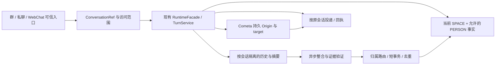

# GitNexus Engineering Plan：QQ 私聊与跨会话个人记忆

> Task：修复 Stella 主聊天链路不支持 QQ 私聊，以及同一 QQ 用户在不同群空间/私聊之间无法复用个人认知的问题。
> 深度：deep；形式：full；状态：待实施方案，未修改业务代码、配置或生产数据库。
> Evidence verified at commit `0600226b8879b01adf507308d7a71f3338d36b76`；分支 `feat/cometa-agent-task-layer`。
> GitNexus：Docker `stella-gitnexus`，`/repo`，明确选择 `Stella_project`；本轮 `--index-only --pdg` 刷新完成。
> Evidence provenance schema 2；global dirty digest `e6d69aa28da96fe692d512f49910cfe1c86bdcfe921c0d9d2a5b0e46547823a0`；64 个已排序引用路径；仅排除本计划的精确路径。
> 阅读约定：`[verified]` = 当前源码/真实探针核验；`[graph]` = 图结果；`[inferred]` = 基于证据的工程决策或拟新增实现；`[assumed]` = 必须在实施时验证的环境/产品假设。所有“新增”文件、符号和配置均尚不存在。

## 1. Objective

[inferred] 推荐实施“统一会话身份 + 保留旧存储接口的会话注册表 + 双层记忆归属”。复用现有 RuntimeFacade、TurnService、SQLite、异步整合与 Python/Rust 后端，不另外建立私聊聊天引擎或个人记忆引擎。

目标的可观察行为：

1. QQ 用户给 Bot 发普通私聊消息，无须 @，可以进入 Stella 本体，获得回复，并在下一轮引用本私聊历史。
2. 同一 Bot 下，同一 QQ 用户在群 A 表达允许共享的稳定偏好后，在另一空间的群 B 或本人私聊中可以检索到；最终是否使用仍由相关性、策略和既有上下文预算决定。
3. 私聊历史和默认私密事实仅对本人私聊可见；群关系、群内行为规则和群知识权限仍按原空间处理。
4. 群、私聊、WebChat、后台任务具有明确投递地址；并发、重启、缓存和迁移不会把历史或结果送到其他会话。
5. 现有群聊触发、Astrbot 兼容插件优先权、WebChat、Cometa 幂等/回执、Python/Rust 行为保持可测兼容。

方案选择：

| 可实施路线 | 能解决什么 | 边界与成本 | 本次判断 |
|---|---|---|---|
| A：只补 private matcher，再合并所有群 space | 可快速验证私聊接收；合并后的群可共享旧记录 | 无法区分群记忆/个人事实；整合、通知、画像仍需改；私聊与多 Bot 身份未解决 | 仅作为受限的开发探针，不作为交付方案 |
| B：ConversationRef + 注册表 + SPACE/PERSON 双归属 | 两个问题均有完整闭环；保留现有表、引擎、群空间规则 | 需要跨入口、记忆全链路、Cometa 和 native 的合同升级 | **推荐**，分 6 个受控实施阶段 |
| C：立即重写全部消息/会话表和 runtime key | 可获得纯粹的统一会话数据模型 | 旧群、WebChat、活动任务及所有统计模块同时迁移，范围过大 | 后续独立重构，当前不依赖 |

## 2. Current Behaviour

- [verified] `ai_gateway.py:773` 的 `is_chat_trigger` 和 `:846` 的 `handle_chat` 使用 `GroupMessageEvent`；入口、锁、系统 prompt、整合、发送记账直接读取 `event.group_id`。真实 NoneBot matcher 探针：私聊不匹配本体，群聊匹配。插件私聊规则能匹配，不等于 Stella 本体支持私聊。
- [verified] `astrbot_compat/pipeline.py:35` 接受允许的私聊；插件 requestLLM 使用自己的 provider/history，不能替代 Stella 的 memory/runtime 链路。具体配置/探针记录见 `docs/reports/2026-10-03-qq-private-and-cross-context-memory.md`。
- [verified] `core/context.py:29` 的群字段和 `:216` 的空间自动解析，以群作为默认身份；`ai_gateway.py:482` 提交 runtime 使用 `qq:{group_id}`。
- [verified] `memory/pre_processors.py:100` 的消息表物理键是 `group_id`；`:111` 的短期历史也按该键查。`session_context.py:24`、`session_compact.py:260` 的摘要/在途状态使用整数会话键。`webui/chat_ingress.py:20` 已占用 `-1` 并使用独立 runtime key。
- [verified] `pre_processors.py:617` 的画像、`retriever.py:518` 的 v1、`retrieval_v2.py:154/:278` 的 SQL/FTS、native `retrieval.rs:111` 都按空间/用户过滤。向量排序不能突破候选池权限；同一 QQ 用户跨不同 space 无法拿到原空间事实。
- [verified] 报告中的真实检索探针：A/2001→a，B/2001→b，C/2001→空，A/2002→other；INTERNAL 不进入普通回复。两个已映射到同一 space 的群本就具备共享条件，问题是跨不同空间。
- [verified] `consolidator.py:643` 按群解析空间，`:771/:826/:853` 分别写画像、候选、长期记忆；候选有 `origin_group_id`，但 `memory_manager.py:879` 新建正式记忆没有持久化该字段。不能假定旧正式记忆都能反推出真实 Bot/来源群。
- [verified] `cometa/models.py:278` 的 Origin 有 platform、bot_id、conversation_id，没有会话 kind；`store.py:586` 及 submit ack target 将 QQ conversation_id 当群 ID；`cometa_bridge.py:155` 的持久通知发送采用群 API。
- [verified] 当前 memory schema=14、backend API=1；`memory_rust/selector.py:74` 和 native `schema.rs:30` 严格匹配版本。引入新 scope 不能仅改 Python。

## 3. Relevant Architecture

[inferred] 将三个身份显式分开：

| 身份 | 新约定 | 用途 |
|---|---|---|
| 会话身份 | `qq:<bot_id>:group:<group_id>` / `qq:<bot_id>:private:<user_id>` | runtime owner、重置/取消、trace、消息去重、回复地址 |
| 用户身份 | `subject_key=qq:<user_id>`；默认个人 owner=`person:qq:<bot_id>:<user_id>` | 同一 Bot 跨群/私聊认人；不默认跨 Bot 或跨 WebChat 合并 |
| 空间身份 | 原 `resolve_space(real_group_id)` | 群记忆、群画像、群知识权限与群 persona |

[inferred] 新增 `ConversationRef` 是可信入口生成的值对象，至少包含 platform、bot_id、kind、peer_id、conversation_key、storage_session_id、runtime_key、memory_space。group kind 才有真实 group_id；private peer 必须等于当前 sender，不能从正文、模型 JSON 或来源群推导。WebChat 由本身可信入口生成，保留既有主体和 key。

[inferred] `storage_session_id` 只适配历史 SQLite/摘要接口；它不是 QQ 地址、用户 ID 或访问权限。SQL 旧列名 `group_id` 可暂留，语义调整为“注册表分配的存储会话 ID”。所有需要真实群语义的功能仍检查 kind 并取真实 group_id。

[inferred] 记忆检索允许范围由服务端 `MemoryAccessScope`（拟新增）生成：当前 SPACE owner，加当前 Bot/当前用户 PERSON owner 的允许 audience。模型只能给查询文本或候选 fact hint，不能提交 owner、scope 列表或读其他人的请求。



## 4. GitNexus Findings

本轮图结果均来自 Docker MCP，并显式传 `repo=Stella_project`；图数据在本轮 refresh 后使用。初次报告的风险结论作为种子，其余关键接口本轮补查。

| 工具与关键参数 | 结果摘录 | 对方案的含义 |
|---|---|---|
| `query(search_query="group_messages session_state checkpoint compact WebChat conversation group_id")` | 返回会话历史/摘要/入口相关定义 | 先覆盖状态消费者，而非只修改 matcher |
| `context(name="_write_memory_candidates", file_path="memory/consolidator.py")` | 找到候选归属、强化与写入接口 | 个人事实路由放在证据核验之后、持久化之前 |
| `context(name="_process_new_candidates_python", file_path="memory/memory_manager.py")` | 找到晋升链路 | owner 必须传到相似匹配、配额、创建和 native 请求 |
| `context(name="Origin", file_path="cometa/models.py")` | Origin 定义 278–319 | 升级持久 origin/target；不要只依赖当轮 raw_event |
| `impact(target="ChatContext", direction="upstream", maxDepth=3)` | `MEDIUM`，17 impacted，9 个直接依赖文件 | 9 个直接消费者逐一处理，见 §9 |
| `impact(target="retrieve_memories", file_path="memory/retrieval_v2.py", direction="upstream", maxDepth=3)` | `MEDIUM`，11 impacted，6 个直接调用 | 快速检索、Planner、embedding、Python backend 和 benchmark 同步 |
| `impact(target="_consolidate_group_core", direction="upstream", maxDepth=3)` | `LOW`，3 impacted；直接调用 consolidate_group | drain/job 包装也须支持注册表，不沿用 ALLOWED_GROUPS 作为完整会话列表 |
| `impact(target="_target_from_task_row", direction="upstream", maxDepth=3)` | `LOW`，4 impacted，均为 store 事务闭包 | deadlines/finish/input_request/cancel 必须使用同一个 target builder |
| 初次报告：`impact(target="resolve_space", direction="upstream")` | **`CRITICAL`，20 impacted，11 direct** | 明确高风险警告：保留 resolve_space 的群空间语义，私聊不调用它；实施时必须重新做 impact |
| 初次报告：`impact(target="handle_chat", direction="upstream")` | `UNKNOWN`，decorator 动态入口没有静态 callers | 不是低风险；已由真实 matcher 与源码补证，实际入口不可删 |
| `context(name="normalize_source_kind", file_path="memory/schema.py")` | record_message 调用该规范化函数 | 新 PRIVATE_DIRECT 未入合法枚举会静默变 PASSIVE |
| `query(search_query="RetrievalRequest API_VERSION MemoryCandidate schema_version Rust eligibility scope")` | 定位 Python 请求合同、selector、backend | 同步 ABI/schema 与 native SQL，不能把缺失调用边视作无影响 |

[graph] repo processes 资源只返回有限条目；`_consolidate_group_core` 的完整控制 PDG 也触及上限。它们不能证明没有其他动态/定时/跨语言路径。§5 用有界数据流和具体源码补证，实施前对新拟修改符号重新 impact。

## 5. Statement-Level PDG Findings

### 5.1 入口、预算与发送顺序

- [graph] `pdg_query(mode="controls", target="handle_chat", limit=200)`：104 条结果，未截断。控制点包括 cometa origin、budget block、E_CANCELLED、Planner wait、最终发送分支。
- [verified] `ai_gateway.py:935–942` 的预算阻断返回、`:954` 的取消返回，必须发生在回复发送前。私聊接入不绕开预算、取消和已有静默结束语义。
- [graph] `pdg_query(mode="flows", target="handle_chat", variable="delivered", limit=100)`：5 条有界结果，未截断；数据流进入 `:1034` 条件、`:1038` 主动记账、`:1046` 学习、`:1060` BOT_SELF、`:1065` applied。
- [verified] 实际 `receipts = deliver_lines(...)` 位于 `:1025`，`delivered_texts(receipts)` 位于 `:1033`。改造应保留“只把确认送达片段写 BOT_SELF”的顺序；group participation/群表达学习按 kind 保护。部分成功只落已送达段；unknown 不生成虚假历史或重复发送。
- [verified] `:998–1019` 的 Cometa ack 是单独认领路径。统一私聊发送地址，但不要把 ack 再塞普通多段回复，避免入口与泵双发。

### 5.2 权限必须进入候选 SQL

- [graph] `pdg_query(mode="flows", target="_fetch_candidates", variable="params", limit=100)`：6 条结果，未截断；参数从 `retrieval_v2.py:142` 经空间/用户、visibility 与 limit 的绑定进入 `:176` execute。
- [verified] SQL/FTS 在候选构造阶段限制空间。新增范围必须以参数化 owner/subject/audience 谓词进入 SQL 与 FTS 同一层，再做相关性排序；先全库召回再过滤会影响 top-k、旁路缓存和后端一致性。
- [inferred] Scope 缺失、非法或主体不明时，仅允许旧 SPACE 范围；PERSON 返回空。`proactive` 去掉 user 条件的现有逻辑不能顺带获得全空间个人事实。只有明确目标用户的路径才可创建该用户的访问范围。

### 5.3 整合与 checkpoint

- [graph] `pdg_query(mode="controls", target="_consolidate_group_core", limit=200)`：总 235、截断。没有把该查询判为完整。补充 `mode="flows", variable="group_shared_space", limit=100`，6 条结果未截断，指向 `:643` 解析与 `:771/:826/:853` 写入。
- [verified] `consolidator.py:631–646` 持会话级 async lock；`:672–729` 阈值/预算/cost gate 跳过；`:753–858` 在写入后推进 checkpoint。当前 JSON 解析失败分支 `:767` 会推进 checkpoint；这是既有行为，不应在文档中误称“所有错误都保留 checkpoint”。
- [inferred] 新 owner 写入失败必须不推进相应整合批次 checkpoint；可解析的确定性拒绝候选须落拒绝原因并允许推进。无法解析批次应明确 quarantine/重试上限，不能无限重试或默默丢失。已有 JSON fail 分支需纳入回归与显式决策。
- [verified] 画像、候选/晋升并非天然同一事务。新实现要让“批次输出与证据去重记录”先可靠落库，checkpoint 后提交；或同一连接短事务原子提交输出+checkpoint。晋升可以后置重放，不能宣称改一个 finally 就得到 exactly-once。
- [verified] `session_compact.py:260` 先检查在途集合，`:274` 在新任务内才添加。新私聊调度需在 `create_task` 前同步占位，finally 清理；用同一 tick 的重复请求测试竞态，不靠 await 后再加锁。

## 6. Proposed Changes

本节均为拟实施决定 `[inferred]`。已有具名符号由报告/本轮源读核验；所有拟新增符号明确标为“新增”。

### 6.1 会话值对象与存储注册表

**新增文件 `core/conversation.py`**：新增不可变 `ConversationRef` 和可信入口工厂。QQ private 填真实 sender 与 bot_id；group 填真实 group_id；不伪装成 GroupMessageEvent，不使用 group_id=0 或负 user_id 作为路由。

**新增文件 `memory/conversation_registry.py`**：新增注册/查找接口及 `conversation_registry` 表：

```text
conversation_key PRIMARY KEY
platform, bot_id, kind, peer_id
storage_session_id UNIQUE NOT NULL
runtime_key UNIQUE NOT NULL
memory_space NOT NULL
legacy_binding, created_at, updated_at
UNIQUE(platform, bot_id, kind, peer_id)
```

- 群历史按配置明确绑定历史 Bot，可继续使用原正整数 group_id 和旧 `qq:<group_id>` runtime alias；注册表同时存新的规范 conversation_key。保留 alias 时 trace/投递仍使用规范身份。
- WebChat 保留存储 `-1`、原 `webchat:<user>` runtime key 与独立主体。不能把它自动认作 QQ 用户，也不能占用其 `-1`。
- private 与发生存储 ID 冲突的新 Bot/group 从专用序列分配尚未使用的负整数。分配使用短 `BEGIN IMMEDIATE`，扫描/保留历史消息、checkpoint、summary 和已注册会话中的占用值；起点小于全部已占用负值，唯一约束兜底。不能直接用 `-user_id`，不能用 kind 从正负号反推。
- 多 Bot 历史原群 ID 没有 bot 信息，不能自动区分。如果预检发现历史归属不明确：保留 legacy namespace 等待显式绑定；为新 Bot 分配新存储 ID，不把旧记录盲绑给首个上线 Bot。
- private `memory_space` 采用隔离名称，如 `private:qq:<bot_id>:<user_id>`；群仍由真实 group_id 解析 space。它是私聊本地上下文/旧 SPACE 记录的归属，不能赋予群知识权限。
- 注册表初始化放进迁移/首次可信入口，不在模块 import 时写生产配置或触发 resolve_space 账本分配。

**`core/context.py` / `ChatContext`、投影、`__post_init__`**：新增上述身份字段与 storage_session_id；private 的兼容 group_id 为 0，但所有 private-aware 消费者使用 ref，不把 0 当公共会话。新增 projection 版本 3（当前 2）；旧 projection 无 ref 仅在明确 QQ group/WebChat 旧格式时恢复，不能把缺失 kind 的新格式猜成群。plain DTO 投影包含身份字段，不包含 bot/raw_event。

### 6.2 QQ 本体入口与路由

**`stella_project/plugins/bot_main/ai_gateway.py` / `is_chat_trigger`、`handle_chat`、`record_group_chat`、`_space_system_prompt`、`_run_turn_via_engine`**：

- matcher/handler 接受 GroupMessageEvent 与 PrivateMessageEvent 的明确 union，先转 ConversationRef 再进入同一 runtime。不要只将注解改成通用 Event 而留下一堆 event.group_id。
- private 的用户普通消息即可触发，过滤自身/非消息事件；沿用 `trigger="reply"`，另设 `source_kind="PRIVATE_DIRECT"`。私聊允许策略独立于 ALLOWED_GROUPS，默认本体启用，可选 sender allowlist；配置键为拟新增，在统一 config/env schema 注册。
- private 不走群提及/参与评分/主动发言目标，但走预算、能力路由、取消、回复整形、已送达记录。私聊 persona 使用明确 private/default 配置，不继承任意群人格或群系统 prompt。
- group 原触发和 passive 摄入保持；private 由一个所有者负责 record_message，避免通用 handler 与 silent recorder 双写。
- 在会话 owner/入口锁内先持久化用户消息，再构造短期上下文，再提交 turn；同会话消息串行。锁覆盖范围要同时防历史插入与压缩竞态；不要先在锁外记录多个并发私聊再让 runtime 串行生成。
- `_group_locks` 与插件已处理去重按规范 conversation/event key 适配；event key 至少包含 bot、kind、peer、message_id。相同 msg_id 在不同 Bot/会话不可互相压掉。
- 保持当前 Astrbot 优先权：插件明确“handled”后本体不再次生成/发送。实现前用现有规则确定 plugin hooks 调用顺序；不能让两个 private matcher 各跑一次插件。
- trace preprocess/postprocess 的 group-only skip 改为可接受私聊且记录完整 scope；runtime/facade 的硬编码 `qq:{ctx.group_id}` 同步改为规范 conversation scope。详细 prompt 日志沿用原显式开启策略，不因增加私聊默认开启。

**称呼入口与服务 `ai_gateway.py` / `handle_addressing`、`memory/addressing.py` / `get_preference`、`set_preference`**：当前专用称呼入口也只接 GroupMessageEvent，并调用 resolve_space。同步增加 private self-address 命令，在本人私聊保存 PRIVATE_ONLY 称呼或按明确意图 USER_SHARED；群管理员替别人改称呼的权限只作用当前 SPACE，不能改对方全局 PERSON。群显式偏好优先、个人 fallback 其次。private 不调用群管理员检查，不可伪造 @目标改他人个人记录；决策缓存由 message_id 改成完整 event key。

**配置具体位置**：新增 private enable/allowlist/persona 和个人共享/回填 flags 放 `config/settings.py`，使用已有 `_env_bool` 等字面量默认声明；在 `deploy/env_keys.py` 登记生命周期，并由 `deploy/env_schema.py` 的 AST提取暴露GUI。最终发布私聊默认启用；灰度发布阶段显式关闭/限制 canary，不能因 flags默认值误开全量。

### 6.3 历史、摘要与后台整合

**`memory/pre_processors.py` / `record_message`、`short_term_context`、`_max_message_id`、`build_user_context` 及 v2 构建**：将通用消息/摘要存储查询切到 storage_session_id，group 兼容别名作为物理存储键；访问范围从 ref/用户构造，不通过负整数调用 resolve_space。增加稳定接收去重记录，把 OneBot 消息 ID 绑定到规范会话；source evidence 引用已持久化消息行。

**`memory/session_context.py`、`memory/session_compact.py` / `schedule_compact`**：状态和在途压缩以存储会话 ID/规范 key 配对；恢复摘要用注册表。私聊关闭空闲后仍能恢复；已删除会话/重置 epoch 的迟到任务不得覆盖新摘要。

**`memory/consolidator.py` / `_consolidate_group_core`、`_write_user_profiles`、`_write_memory_candidates`**：保留旧群包装接口，内部增加适用于所有 registered conversations 的核心入口（新增符号）；从注册表获得 ref/memory_space/source key，不能直接 `resolve_space(storage_session_id)`。原群画像照常；个人事实由 §6.5 的验证路由处理。

**gateway consolidation drain 与 `memory/db_cleaner.py`**：调度应遍历有待整合行的 registered sessions，覆盖私聊，并使用现有 gate/budget/concurrency 限制；不可只遍历 ALLOWED_GROUPS。清理要把存储 ID 当会话键，保护对应 checkpoint/未处理证据，不以负号跳过。

**`memory/schema.py` / `normalize_source_kind`；`memory/memory_manager.py` / `_has_at_mention` 与对应 native 晋升来源判断**：扩充合法来源为 PRIVATE_DIRECT；直接对话证据判断同时识别 AT_MENTION 和 PRIVATE_DIRECT（可新增中性命名 helper，旧 helper 保留兼容），但高密度单次晋升仍受置信度/策略约束；整合 source kind 校验、提示、验证规则、计数与 native 参数同步。PRIVATE_DIRECT 代表直接对 Bot 说，不能自动代表允许跨群共享。BOT_SELF 仍绝不产生个人候选。

**`memory/trace.py` / `record_trace` 与 `TurnService._finalize_trace`**：记忆trace原group_id代表真实群，不能让所有private记录成0而失去身份。schema15添加conversation_key/kind/peer/storage_session_id，private真实group字段为空；group兼容旧真实群字段。持久trace、WebUI过滤及详细日志按规范会话标识处理，而不是只把日志字符串改成private。

### 6.4 持久化个人事实模型

**新增文件 `memory/ownership.py`**：新增 `MemoryOwner`、`MemoryAccessScope`、owner/audience 校验与 SQL 参数构造。scope 由可信代码生成，不把“当前有 user_id”当成跨平台绑定证据。

`memory_candidates`、`memories` 增加字段；atomic_facts 继承相同访问限制：

| 拟新增字段 | 规则 |
|---|---|
| owner_type | SPACE / PERSON；旧行默认 SPACE |
| owner_key | SPACE=`space:<space_id>`；PERSON=`person:qq:<bot_id>:<user_id>` |
| subject_key | 明确平台+真实用户；旧 SPACE 行可保留空/原 user_id 兼容 |
| audience | CURRENT_SPACE / PRIVATE_ONLY / USER_SHARED；独立于既有 visibility |
| source_conversation_key | 可信注册表给出；旧行无法恢复标为 legacy_unknown |
| fact_key、policy_version | 稳定事实键及路由策略版本；缺证据不共享 |

- PERSON 行的旧 `group_shared_space` 设为专用不可与真实群 space 匹配的兼容 namespace，例如 `personal:<owner-key>:<audience>`。真实来源放 source 字段。所有新 reader 仍显式检查 owner_type；旧读取路径不应意外读到个人记录。
- 旧 SPACE 行保持原主键/空间/用户语义。新增索引至少覆盖 `(owner_type,owner_key,subject_key,audience,status)`，候选 fact 去重覆盖 owner+audience+fact_key；用 EXPLAIN QUERY PLAN 验证 SQL/FTS。
- 新增 `personal_profile_facts` 表（派生于同一事实/证据链，非另一套抽取引擎）支持跨群稳定画像。原 `user_profiles.agent_attitude`、群关系仍留 SPACE；不能把旧画像 JSON 整包跨空间搬走。
- 当前群的明确称呼偏好优先，个人共享称呼其次；私聊默认称呼可以个人范围生效。称呼表/查询增加归属和 audience 或使用个人 fact 投影，保持既有空间覆盖优先级。
- 冲突事实保留来源/更新时间，显式更正高于旧事实，受众不扩张；公开事实和私密更正可分别存在。群中的更正不会自动披露私聊证据。管理删除/纠正需作用到明确 owner，并使派生画像、索引、向量映射、缓存同时失效。

### 6.5 写入与共享规则

[inferred] 第一版采用确定性类型白名单 + 真实说话者证据 + 用户分享意图，不给回复主路径增加一次 LLM 分类。复用现有后台提取，但模型输出的 user_id、source_ids、scope/audience 都必须服务端核验。

| 输入事实 | 写入目标 | 群 B / 本人私聊读取 |
|---|---|---|
| 用户本人公开自述的稳定称呼、语言/输出偏好、常用技术偏好，且通过白名单与自述证据校验 | PERSON + USER_SHARED | 同 Bot 的本人范围可用 |
| 群内关系、群梗、特定群行为、群成员对他人的评价 | SPACE + CURRENT_SPACE | 只限现有共享空间；不转个人 |
| 私聊稳定个人事实 | PERSON + PRIVATE_ONLY | 本人私聊可用；群 B 不可用 |
| 用户明确“这个偏好可以跨群记住/使用” | 核验本人及具体事实后建立 USER_SHARED 表示 | 可跨群；只共享该事实的可共享文本 |
| 他人转述/引用、未找到真实 source row、user_id 不属于说话者、自身 Bot 台词 | 拒绝个人路由或保持 SPACE 候选，落原因 | 不能靠提到某 QQ 号写入对方个人事实 |
| 私聊复述已有公开事实，同时含私密背景 | 保留独立 PRIVATE_ONLY 证据/表示 | 不向 USER_SHARED 的 content/evidence 拼接私密背景 |

- 共享内容只能从允许共享的证据生成。检索最终文本不附带未经 audience 检查的原始证据；原始来源仅在授权审计界面查看。
- 现有 `memory/policy.py` / `validate_candidate` 只修正 usage/visibility/confidence，不核验事实归属；先保留该校验，再增加 owner/evidence 验证，二者不能互相替代。候选 ID、source_conversation_key、owner 由服务端生成。source row 必须存在、所属会话正确、真实 sender 等于 subject，且 source kind 不为 BOT_SELF；不得仅检查该用户“在本批 sender 列表里”。
- 新增 `memory_evidence` 去重表/约束：owner_key、audience、fact_key、source_conversation_key、source_row_id 唯一。重试同消息不增加 occurrence/confirmation；不同群的真实新证据可强化同一共享事实。
- `_write_memory_candidates` 先确定事实与证据，再在短事务内 insert evidence + upsert candidate/version。相同 owner+audience+fact_key 并发使用唯一约束/CAS 或 UPDATE 原子累加；不要读旧计数到 Python 后无条件覆盖。
- 晋升、配额、相似匹配、压缩、原子化、归档/编辑都保留 owner+subject+audience。候选合并必须先同归属同受众，再比较语义；不同 audience 永不自动拼接正文。配额按 owner+subject 与事实类型计算，私密/共享表示分别受控。
- 当共享禁用/撤销时，不通过降 visibility 隐式处理：更新 audience/状态、来源表示及持久版本，影响所有群的缓存；当前会话已注入的快照在发送前按版本复查或由 owner epoch 取消，避免撤销后迟到发送。

### 6.6 全链路检索与缓存

**`memory/retrieval_v2.py` / `_fetch_candidates`、`retrieve_memories`、`retrieve_memories_emb`、FTS；`memory/retriever.py` v1；`memory/pre_processors.py`；`core/planner.py` / `_query_memory`**：增加可选可信 scope 参数，旧调用默认仅 SPACE。SQL 候选逻辑：

```text
status=active AND existing_visibility_policy AND existing_usage_policy
AND (
  owner_type=SPACE AND owner_key=current_space_owner AND legacy_user_policy
  OR
  owner_type=PERSON AND owner_key=current_person_owner
      AND subject_key=current_subject
      AND audience IN allowed_audiences_for_current_conversation
)
```

- group 允许当前 SPACE + 当前用户 USER_SHARED；private 允许自身隔离 SPACE + 当前用户 PRIVATE_ONLY/USER_SHARED；user=0 或主体不可信不生成 PERSON 分支。共享 namespace 不意味着所有人均可读该 user 的事实。
- FTS、embedding 候选、Planner 深度查忆、原子事实检索、WebUI 管理与 native 都用同一合同；FTS 为空的回退仍保留权限，不能回到裸 space SQL。
- 原有 visibility/usage、行为约束、相关性和 token budget 仍独立生效。scope 是授权上限，不是强制让模型提及该用户所有事实。群行为约束不因“来自同一个 QQ 用户”跨空间扩张。
- 缓存 key 包含 DB path/身份、scope fingerprint、用户、query/topic、mode/trigger、策略版本、空间版本和个人版本；个人版本存在 SQLite 并在成功事务后增加，不能只用某进程内 bump。
- 修改、晋升、压缩、删除、共享撤销和回填都更新对应持久版本。若后台缓存刷新失败，读路径通过版本可见性发现变化；避免群 A 修改后群 B 热缓存永久陈旧。
- 合并候选后仍使用既有条数/token 上限；建议 SPACE/PERSON 各自小额候选再统一排序，并用 benchmark 调整，禁止无界扩大 prompt。保留本地 8K 使用约束，不引入第二轮同步 LLM。

### 6.7 后端与数据库合同升级

**`memory/schema.py`、`memory/migrations.py`**：拟新增 `migrate_v15`，schema 14→15，一次版本化迁移创建 registry、owner/evidence/version/profile 表与索引；`_migrate` 做幂等建表/补列，MIGRATIONS 注册版本化回填。继承每级事务、版本同事务提交、迁移前快照和校验；新库与旧库均测试。

**`memory_rust/backend.py` / `RetrievalRequest`、`PromotionRequest`；`python_backend.py`；`selector.py`；native `retrieval.rs`、`promotion.rs`、`schema.rs`**：拟将 backend API 1→2、schema 14→15，携带受限 owner/subject/audience 和版本字段，SQL/FTS/配额/合并同步实现。API 请求无新 scope 必须明确 SPACE-only，不能默认全部个人记录。

- `python` 使用新合同；`auto`/`shadow` 的旧 native 合同不兼容时按当前 selector 规则可回退 Python并记录原因；显式 `rust`/`strict` 继续报错，不能悄悄换后端。
- 不修改旧 native 二进制的运行时常量伪装兼容。交付必须带正确 ABI 的 Windows wheel/native artifact，并完成真实 Python/Rust 双后端集合、排序、权限、晋升 parity。
- schema 15 是整体合同；不能部署旧程序读取新 PERSON 行。即便 features 关闭，旧 schema 14 native 与新库也不能宣称兼容。

### 6.8 Cometa、回执与权限边界

**`cometa/models.py` / `Origin`**：Origin 独立升级为 v2，新增 conversation_kind、peer_id、规范 conversation_key（保留旧 conversation_id 兼容）；不要直接提高全包共享 SCHEMA_VERSION 影响所有 DTO。旧 v1 QQ Origin 按历史 group 解释，新 v2 缺 kind/peer 校验失败，不猜默认群。

**`cometa/store.py` / `_target_from_task_row`、`submit_task`**：统一持久 target builder，ack/deadline/finish/input-request/cancel 都生成 platform、bot、kind、peer 与规范 key；private target 不填写 group_id。持久 origin_scope、幂等、权限检查、配额使用完整会话 identity；旧群活动任务保持原origin_scope或通过显式legacy alias兼容，任务查询/控制不得因升级kind而失联，新的private不能匹配旧群scope；用户总配额仍按当前真实 requester 保留，群配额只适用 group，private 用独立会话/用户限额。消除群 ID 与用户 ID 相同导致的配额碰撞。

**`stella_project/plugins/bot_main/cometa_bridge.py` / `build_origin`、sender 工厂及旧通知 sender**：

- 普通短消息按 kind 选择群或私聊 API；private 不构造群 @，reply 引用兼容按 adapter 验证。初次 ack 复用当轮 matcher，但 task origin 已有完整持久地址。
- 长结果保留“文件主、转发兜底、短摘要指针”的交付原则；private 文件/转发 API 必须按实际 NapCat 能力探测，缺能力直接走私聊文本降级，不把 private user_id 塞进 upload_group_file。
- bot offline 使用既有待投递重试；明确未发送的 API 失败可按策略重试；delivery_unknown 保留不自动重复，尤其不能在不知文件/转发是否成功时跨会话或切群重发。
- 沿用 ack claim/CAS、后台泵唯一发送者与收据语义。重启后的结果只能依持久 target 回原私聊；取消/输入补充只能由授权 actor 在正确 origin scope 操作。

**`capability/hooks.py`**：技能 sandbox session_id 采用可信 conversation runtime/key，防止同 space 的两个群或私聊意外共享执行会话；旧 session alias 如需迁移，冷启动/drain 后处理。

**`capability/providers/knowledge.py` / `_principal_of`**：维持基于真实 Astrbot event 的 ACL。个人记忆共享不能让 private 获得某个群知识 principal；伪存储 ID 不进入知识 space resolver。没有显式 user/document ACL 的群文档私聊仍拒绝。

**群学习边界（第一版确定选择）**：`core/social/contracts.py:72` 的 ConversationScope 当前要求非空 group_id，其 row/key 与现有学习存储绑定。第一版 private 调用 `deliver_lines(scope=None)`，从返回收据写确认 BOT_SELF 和带规范会话身份的通用 trace；不将private写入群 social scope。participation、group proactive、群表达/回复效果学习均按kind保护。启用私聊社交学习与升级其持久scope是独立后续方案；不在本次强行迁移全部学习表。

### 6.9 历史回填、管理与发布

**新增 `tools/backfill_personal_memory.py`（拟新增 CLI）**：提供 preview 与 apply；要求显式 Bot 绑定、原空间、用户、候选类型/规则、来源证据和批次 manifest。输出 planned copy/skip/conflict/reason，可重入，有 batch_id、迁移审计与撤回记录。

- schema 迁移只把旧记忆标为 SPACE，不自动共享全部 845 条旧 active 记忆，也不整包复制 47 条画像。
- 有可靠 source row、主体、Bot、可共享事实证据的记录可按 manifest 转成/复制为 PERSON + USER_SHARED；缺 origin、来源不明、群关系或私密信息仅保持 SPACE，并标注 skip。old memory_id + owner + policy_version 防重复回填。
- 新事实正常增长即可修复未来行为；为了让“在另一群已经认识我”立即体现，当前旧库需要一次审查后的回填。仅上线新检索而不回填，不代表历史认知已经跨空间可用。
- 管理界面新增文件拟定为 `webui/services/personal_memory.py`、`webui/routers/personal_memory.py`、`dashboard/src/views/data/PersonalMemoryPage.vue`，注册路由与现有登录管理员权限；提供 owner/audience/source、精确筛选及个人删除/导出能力；默认展示当前选择空间，不将全库个人事实混入群页面。服务端权限必须核验，前端筛选不充当授权。现有 `webui/services/conversations.py` / `groups`、`messages` 以存储group_id展示群名，改为注册表识别kind/peer；现有 `webui/services/trace.py` / `_resolve_memories`、`memory_trace_detail` 补owner/audience/source字段与private标识。管理员可审计授权内容，普通群页面不自动混列私聊。
- 拟新增私聊/个人事实 feature flags：先安装支持 schema/ABI 的代码并关闭 PERSON 写入，shadow 对比；再有限用户 private canary；再启用新共享事实；最后执行审查回填。flags 统一注册，不能假设当前已存在。
- 关闭 flag 是功能降级，不能作为旧二进制回滚。回滚到旧 schema 14 必须停止本实例写入并恢复迁移前一致快照；明确恢复点后的消息可能丢失。活动 Cometa 任务先 drain 或保持兼容 sender，不能连带恢复旧 tasks DB 使通知重复。

## 7. Implementation Sequence

| 阶段 | 可独立实施的内容 | 依赖/退出条件 |
|---|---|---|
| M0：合同与夹具 | 写 ConversationRef/access scope/Origin v2 的 DTO 与兼容读取；建立 group/private/WebChat、同 ID、多 Bot、旧 DTO fixtures | 明确主体、key、负 ID 注册分配规则；现有测试仍通过；每个既有修改符号先 impact |
| M1：数据与双后端 | schema15、registry、SPACE 默认 owner、evidence/version 表；API2 Python/Rust、索引与合同校验；PERSON flag 关闭 | v14/v15/新库迁移与失败恢复通过；正确 native artifact 可装载；旧 reader SPACE-only；不能提前写 PERSON |
| M2：私聊闭环 | matcher、ref、runtime、历史/摘要、private system prompt、后台整合、BOT_SELF、trace、Cometa target/sender与配额 | 私聊回复/后续历史/后台整合/重启通知均通过；旧群/WebChat不回归；同会话串行、异会话并发 |
| M3：个人事实全链路 | 写入路由与证据验证、画像事实、强化/晋升/压缩、v1/v2/FTS/embedding/Planner/native scope、缓存持久版本 | 完整受众矩阵和跨 backend parity 通过；共享写入仍限定 canary，不先扩大线上空间 |
| M4：管理与历史修复 | 回填 preview/apply/撤回、WebUI owner/audience 删除导出、历史来源审查 | manifest 无不明主体；可共享记录跨群命中；不明来源不迁；重复运行幂等；删除/撤销热缓存不返回 |
| M5：真实适配器验收与发布 | 测试 QQ 私聊短/长结果、插件接管、重启、断线、部分成功、群回归；故障演练和发布文档 | §8 全矩阵通过，§13 完成；分批开启 flags；需要停 Bot/操作正式库时在具体维护步骤执行 |

[inferred] 可以按 6 个 PR 拆分，但 M1 的 schema 和 native 必须在同一个可发布版本配齐；M2/M3 不能用文档声称完成而缺后台或替代 backend。每步 PR 描述包含触发前后行为、影响范围和真实测试证据。

## 8. Test Strategy

### 8.1 兼容与权限矩阵

| 场景 | 必须观察到的结果 |
|---|---|
| 群 @ / 群 passive / 群 proactive | 触发、参与、现有共享空间和 persona 不变；proactive 无目标用户不读 PERSON |
| 私聊普通文本，无 @ | 本体匹配并回复，原始 event 不要求 group_id；trigger=reply、来源 PRIVATE_DIRECT |
| private 与 group 恰好 peer=同一整数 | conversation、历史、锁、配额、消息去重、通知完全隔离 |
| 同 QQ 在两个不同 space 群 | USER_SHARED 个人偏好可检索，群关系不跨 space；默认当前群称呼覆盖个人默认 |
| 同 QQ 群→本人私聊 | 允许共享事实可用；群知识文档不自动授权 |
| 同 QQ 私聊→群 | PRIVATE_ONLY 不入 SQL/FTS/vector/Planner/trace final；明确共享后的可共享表示才可用 |
| 同 QQ 私聊→其他用户私聊 | 所有 PERSON 事实与原始证据均隔离 |
| 同 QQ 在两个 Bot | 默认不共用 PERSON/history；相同 message_id 不去重碰撞 |
| QQ 与 WebChat 数值 user 相同 | 不自动认同一人；WebChat -1/key不被重用 |
| 原同 space 两群 | 原 SPACE 共享继续存在；新增个人层不替代群合并语义 |
| 无 scope 的旧调用/旧 v1 DTO | SPACE-only；旧 QQ Origin 按群回传；新 v2 缺 kind 拒绝 |
| visibility=INTERNAL / 不允许 usage | 即使 PERSON+USER_SHARED 也不进入普通 conversation prompt |
| Python / auto / shadow / rust / strict | 新 ABI 一致；旧 native auto/shadow明确回退，rust/strict明确失败 |
| SQL / FTS / FTS fallback / embedding / v1 / Planner | 授权集合一致，没有某条旁路绕过 owner/audience |
| 恶意模型篡改 user/source_ids/owner/audience | 服务端拒绝；不写他人事实，不从私聊自动升级 USER_SHARED |
| 私密证据强化公开事实 | 公开正文不增加私密信息；scope/audience 保持分离 |
| 同消息重复 / 批次重放 / 进程崩溃恢复 | 单 source evidence 单计数；checkpoint 不掩盖未落库输出 |
| 两群同时整合同用户 / 同 tick 2次 compact | 事实不丢更新、计数不翻倍；compact 一个 owner；SQL 事务不包 LLM等待 |
| 重置/取消与迟到结果 | owner epoch 阻止旧历史/摘要覆盖；取消不误发私聊回复 |
| 删除/撤销个人共享后群 B 热缓存命中 | 下一次检索不返回；已准备未发快照复查/取消 |
| Cometa private ack / completion / need-input / cancel / timeout / restart | 每次只回原 private；ack 不双发；private/group配额不碰撞 |
| sender offline / 部分送达 / delivery_unknown | 只有确认片段 BOT_SELF；可重试未发送，unknown 不自动重复 |
| private 大结果文件/转发不支持 | 按真实能力私聊降级，有结果指针；不调用任何群投递 API |
| v14→v15、重复迁移、注入失败、恢复备份 | 行数/归属/索引校验正确；失败事务回滚；生产恢复路径可执行 |
| 回填 preview / apply / 再apply / 撤回 | preview 不改原库；不明来源 skip；幂等；保留原 SPACE 数据和 audit |

### 8.2 测试文件

[verified] 可复用已有：`tests/test_retrieval_v2_and_schema.py`、`test_cross_user_isolation.py`、`test_candidate_reinforcement.py`、`test_consolidator_core.py`、`test_session_context.py`、`test_session_context_cache.py`、`test_session_compact.py`、`test_migrations.py`、`test_spaces.py`、`tests/runtime/test_session_ownership.py`、`test_facade_turns.py`、`test_ingress_native.py`、`tests/cometa/test_bridge.py`、`test_qq_delivery.py`、`test_delivery.py`、`test_runtime_assembly.py` 及三组 memory_rust 测试。runtime harness 已覆盖同 key 串行/不同 key 并行；Cometa FakeBot 当前只识别群 API，必须新增 private API 断言。

[inferred] 拟新增：

- `tests/test_conversation_registry.py`：旧群、WebChat -1、private、跨 Bot storage 分配、并发注册/重启恢复/历史未绑定。
- `tests/test_private_chat_ingress.py`：真实 NoneBot private matcher、插件接管、正文不带 @、用户消息只记录一次、trace与系统 prompt。
- `tests/test_personal_memory_scope.py`：§8.1 的 owner/audience 矩阵及各检索旁路。
- `tests/test_personal_memory_concurrency.py`：不同会话并发同用户、证据重放、短事务/持久缓存版本。
- `tests/test_personal_memory_backfill.py`：preview/copy/skip/conflict、缺 origin、重复批次、删除撤销与审计。
- `tests/cometa/test_private_delivery.py`：完整任务 lifecycle、Origin版本、多 Bot、未知投递、长结果降级与权限。

### 8.3 验证命令与边界

[verified] 以下均使用当前已有 Python/pytest 或既有 Cargo manifest，不要求下载/启动 QQ/LLM。规划阶段没有业务变更，本轮不重跑全套测试；报告阶段的 42 passed 只是原实现回归基线，不代表新方案已通过。

```powershell
python -m pytest tests/test_spaces.py tests/test_retrieval_v2_and_schema.py tests/astrbot_compat/test_dispatch.py -q -p no:cacheprovider
python -m pytest tests/test_migrations.py tests/test_cross_user_isolation.py tests/test_candidate_reinforcement.py tests/test_consolidator_core.py tests/test_session_context.py tests/test_session_context_cache.py tests/test_session_compact.py -q -p no:cacheprovider
python -m pytest tests/runtime tests/cometa tests/test_memory_rust_selector.py tests/test_memory_rust_promotion.py tests/test_memory_rust_benchmark.py -q -p no:cacheprovider
python -m pytest tests/ -q
```

[inferred] 实施阶段安装既有开发/native 构建依赖后执行 `ruff check .`、`cargo test --manifest-path memory_rust/native/Cargo.toml`，以及上述拟新增测试。CI 当前 Python 3.10/3.11/3.12；Windows native parity 和真实 NapCat private API 需要单独补齐，Linux Python tests 不能代替真实适配器验收。

[inferred] 修改前逐符号跑 Docker GitNexus impact；提交前 `detect_changes(scope="all")`。若 partial/truncated/UNKNOWN，补充有界图查询与源读后再提交，零变化结果不作为“无影响”证据。规划阶段无业务编辑且不提交，不把 detect_changes 当成方案实现测试。

## 9. Risk and Impact Analysis

### 9.1 直接依赖闭环

| 被分析接口 | 已知直接依赖 | 处理方式 |
|---|---|---|
| ChatContext | ai_gateway、webui/chat_ingress、core/runtime/facade、core/runtime/turn_service、core/planner、memory/pre_processors、memory/post_processors、capability/hooks、capability/delegation，共 9 文件 | 前 8 适配/回归；delegation 当前读取 message/trigger/intent 与 cometa_origin，不直接解析群字段，保留兼容字段并增加 private origin 控制测试 |
| retrieve_memories | pre_processors._build_user_context_v2、retrieve_memories_emb、_retrieve_with_optional_backend、Planner._query_memory、PythonMemoryBackend.retrieve、benchmark.evaluate_case，共 6 调用 | 每处显式转发可信 scope；benchmark 增跨 scope fixtures；没有 scope 的外部旧调用只限 SPACE |
| _consolidate_group_core | consolidate_group；上游 drain_group、consolidation_drain_job | 保留群兼容 wrapper、新增 registered session 核心；drain 调度显式覆盖 private |
| _target_from_task_row | enforce_deadlines、finish_task、register_input_request、request_cancel 的事务闭包，共 4 | 统一 builder；submit_task 自建 ack target 虽不在这 4 边中，也由源读发现并同步 |
| resolve_space | _principal_of、list_spaces、build_user_context、_build_user_context_v2、pick_target、_space_system_prompt、handle_addressing、webui groups.list_groups、ChatContext.__post_init__、Planner._query_memory、Consolidator._consolidate_group_core，共 11 | **CRITICAL 警告仍有效**；不改变 resolver群语义；调用方先判 kind，private 用 ref空间，knowledge ACL仍使用真实event |

[verified] `memory/compressor.py:312` 的合并使用 space+user；`:476` 的 atomic_facts 写入只带空间/subject。仅修改晋升后新 PERSON 会在后续周任务丢失/混淆受众，必须同时更新压缩查询、表示和继承字段。

### 9.2 并发与事务边界

- [inferred] 会话锁只锁同一个会话，不能因同用户跨群而串行锁住所有 LLM 请求。共享事实的竞争通过短 SQL 事务、唯一 evidence key 和原子 UPDATE/CAS 处理。
- [inferred] 没有 SQLite write transaction 跨 await LLM/network；提取用稳定 source snapshot，写时复核 rows/epoch，输出可靠落库后更新 checkpoint。写失败退出时不伪造整合成功。
- [inferred] registry 分配、candidate/evidence 写入和晋升各自有可重试单元；BEGIN IMMEDIATE 的 busy timeout/有界重试沿用统一数据库策略。连接不跨线程复用，不能让同步大扫描阻塞全部私聊。
- [inferred] conversation/runtime key 的迁移在 drain/冷启动边界进行。已有 active owner、skill sessions、Cometa task scope 需兼容读取，不在在途 turn 中热切 key。
- [inferred] 回填和压缩批次限额、可重入；quota按 owner 统计并索引。上线前比较 p95检索、整合占用、候选池与 prompt token；不以扩大 top-k 掩盖新 SQL 未走索引。

### 9.3 迁移、交付与可观测性

- [inferred] 两大风险是身份/受众串用和新 schema/旧 native 不兼容。必须以权限矩阵和 strict握手测试作为 release gate，不能仅靠聊天“看起来正常”。
- [inferred] trace/metrics 新增 kind、规范 conversation key、storage session、owner type、scope fingerprint、policy/schema/API 版本与个人/空间缓存版本；记录 route拒绝、未绑定 legacy、native降级、回填skip、delivery_unknown。默认 metadata日志不包含私聊正文/私密证据。
- [inferred] WebUI 个人编辑、导出、删除也属 owner-aware路径；对 privileged管理员展示仍需清晰 audience标签，避免群数据页误操作全个人记录。
- [verified] 本地库历史 origin 并不完整，现有 845 active/54用户不能被当作同 Bot可共享事实集合。统计来自报告只读快照；执行回填前需重新读实际库并更新 manifest，不能套旧计数。
- [inferred] 临时把所有群合并一个 space 将改变群画像/行为/知识边界，不能作为这两个缺陷的默认修复手段。

## 10. Files Expected to Change

已有文件均按责任边界列出；未核验其内部具体符号的文件明确留为实施前定位/impact，而不伪造符号名。新增文件只是拟定位置。

| 文件 | 符号或责任 | 原因 |
|---|---|---|
| core/conversation.py（新增） | ConversationRef、入口工厂（新增） | 统一真实身份与路由 |
| memory/conversation_registry.py（新增） | 注册/查找/分配接口（新增） | 旧存储兼容、私聊持久会话 |
| memory/ownership.py（新增） | MemoryOwner、MemoryAccessScope（新增） | 可信归属和受众谓词 |
| core/context.py | ChatContext、projection、__post_init__ | 私聊字段/版本恢复 |
| stella_project/plugins/bot_main/ai_gateway.py | is_chat_trigger、handle_chat、record_group_chat、_space_system_prompt、_run_turn_via_engine；trace/drain/发送记账 | 私聊完整入口闭环 |
| core/runtime/facade.py、core/runtime/turn_service.py | trace scope、history/finalize context | owner、重置与追踪正确 |
| webui/chat_ingress.py | WebChat context构造 | -1、runtime key与主体兼容 |
| memory/pre_processors.py、memory/post_processors.py | record_message、short_term_context、build_user_context；日志标签 | storage适配、读取个人层 |
| memory/session_context.py、memory/session_compact.py | 会话状态、schedule_compact | 私聊摘要/压缩、调度竞态 |
| memory/consolidator.py | _consolidate_group_core、_write_user_profiles、_write_memory_candidates | 注册会话、证据路由与可靠checkpoint |
| memory/schema.py、memory/migrations.py | normalize_source_kind、DDL、MIGRATIONS、migrate_v15（新增） | schema15和幂等升级 |
| memory/retrieval_v2.py、memory/retriever.py | retrieve_memories、retrieve_memories_emb、候选SQL/FTS和旧reader | 全路径同scope过滤 |
| core/planner.py | RestrictedPlanner._query_memory | 深度查忆不旁路 |
| memory/memory_manager.py | _process_new_candidates_python、_find_similar_memory、_create_memory及配额SQL | 晋升/合并保持归属 |
| memory/compressor.py、memory/db_cleaner.py | _merge_duplicate_memories、_store_atomic_facts；保留会话/证据 | 定时任务不破坏受众 |
| memory_rust/backend.py、python_backend.py、selector.py | RetrievalRequest、PromotionRequest、adapter/validate | API2/版本与parity |
| memory_rust/native/src/{schema,retrieval,promotion}.rs | 合同、SQL/FTS、晋升配额 | native支持相同owner/audience |
| cometa/models.py、cometa/store.py | Origin、_target_from_task_row、submit_task | 持久私聊地址、幂等与配额 |
| stella_project/plugins/bot_main/cometa_bridge.py | build_origin、sender工厂与legacy sender | 私聊ack/结果/附件 |
| capability/hooks.py | sandbox session_id赋值 | 隔离技能执行会话 |
| tools/backfill_personal_memory.py（新增） | preview/apply/撤回（新增） | 安全修复旧个人认知 |
| config/settings.py、deploy/env_keys.py、deploy/env_schema.py | 拟新增配置的声明、登记与AST schema | GUI/运行配置统一 |
| memory/policy.py、memory/addressing.py、ai_gateway.py | validate_candidate、get_preference、set_preference、handle_addressing | 核验来源受众、个人称呼与群覆盖 |
| webui/services/conversations.py、webui/services/trace.py | groups、messages、_resolve_memories、memory_trace_detail | 会话种类与归属标识 |
| memory/trace.py、core/runtime/turn_service.py | record_trace、_finalize_trace | 持久记忆trace会话字段 |
| webui/services/personal_memory.py、webui/routers/personal_memory.py、dashboard/src/views/data/PersonalMemoryPage.vue（均新增） | 精确管理/删除/导出接口与页面（新增） | 对用户可用的个人事实管理 |
| §8列出的已有/新增测试、CI native验证与相关使用文档 | 测试/交付合同 | 发布可复现验收 |

[inferred] `config/spaces.py` 和 knowledge principal 不需要改变原空间/ACL语义；在实施时根据private调用隔离是否需要小幅guard改动，先 impact，再修改。`astrbot_compat`优先权主要通过入口接续与测试保持，只有具体测试发现需要适配才改插件内部。

## 11. Reusable Implementation Context

以下 JSON 是实施入口，引用路径均为 repo-relative。生成计划的 schema2 provenance由技能官方 helper输出，包含 HEAD/index/worktree/untracked 各层摘要；不能手工重算。它绑定当前调查证据，不能作为未来代码的永久 all-clear。

```json
{
  "implementation_context": {
    "task_summary": "Deep implementation plan for QQ private Stella runtime and same-bot same-QQ personal memory across spaces; no code implemented",
    "acceptance_criteria": [
      "私聊本体完整入口历史整合投递与追踪",
      "同QQ跨空间个人认知检索",
      "并发会话隔离",
      "旧群WebChat兼容迁移与回滚",
      "Python/Rust一致",
      "Audience all retrieval paths parity",
      "Persistent Cometa private notifications",
      "Source-verified legacy backfill"
    ],
    "evidence_provenance": {
      "schema_version": 2,
      "head_commit": "0600226b8879b01adf507308d7a71f3338d36b76",
      "generated_plan_path": "docs/plans/2026-10-03-gitnexus-plan-qq-private-personal-memory.md",
      "global_dirty_digest": {
        "algorithm": "sha256",
        "canonicalization": "gitnexus-evidence-provenance-v2 NUL-framed UTF-8 records",
        "value": "e6d69aa28da96fe692d512f49910cfe1c86bdcfe921c0d9d2a5b0e46547823a0"
      },
      "cited_path_manifest": [
        {
          "path": ".github/workflows/ci.yml",
          "object_kind": {
            "head": "regular",
            "index": "regular",
            "worktree": "regular",
            "untracked": "absent"
          },
          "state": "clean",
          "rename_from": null,
          "rename_to": null,
          "head_digest": "sha256:fdd5a82926831dc902d6d5986fc862275c49dcb8ae986af5948ca2e18eac0ea5",
          "index_digest": "sha256:fdd5a82926831dc902d6d5986fc862275c49dcb8ae986af5948ca2e18eac0ea5",
          "worktree_digest": "sha256:63de89a47ac1b55e5a0fd35b20c8724d8a8082ddf212f26f2726e9b78f624e81",
          "untracked_digest": "absent"
        },
        {
          "path": "astrbot_compat/pipeline.py",
          "object_kind": {
            "head": "regular",
            "index": "regular",
            "worktree": "regular",
            "untracked": "absent"
          },
          "state": "clean",
          "rename_from": null,
          "rename_to": null,
          "head_digest": "sha256:6d69cee8e25b8bf96489b4bb48ae150dfe98277f9d470dc4bd45667bcd82edf0",
          "index_digest": "sha256:6d69cee8e25b8bf96489b4bb48ae150dfe98277f9d470dc4bd45667bcd82edf0",
          "worktree_digest": "sha256:653ef12be0e6411718beedb30d49f83a48226aaa28143c00a8d1a29187e34439",
          "untracked_digest": "absent"
        },
        {
          "path": "capability/delegation.py",
          "object_kind": {
            "head": "regular",
            "index": "regular",
            "worktree": "regular",
            "untracked": "absent"
          },
          "state": "clean",
          "rename_from": null,
          "rename_to": null,
          "head_digest": "sha256:330d97327e38d9440f766ce17863f5ae6636da68e9b1c1bf2c2c290db26596b8",
          "index_digest": "sha256:330d97327e38d9440f766ce17863f5ae6636da68e9b1c1bf2c2c290db26596b8",
          "worktree_digest": "sha256:330d97327e38d9440f766ce17863f5ae6636da68e9b1c1bf2c2c290db26596b8",
          "untracked_digest": "absent"
        },
        {
          "path": "capability/hooks.py",
          "object_kind": {
            "head": "regular",
            "index": "regular",
            "worktree": "regular",
            "untracked": "absent"
          },
          "state": "clean",
          "rename_from": null,
          "rename_to": null,
          "head_digest": "sha256:62f6bc466fd3bd5270001e04beb261c1f82a170e7fbb0b7927c88190a8140087",
          "index_digest": "sha256:62f6bc466fd3bd5270001e04beb261c1f82a170e7fbb0b7927c88190a8140087",
          "worktree_digest": "sha256:da2ec8930212944a17603d2ab842a08e38425700032f1df7ec5277acd2d6126e",
          "untracked_digest": "absent"
        },
        {
          "path": "capability/providers/knowledge.py",
          "object_kind": {
            "head": "regular",
            "index": "regular",
            "worktree": "regular",
            "untracked": "absent"
          },
          "state": "clean",
          "rename_from": null,
          "rename_to": null,
          "head_digest": "sha256:819a4825b585f196459a4212de1314aae9e1884a82621c4c3d3faa466d4147fb",
          "index_digest": "sha256:819a4825b585f196459a4212de1314aae9e1884a82621c4c3d3faa466d4147fb",
          "worktree_digest": "sha256:d222f8cb7f59df7c4502e406d1e31021fa7a5156fe8ef8996e1d172d3bfd4c6d",
          "untracked_digest": "absent"
        },
        {
          "path": "cometa/models.py",
          "object_kind": {
            "head": "regular",
            "index": "regular",
            "worktree": "regular",
            "untracked": "absent"
          },
          "state": "clean",
          "rename_from": null,
          "rename_to": null,
          "head_digest": "sha256:6a690d182d6ff8cbe11824fafd61b24a4276f3751017664cda0b8906f374602f",
          "index_digest": "sha256:6a690d182d6ff8cbe11824fafd61b24a4276f3751017664cda0b8906f374602f",
          "worktree_digest": "sha256:6a690d182d6ff8cbe11824fafd61b24a4276f3751017664cda0b8906f374602f",
          "untracked_digest": "absent"
        },
        {
          "path": "cometa/store.py",
          "object_kind": {
            "head": "regular",
            "index": "regular",
            "worktree": "regular",
            "untracked": "absent"
          },
          "state": "clean",
          "rename_from": null,
          "rename_to": null,
          "head_digest": "sha256:2c14f37768bb36220eed84a873f6d7be6e82d516638f1b6965b614aa38408365",
          "index_digest": "sha256:2c14f37768bb36220eed84a873f6d7be6e82d516638f1b6965b614aa38408365",
          "worktree_digest": "sha256:2c14f37768bb36220eed84a873f6d7be6e82d516638f1b6965b614aa38408365",
          "untracked_digest": "absent"
        },
        {
          "path": "config/settings.py",
          "object_kind": {
            "head": "regular",
            "index": "regular",
            "worktree": "regular",
            "untracked": "absent"
          },
          "state": "clean",
          "rename_from": null,
          "rename_to": null,
          "head_digest": "sha256:1175723ed26c7174b5ce3f4b15f85443bc7dc636d2d61c8d001b5f6725b04aa7",
          "index_digest": "sha256:1175723ed26c7174b5ce3f4b15f85443bc7dc636d2d61c8d001b5f6725b04aa7",
          "worktree_digest": "sha256:8a805cd14a7705c1db143020f0e22d543b8100b35def6526d4dd2e0ce27084ea",
          "untracked_digest": "absent"
        },
        {
          "path": "config/spaces.py",
          "object_kind": {
            "head": "regular",
            "index": "regular",
            "worktree": "regular",
            "untracked": "absent"
          },
          "state": "clean",
          "rename_from": null,
          "rename_to": null,
          "head_digest": "sha256:47a8ab809acf58ac9eff08f2b63f399a02797f2c0c6b7094d815730e62ccbda8",
          "index_digest": "sha256:47a8ab809acf58ac9eff08f2b63f399a02797f2c0c6b7094d815730e62ccbda8",
          "worktree_digest": "sha256:47a8ab809acf58ac9eff08f2b63f399a02797f2c0c6b7094d815730e62ccbda8",
          "untracked_digest": "absent"
        },
        {
          "path": "core/context.py",
          "object_kind": {
            "head": "regular",
            "index": "regular",
            "worktree": "regular",
            "untracked": "absent"
          },
          "state": "clean",
          "rename_from": null,
          "rename_to": null,
          "head_digest": "sha256:6d16d12bcefca3dfac88cdef2e0084a7049cfb00f6cfdc70c0d0f7a27fda67fe",
          "index_digest": "sha256:6d16d12bcefca3dfac88cdef2e0084a7049cfb00f6cfdc70c0d0f7a27fda67fe",
          "worktree_digest": "sha256:8618d7bbd5ba077d0dde4da845d725c8af09a7dd907b794560a06000d27e472d",
          "untracked_digest": "absent"
        },
        {
          "path": "core/planner.py",
          "object_kind": {
            "head": "regular",
            "index": "regular",
            "worktree": "regular",
            "untracked": "absent"
          },
          "state": "clean",
          "rename_from": null,
          "rename_to": null,
          "head_digest": "sha256:18c3667d1c8e190425b38204c155f8f79bfa778089d3a620658301947cac77ef",
          "index_digest": "sha256:18c3667d1c8e190425b38204c155f8f79bfa778089d3a620658301947cac77ef",
          "worktree_digest": "sha256:5189002ed570f87463f03622a18fe756ecdd5d12340326e615a0863da31a762b",
          "untracked_digest": "absent"
        },
        {
          "path": "core/runtime/facade.py",
          "object_kind": {
            "head": "regular",
            "index": "regular",
            "worktree": "regular",
            "untracked": "absent"
          },
          "state": "clean",
          "rename_from": null,
          "rename_to": null,
          "head_digest": "sha256:0504e0c81eb32c2a8a1cc683318cce29c16e5f9b170bdcda468b81e6391d1ac8",
          "index_digest": "sha256:0504e0c81eb32c2a8a1cc683318cce29c16e5f9b170bdcda468b81e6391d1ac8",
          "worktree_digest": "sha256:0504e0c81eb32c2a8a1cc683318cce29c16e5f9b170bdcda468b81e6391d1ac8",
          "untracked_digest": "absent"
        },
        {
          "path": "core/runtime/turn_service.py",
          "object_kind": {
            "head": "regular",
            "index": "regular",
            "worktree": "regular",
            "untracked": "absent"
          },
          "state": "clean",
          "rename_from": null,
          "rename_to": null,
          "head_digest": "sha256:cf900b1842238f22642266732a8c5ef9a0c4cbdf498191ab0f17ea1239230484",
          "index_digest": "sha256:cf900b1842238f22642266732a8c5ef9a0c4cbdf498191ab0f17ea1239230484",
          "worktree_digest": "sha256:552f06b7f05d01fe73a927e9ec75b76740ac3e6da0615068ed5815902eb767d7",
          "untracked_digest": "absent"
        },
        {
          "path": "core/social/contracts.py",
          "object_kind": {
            "head": "regular",
            "index": "regular",
            "worktree": "regular",
            "untracked": "absent"
          },
          "state": "clean",
          "rename_from": null,
          "rename_to": null,
          "head_digest": "sha256:d16cceffc0e9035d008fea6555b02416a1e96ee834a70511988c47ad7f761eb9",
          "index_digest": "sha256:d16cceffc0e9035d008fea6555b02416a1e96ee834a70511988c47ad7f761eb9",
          "worktree_digest": "sha256:2a560e46fa00fb1ae4ce7a4040c106d3291e1ae15948cbff6ce47da25df754e9",
          "untracked_digest": "absent"
        },
        {
          "path": "deploy/env_keys.py",
          "object_kind": {
            "head": "regular",
            "index": "regular",
            "worktree": "regular",
            "untracked": "absent"
          },
          "state": "clean",
          "rename_from": null,
          "rename_to": null,
          "head_digest": "sha256:2ac3fa94a0e62c157342ff1de952f3f0efe7ea9b0f87015c3a80deeb835e9619",
          "index_digest": "sha256:2ac3fa94a0e62c157342ff1de952f3f0efe7ea9b0f87015c3a80deeb835e9619",
          "worktree_digest": "sha256:8382fe7d21a0396ba8bcd40924ab43061cdc6fbe6b1bdbf65694b9d357e6f82a",
          "untracked_digest": "absent"
        },
        {
          "path": "deploy/env_schema.py",
          "object_kind": {
            "head": "regular",
            "index": "regular",
            "worktree": "regular",
            "untracked": "absent"
          },
          "state": "clean",
          "rename_from": null,
          "rename_to": null,
          "head_digest": "sha256:752ac7e9d966d24724267228b25c61fcfa13782137d32077df629b1a0e50c285",
          "index_digest": "sha256:752ac7e9d966d24724267228b25c61fcfa13782137d32077df629b1a0e50c285",
          "worktree_digest": "sha256:11ae990538ce43fd510bf7ea4e1bd1c952a81398f0a551eaff3d647dfb6da9b4",
          "untracked_digest": "absent"
        },
        {
          "path": "docs/reports/2026-10-03-qq-private-and-cross-context-memory.md",
          "object_kind": {
            "head": "absent",
            "index": "absent",
            "worktree": "absent",
            "untracked": "regular"
          },
          "state": "untracked",
          "rename_from": null,
          "rename_to": null,
          "head_digest": "absent",
          "index_digest": "absent",
          "worktree_digest": "absent",
          "untracked_digest": "sha256:fbb0341578f3eba63a3d5ddb0d6fcf78af2588f7da00eb6fe716758dd3bdf7b4"
        },
        {
          "path": "memory/addressing.py",
          "object_kind": {
            "head": "regular",
            "index": "regular",
            "worktree": "regular",
            "untracked": "absent"
          },
          "state": "clean",
          "rename_from": null,
          "rename_to": null,
          "head_digest": "sha256:fd6c815e56f76cde9ccd1c95b945ef3e0b323d32a369aba99ce67f751b3708e7",
          "index_digest": "sha256:fd6c815e56f76cde9ccd1c95b945ef3e0b323d32a369aba99ce67f751b3708e7",
          "worktree_digest": "sha256:938ad73adf5d510a8eea117de0af1b92d4388c3bfe2972ca93a0e448caa6e206",
          "untracked_digest": "absent"
        },
        {
          "path": "memory/compressor.py",
          "object_kind": {
            "head": "regular",
            "index": "regular",
            "worktree": "regular",
            "untracked": "absent"
          },
          "state": "clean",
          "rename_from": null,
          "rename_to": null,
          "head_digest": "sha256:7cf34c2d9028c46282212877849c4e563d02b2ecda4d9ac273c96d1d6b03d8be",
          "index_digest": "sha256:7cf34c2d9028c46282212877849c4e563d02b2ecda4d9ac273c96d1d6b03d8be",
          "worktree_digest": "sha256:8abe7b3545be6ff511651f8e8964856e1db6b5420e2e954b4b1fabe2c6f7cb6b",
          "untracked_digest": "absent"
        },
        {
          "path": "memory/consolidator.py",
          "object_kind": {
            "head": "regular",
            "index": "regular",
            "worktree": "regular",
            "untracked": "absent"
          },
          "state": "clean",
          "rename_from": null,
          "rename_to": null,
          "head_digest": "sha256:a13b0c7d69d707e035fba8abcfa72ff71cad0568587130ef71391c8d87ee34c3",
          "index_digest": "sha256:a13b0c7d69d707e035fba8abcfa72ff71cad0568587130ef71391c8d87ee34c3",
          "worktree_digest": "sha256:a13b0c7d69d707e035fba8abcfa72ff71cad0568587130ef71391c8d87ee34c3",
          "untracked_digest": "absent"
        },
        {
          "path": "memory/db_cleaner.py",
          "object_kind": {
            "head": "regular",
            "index": "regular",
            "worktree": "regular",
            "untracked": "absent"
          },
          "state": "clean",
          "rename_from": null,
          "rename_to": null,
          "head_digest": "sha256:43c9e4b9d407ebb69efc1477e6ebeeba68a6a58870955cc90eaeb30dbd0dff8c",
          "index_digest": "sha256:43c9e4b9d407ebb69efc1477e6ebeeba68a6a58870955cc90eaeb30dbd0dff8c",
          "worktree_digest": "sha256:6aa97f549cd51c4ee9779f9ed25cd8a3c7bb268436302dbd6db6251482a98dda",
          "untracked_digest": "absent"
        },
        {
          "path": "memory/memory_manager.py",
          "object_kind": {
            "head": "regular",
            "index": "regular",
            "worktree": "regular",
            "untracked": "absent"
          },
          "state": "clean",
          "rename_from": null,
          "rename_to": null,
          "head_digest": "sha256:7e02f487e6af158d6b00a458aced045942856a25d15d353dc27f70ff8540bbf7",
          "index_digest": "sha256:7e02f487e6af158d6b00a458aced045942856a25d15d353dc27f70ff8540bbf7",
          "worktree_digest": "sha256:2ee29cfb72ebe12cf233025320074cff834ecda8dc9206ed35d68f36c33f462a",
          "untracked_digest": "absent"
        },
        {
          "path": "memory/migrations.py",
          "object_kind": {
            "head": "regular",
            "index": "regular",
            "worktree": "regular",
            "untracked": "absent"
          },
          "state": "clean",
          "rename_from": null,
          "rename_to": null,
          "head_digest": "sha256:eca87c32ce8e51ba7595d8b3be047f581b12437e62b5d59b60116fb73adee222",
          "index_digest": "sha256:eca87c32ce8e51ba7595d8b3be047f581b12437e62b5d59b60116fb73adee222",
          "worktree_digest": "sha256:d67ca124e9128e9fe1944cbbbd53964ac56b572a30659798de47bbce73e128f2",
          "untracked_digest": "absent"
        },
        {
          "path": "memory/policy.py",
          "object_kind": {
            "head": "regular",
            "index": "regular",
            "worktree": "regular",
            "untracked": "absent"
          },
          "state": "clean",
          "rename_from": null,
          "rename_to": null,
          "head_digest": "sha256:97fcf832995e0eb8a11e6d16dec731bf6a910f5b2357090902807e73186df1eb",
          "index_digest": "sha256:97fcf832995e0eb8a11e6d16dec731bf6a910f5b2357090902807e73186df1eb",
          "worktree_digest": "sha256:97fcf832995e0eb8a11e6d16dec731bf6a910f5b2357090902807e73186df1eb",
          "untracked_digest": "absent"
        },
        {
          "path": "memory/post_processors.py",
          "object_kind": {
            "head": "regular",
            "index": "regular",
            "worktree": "regular",
            "untracked": "absent"
          },
          "state": "clean",
          "rename_from": null,
          "rename_to": null,
          "head_digest": "sha256:c725f8e42911a8bfcf4a951d4e29dd7f283c0644e6511f57e65b26d87d560d33",
          "index_digest": "sha256:c725f8e42911a8bfcf4a951d4e29dd7f283c0644e6511f57e65b26d87d560d33",
          "worktree_digest": "sha256:47f77377864959e6e1d4dc75ee8d50f1f96e3c3927f4ec0ff9d6381610a5650d",
          "untracked_digest": "absent"
        },
        {
          "path": "memory/pre_processors.py",
          "object_kind": {
            "head": "regular",
            "index": "regular",
            "worktree": "regular",
            "untracked": "absent"
          },
          "state": "clean",
          "rename_from": null,
          "rename_to": null,
          "head_digest": "sha256:c9ed86b5e52ca9c0d12c121039be66e6c4b955e3a4d2fd5935882c6d628c9940",
          "index_digest": "sha256:c9ed86b5e52ca9c0d12c121039be66e6c4b955e3a4d2fd5935882c6d628c9940",
          "worktree_digest": "sha256:0133b8f13be3dcdd45d1c91ca2ff64be2a358a94642ed29b7ede0ed0de12f230",
          "untracked_digest": "absent"
        },
        {
          "path": "memory/retrieval_v2.py",
          "object_kind": {
            "head": "regular",
            "index": "regular",
            "worktree": "regular",
            "untracked": "absent"
          },
          "state": "clean",
          "rename_from": null,
          "rename_to": null,
          "head_digest": "sha256:59da51e0932d5e7aad736b90ca12a409288eda81e67687a547a0b1d075c11d97",
          "index_digest": "sha256:59da51e0932d5e7aad736b90ca12a409288eda81e67687a547a0b1d075c11d97",
          "worktree_digest": "sha256:79442e122410123efab5ccd416189645092d2421c099b114f0e96e8b247e50e6",
          "untracked_digest": "absent"
        },
        {
          "path": "memory/retriever.py",
          "object_kind": {
            "head": "regular",
            "index": "regular",
            "worktree": "regular",
            "untracked": "absent"
          },
          "state": "clean",
          "rename_from": null,
          "rename_to": null,
          "head_digest": "sha256:8ed809ea232638e45b84e9a87c3d4bb1ab1b147cc695da3369c0085d09ef21a5",
          "index_digest": "sha256:8ed809ea232638e45b84e9a87c3d4bb1ab1b147cc695da3369c0085d09ef21a5",
          "worktree_digest": "sha256:7b8319e05efb04a936aaccfd7936766272c04245ccfd8ec09f7e9c08ed1cf3e0",
          "untracked_digest": "absent"
        },
        {
          "path": "memory/schema.py",
          "object_kind": {
            "head": "regular",
            "index": "regular",
            "worktree": "regular",
            "untracked": "absent"
          },
          "state": "clean",
          "rename_from": null,
          "rename_to": null,
          "head_digest": "sha256:ece6d5a6847e5d57f192c3dc702617fb1eb9b698adcc81786b1fb19eabc2be03",
          "index_digest": "sha256:ece6d5a6847e5d57f192c3dc702617fb1eb9b698adcc81786b1fb19eabc2be03",
          "worktree_digest": "sha256:826893be333bb56a99b316794356e9c075f36e62201408d2e406b34e0d65d086",
          "untracked_digest": "absent"
        },
        {
          "path": "memory/session_compact.py",
          "object_kind": {
            "head": "regular",
            "index": "regular",
            "worktree": "regular",
            "untracked": "absent"
          },
          "state": "clean",
          "rename_from": null,
          "rename_to": null,
          "head_digest": "sha256:3600730512b5a7ad3ad91d25e8a0102e07936437589568da594666f9ef962ee5",
          "index_digest": "sha256:3600730512b5a7ad3ad91d25e8a0102e07936437589568da594666f9ef962ee5",
          "worktree_digest": "sha256:3600730512b5a7ad3ad91d25e8a0102e07936437589568da594666f9ef962ee5",
          "untracked_digest": "absent"
        },
        {
          "path": "memory/session_context.py",
          "object_kind": {
            "head": "regular",
            "index": "regular",
            "worktree": "regular",
            "untracked": "absent"
          },
          "state": "clean",
          "rename_from": null,
          "rename_to": null,
          "head_digest": "sha256:4508dcb1c8dfcc893fd2297198bdf65c0fad3a0300d4035f50e7182bb7d6ec46",
          "index_digest": "sha256:4508dcb1c8dfcc893fd2297198bdf65c0fad3a0300d4035f50e7182bb7d6ec46",
          "worktree_digest": "sha256:4508dcb1c8dfcc893fd2297198bdf65c0fad3a0300d4035f50e7182bb7d6ec46",
          "untracked_digest": "absent"
        },
        {
          "path": "memory/trace.py",
          "object_kind": {
            "head": "regular",
            "index": "regular",
            "worktree": "regular",
            "untracked": "absent"
          },
          "state": "clean",
          "rename_from": null,
          "rename_to": null,
          "head_digest": "sha256:1f42dc70e517404a2600d5688d7f7816dbaed3274935a54e18397f2a24b195fe",
          "index_digest": "sha256:1f42dc70e517404a2600d5688d7f7816dbaed3274935a54e18397f2a24b195fe",
          "worktree_digest": "sha256:1f42dc70e517404a2600d5688d7f7816dbaed3274935a54e18397f2a24b195fe",
          "untracked_digest": "absent"
        },
        {
          "path": "memory_rust/backend.py",
          "object_kind": {
            "head": "regular",
            "index": "regular",
            "worktree": "regular",
            "untracked": "absent"
          },
          "state": "clean",
          "rename_from": null,
          "rename_to": null,
          "head_digest": "sha256:a5b8982ef0f457b683d3b2b7b128d359e151ad65b9613fc49de244056caeb7ec",
          "index_digest": "sha256:a5b8982ef0f457b683d3b2b7b128d359e151ad65b9613fc49de244056caeb7ec",
          "worktree_digest": "sha256:4aef50e31781c7c6f29659b5bff43207fd457227fc04f3918df7f0082dcaaf3c",
          "untracked_digest": "absent"
        },
        {
          "path": "memory_rust/native/Cargo.toml",
          "object_kind": {
            "head": "regular",
            "index": "regular",
            "worktree": "regular",
            "untracked": "absent"
          },
          "state": "clean",
          "rename_from": null,
          "rename_to": null,
          "head_digest": "sha256:e7bfbb381cfa15304e4b46187922031f0eb339266091e619f78dc4e22ed08703",
          "index_digest": "sha256:e7bfbb381cfa15304e4b46187922031f0eb339266091e619f78dc4e22ed08703",
          "worktree_digest": "sha256:0d9f3b3075db37aecf804f84d7eef0d8cc64360dede8f1af1e2dd2d1346a00b0",
          "untracked_digest": "absent"
        },
        {
          "path": "memory_rust/native/src/promotion.rs",
          "object_kind": {
            "head": "regular",
            "index": "regular",
            "worktree": "regular",
            "untracked": "absent"
          },
          "state": "clean",
          "rename_from": null,
          "rename_to": null,
          "head_digest": "sha256:493599face26ef26ec46cb491cca21084e5e036bbca55f564c41d34516f7f4de",
          "index_digest": "sha256:493599face26ef26ec46cb491cca21084e5e036bbca55f564c41d34516f7f4de",
          "worktree_digest": "sha256:a0b8eb11f325a79127b3f86c091bb7c2076602adf308da3ffb3b13460d166d93",
          "untracked_digest": "absent"
        },
        {
          "path": "memory_rust/native/src/retrieval.rs",
          "object_kind": {
            "head": "regular",
            "index": "regular",
            "worktree": "regular",
            "untracked": "absent"
          },
          "state": "clean",
          "rename_from": null,
          "rename_to": null,
          "head_digest": "sha256:bdfe5ec947459d4e2364c084f2cf3b4a33a2aa75fd42bbed8f3600beb19cb4d4",
          "index_digest": "sha256:bdfe5ec947459d4e2364c084f2cf3b4a33a2aa75fd42bbed8f3600beb19cb4d4",
          "worktree_digest": "sha256:0f89f3bc9326c3832be8e0156af1cbd7145d5f0ebfefd21c1acf704e41956115",
          "untracked_digest": "absent"
        },
        {
          "path": "memory_rust/native/src/schema.rs",
          "object_kind": {
            "head": "regular",
            "index": "regular",
            "worktree": "regular",
            "untracked": "absent"
          },
          "state": "clean",
          "rename_from": null,
          "rename_to": null,
          "head_digest": "sha256:87493c29f991b0db9217e5e1965f86e721d942deb58f9065612528bac45d23b9",
          "index_digest": "sha256:87493c29f991b0db9217e5e1965f86e721d942deb58f9065612528bac45d23b9",
          "worktree_digest": "sha256:404dbe7e2bd5558b5fc5c1f1961f96f90499bc75d222fd369a8c7fe5d7bf2924",
          "untracked_digest": "absent"
        },
        {
          "path": "memory_rust/python_backend.py",
          "object_kind": {
            "head": "regular",
            "index": "regular",
            "worktree": "regular",
            "untracked": "absent"
          },
          "state": "clean",
          "rename_from": null,
          "rename_to": null,
          "head_digest": "sha256:ed6f73a8ad358bad868e06c48a4d9eaa4c88b959ce5e592d6c4647a0019216df",
          "index_digest": "sha256:ed6f73a8ad358bad868e06c48a4d9eaa4c88b959ce5e592d6c4647a0019216df",
          "worktree_digest": "sha256:b4d450410c2fa35369a4b284b629abbb3dc8534fc7beb364ab61473c2dfdebf5",
          "untracked_digest": "absent"
        },
        {
          "path": "memory_rust/selector.py",
          "object_kind": {
            "head": "regular",
            "index": "regular",
            "worktree": "regular",
            "untracked": "absent"
          },
          "state": "clean",
          "rename_from": null,
          "rename_to": null,
          "head_digest": "sha256:d21f3f8625fb20fa8d047c348e28244db64077b40d1f468321f00daaf518ead8",
          "index_digest": "sha256:d21f3f8625fb20fa8d047c348e28244db64077b40d1f468321f00daaf518ead8",
          "worktree_digest": "sha256:aa73fcfdee0b01e06f677233cbb5bacc49a460ecafa477da45d61694a169c899",
          "untracked_digest": "absent"
        },
        {
          "path": "stella_project/plugins/bot_main/ai_gateway.py",
          "object_kind": {
            "head": "regular",
            "index": "regular",
            "worktree": "regular",
            "untracked": "absent"
          },
          "state": "clean",
          "rename_from": null,
          "rename_to": null,
          "head_digest": "sha256:b6a4ace7ef70e85533fc8f7ad7383beb690be7205d0e0f388eefe2db791e8c3a",
          "index_digest": "sha256:b6a4ace7ef70e85533fc8f7ad7383beb690be7205d0e0f388eefe2db791e8c3a",
          "worktree_digest": "sha256:d663ca353944158ecdc4e202c29a01675934c18e5793d3cb227d8c297bbabacb",
          "untracked_digest": "absent"
        },
        {
          "path": "stella_project/plugins/bot_main/cometa_bridge.py",
          "object_kind": {
            "head": "regular",
            "index": "regular",
            "worktree": "regular",
            "untracked": "absent"
          },
          "state": "clean",
          "rename_from": null,
          "rename_to": null,
          "head_digest": "sha256:2846e75e3bd1c57aa69a915d649c0f279d3be84cf7fa21ff6a85ddbe6038fa33",
          "index_digest": "sha256:2846e75e3bd1c57aa69a915d649c0f279d3be84cf7fa21ff6a85ddbe6038fa33",
          "worktree_digest": "sha256:2846e75e3bd1c57aa69a915d649c0f279d3be84cf7fa21ff6a85ddbe6038fa33",
          "untracked_digest": "absent"
        },
        {
          "path": "tests/astrbot_compat/test_dispatch.py",
          "object_kind": {
            "head": "regular",
            "index": "regular",
            "worktree": "regular",
            "untracked": "absent"
          },
          "state": "clean",
          "rename_from": null,
          "rename_to": null,
          "head_digest": "sha256:db23b5041623ad790256930384a18b228efcccebbfe1106c3b52bf355d01c158",
          "index_digest": "sha256:db23b5041623ad790256930384a18b228efcccebbfe1106c3b52bf355d01c158",
          "worktree_digest": "sha256:ec5a6028dc2406332a5ad10585b9f6a0be7ed3a56d35eb7107651f92979ea196",
          "untracked_digest": "absent"
        },
        {
          "path": "tests/cometa/test_bridge.py",
          "object_kind": {
            "head": "regular",
            "index": "regular",
            "worktree": "regular",
            "untracked": "absent"
          },
          "state": "clean",
          "rename_from": null,
          "rename_to": null,
          "head_digest": "sha256:8077e8ea919c055e65f55661168d11f3c95dc93779df2918faa7bd4a7cd6ba1d",
          "index_digest": "sha256:8077e8ea919c055e65f55661168d11f3c95dc93779df2918faa7bd4a7cd6ba1d",
          "worktree_digest": "sha256:8077e8ea919c055e65f55661168d11f3c95dc93779df2918faa7bd4a7cd6ba1d",
          "untracked_digest": "absent"
        },
        {
          "path": "tests/cometa/test_delivery.py",
          "object_kind": {
            "head": "regular",
            "index": "regular",
            "worktree": "regular",
            "untracked": "absent"
          },
          "state": "clean",
          "rename_from": null,
          "rename_to": null,
          "head_digest": "sha256:12ab6e07a7f58fa2fe6af5b87366b83eb2cf73ee8cdbd1dce7475ba294827cca",
          "index_digest": "sha256:12ab6e07a7f58fa2fe6af5b87366b83eb2cf73ee8cdbd1dce7475ba294827cca",
          "worktree_digest": "sha256:12ab6e07a7f58fa2fe6af5b87366b83eb2cf73ee8cdbd1dce7475ba294827cca",
          "untracked_digest": "absent"
        },
        {
          "path": "tests/cometa/test_qq_delivery.py",
          "object_kind": {
            "head": "regular",
            "index": "regular",
            "worktree": "regular",
            "untracked": "absent"
          },
          "state": "clean",
          "rename_from": null,
          "rename_to": null,
          "head_digest": "sha256:2a7fa0f437bcff187c2fce7282e95730568463604f9ba631cf08af017abf62f0",
          "index_digest": "sha256:2a7fa0f437bcff187c2fce7282e95730568463604f9ba631cf08af017abf62f0",
          "worktree_digest": "sha256:2a7fa0f437bcff187c2fce7282e95730568463604f9ba631cf08af017abf62f0",
          "untracked_digest": "absent"
        },
        {
          "path": "tests/cometa/test_runtime_assembly.py",
          "object_kind": {
            "head": "regular",
            "index": "regular",
            "worktree": "regular",
            "untracked": "absent"
          },
          "state": "clean",
          "rename_from": null,
          "rename_to": null,
          "head_digest": "sha256:e6cd844e395cacfd2553172f54c81d0d80f02b2a8a964a5175b6707b3f133ba9",
          "index_digest": "sha256:e6cd844e395cacfd2553172f54c81d0d80f02b2a8a964a5175b6707b3f133ba9",
          "worktree_digest": "sha256:e6cd844e395cacfd2553172f54c81d0d80f02b2a8a964a5175b6707b3f133ba9",
          "untracked_digest": "absent"
        },
        {
          "path": "tests/runtime/test_facade_turns.py",
          "object_kind": {
            "head": "regular",
            "index": "regular",
            "worktree": "regular",
            "untracked": "absent"
          },
          "state": "clean",
          "rename_from": null,
          "rename_to": null,
          "head_digest": "sha256:c86622a9e008ef0464cdbebc365e20bc86da7307be4bf4f22d91286f611b9858",
          "index_digest": "sha256:c86622a9e008ef0464cdbebc365e20bc86da7307be4bf4f22d91286f611b9858",
          "worktree_digest": "sha256:aa2510922ef3dab02fe46edd82521a27790f9bb061d0bc32551c8a685f1f90f9",
          "untracked_digest": "absent"
        },
        {
          "path": "tests/runtime/test_ingress_native.py",
          "object_kind": {
            "head": "regular",
            "index": "regular",
            "worktree": "regular",
            "untracked": "absent"
          },
          "state": "clean",
          "rename_from": null,
          "rename_to": null,
          "head_digest": "sha256:da66698d3db357d368c3f5f962a165fc6b3bf2493bbef367ad038df9bb663c1b",
          "index_digest": "sha256:da66698d3db357d368c3f5f962a165fc6b3bf2493bbef367ad038df9bb663c1b",
          "worktree_digest": "sha256:f0f2392abfe3f40efbedf23fc1942a727f9e812bd0f03a37d458c37adaf7368c",
          "untracked_digest": "absent"
        },
        {
          "path": "tests/runtime/test_session_ownership.py",
          "object_kind": {
            "head": "regular",
            "index": "regular",
            "worktree": "regular",
            "untracked": "absent"
          },
          "state": "clean",
          "rename_from": null,
          "rename_to": null,
          "head_digest": "sha256:690f40ec18571893cd9068f81e91a905448afe2035cf7cad1a5b0bd0ad42778f",
          "index_digest": "sha256:690f40ec18571893cd9068f81e91a905448afe2035cf7cad1a5b0bd0ad42778f",
          "worktree_digest": "sha256:a6911bce23250c9433970c64b8b73091ce4631e7264c5e49535e5b824d8d7f19",
          "untracked_digest": "absent"
        },
        {
          "path": "tests/test_candidate_reinforcement.py",
          "object_kind": {
            "head": "regular",
            "index": "regular",
            "worktree": "regular",
            "untracked": "absent"
          },
          "state": "clean",
          "rename_from": null,
          "rename_to": null,
          "head_digest": "sha256:fd790edd308310d58b3857f2e509e79a335cdc7668d0dacf714a8130f8ca7fd5",
          "index_digest": "sha256:fd790edd308310d58b3857f2e509e79a335cdc7668d0dacf714a8130f8ca7fd5",
          "worktree_digest": "sha256:fd790edd308310d58b3857f2e509e79a335cdc7668d0dacf714a8130f8ca7fd5",
          "untracked_digest": "absent"
        },
        {
          "path": "tests/test_consolidator_core.py",
          "object_kind": {
            "head": "regular",
            "index": "regular",
            "worktree": "regular",
            "untracked": "absent"
          },
          "state": "clean",
          "rename_from": null,
          "rename_to": null,
          "head_digest": "sha256:960342ae058d0bd00f79e2cec997f678bd5bb2c616c0126c11c56a38bb3919d2",
          "index_digest": "sha256:960342ae058d0bd00f79e2cec997f678bd5bb2c616c0126c11c56a38bb3919d2",
          "worktree_digest": "sha256:960342ae058d0bd00f79e2cec997f678bd5bb2c616c0126c11c56a38bb3919d2",
          "untracked_digest": "absent"
        },
        {
          "path": "tests/test_cross_user_isolation.py",
          "object_kind": {
            "head": "regular",
            "index": "regular",
            "worktree": "regular",
            "untracked": "absent"
          },
          "state": "clean",
          "rename_from": null,
          "rename_to": null,
          "head_digest": "sha256:5bd8e063ee3c69fafea9c107c9fb6424c286a579d7f696c9bc5f4b5a8487ea74",
          "index_digest": "sha256:5bd8e063ee3c69fafea9c107c9fb6424c286a579d7f696c9bc5f4b5a8487ea74",
          "worktree_digest": "sha256:5bd8e063ee3c69fafea9c107c9fb6424c286a579d7f696c9bc5f4b5a8487ea74",
          "untracked_digest": "absent"
        },
        {
          "path": "tests/test_memory_rust_benchmark.py",
          "object_kind": {
            "head": "regular",
            "index": "regular",
            "worktree": "regular",
            "untracked": "absent"
          },
          "state": "clean",
          "rename_from": null,
          "rename_to": null,
          "head_digest": "sha256:411d89c5b5502c7cf0ddb8fbcbb8bab73adddf841a70f356d43def2a9480cc2c",
          "index_digest": "sha256:411d89c5b5502c7cf0ddb8fbcbb8bab73adddf841a70f356d43def2a9480cc2c",
          "worktree_digest": "sha256:ad527e0407286c27b9e399dd2da33a870ec5ff7f7f4f1035ed66d9717a21129b",
          "untracked_digest": "absent"
        },
        {
          "path": "tests/test_memory_rust_promotion.py",
          "object_kind": {
            "head": "regular",
            "index": "regular",
            "worktree": "regular",
            "untracked": "absent"
          },
          "state": "clean",
          "rename_from": null,
          "rename_to": null,
          "head_digest": "sha256:9d4202785baeebcb029856bc541110eea8fd71490d00b9615f39784b172de4ff",
          "index_digest": "sha256:9d4202785baeebcb029856bc541110eea8fd71490d00b9615f39784b172de4ff",
          "worktree_digest": "sha256:38b041bc5f48b796dc5791d3c32994a4e2682c7a4afffa47159851f803d55c76",
          "untracked_digest": "absent"
        },
        {
          "path": "tests/test_memory_rust_selector.py",
          "object_kind": {
            "head": "regular",
            "index": "regular",
            "worktree": "regular",
            "untracked": "absent"
          },
          "state": "clean",
          "rename_from": null,
          "rename_to": null,
          "head_digest": "sha256:a558a5eeba893e1c8766d561c9b178b6ca41d2b4852ce9c543cfe3f62c2b6611",
          "index_digest": "sha256:a558a5eeba893e1c8766d561c9b178b6ca41d2b4852ce9c543cfe3f62c2b6611",
          "worktree_digest": "sha256:fd062f808dc4f22ec15861b86a445db85b29b552d3ff58b8490f7428cb417d05",
          "untracked_digest": "absent"
        },
        {
          "path": "tests/test_migrations.py",
          "object_kind": {
            "head": "regular",
            "index": "regular",
            "worktree": "regular",
            "untracked": "absent"
          },
          "state": "clean",
          "rename_from": null,
          "rename_to": null,
          "head_digest": "sha256:402e33cfe610ec570c167fe717575e471f303a1560ede9b680fe109c9636f5d6",
          "index_digest": "sha256:402e33cfe610ec570c167fe717575e471f303a1560ede9b680fe109c9636f5d6",
          "worktree_digest": "sha256:402e33cfe610ec570c167fe717575e471f303a1560ede9b680fe109c9636f5d6",
          "untracked_digest": "absent"
        },
        {
          "path": "tests/test_retrieval_v2_and_schema.py",
          "object_kind": {
            "head": "regular",
            "index": "regular",
            "worktree": "regular",
            "untracked": "absent"
          },
          "state": "clean",
          "rename_from": null,
          "rename_to": null,
          "head_digest": "sha256:adbea38ce82cd2084fe0db486af24ac0173054fa76632f1984dd46103435d5a3",
          "index_digest": "sha256:adbea38ce82cd2084fe0db486af24ac0173054fa76632f1984dd46103435d5a3",
          "worktree_digest": "sha256:478b02500ad3456ce54e822255b63790058637bec8d28088cde31128009962bc",
          "untracked_digest": "absent"
        },
        {
          "path": "tests/test_session_compact.py",
          "object_kind": {
            "head": "regular",
            "index": "regular",
            "worktree": "regular",
            "untracked": "absent"
          },
          "state": "clean",
          "rename_from": null,
          "rename_to": null,
          "head_digest": "sha256:e06e882faf89c06ddc76b8e7cf66539719453b1c158dc422048430947b015bd2",
          "index_digest": "sha256:e06e882faf89c06ddc76b8e7cf66539719453b1c158dc422048430947b015bd2",
          "worktree_digest": "sha256:e06e882faf89c06ddc76b8e7cf66539719453b1c158dc422048430947b015bd2",
          "untracked_digest": "absent"
        },
        {
          "path": "tests/test_session_context.py",
          "object_kind": {
            "head": "regular",
            "index": "regular",
            "worktree": "regular",
            "untracked": "absent"
          },
          "state": "clean",
          "rename_from": null,
          "rename_to": null,
          "head_digest": "sha256:c5c77eb943603de3b1d18e319529df6592ea63b85b60992610dc0e23ed25c0d7",
          "index_digest": "sha256:c5c77eb943603de3b1d18e319529df6592ea63b85b60992610dc0e23ed25c0d7",
          "worktree_digest": "sha256:c5c77eb943603de3b1d18e319529df6592ea63b85b60992610dc0e23ed25c0d7",
          "untracked_digest": "absent"
        },
        {
          "path": "tests/test_session_context_cache.py",
          "object_kind": {
            "head": "regular",
            "index": "regular",
            "worktree": "regular",
            "untracked": "absent"
          },
          "state": "clean",
          "rename_from": null,
          "rename_to": null,
          "head_digest": "sha256:fb0daed74e7326fffaa745b5cacfe558b4bb5b853ce135798fe3e276df40b63a",
          "index_digest": "sha256:fb0daed74e7326fffaa745b5cacfe558b4bb5b853ce135798fe3e276df40b63a",
          "worktree_digest": "sha256:fb0daed74e7326fffaa745b5cacfe558b4bb5b853ce135798fe3e276df40b63a",
          "untracked_digest": "absent"
        },
        {
          "path": "tests/test_spaces.py",
          "object_kind": {
            "head": "regular",
            "index": "regular",
            "worktree": "regular",
            "untracked": "absent"
          },
          "state": "clean",
          "rename_from": null,
          "rename_to": null,
          "head_digest": "sha256:c087694ec8a63fa63cf591bb56d32e0ecdb1141f80be2f249a89dd7f57293f56",
          "index_digest": "sha256:c087694ec8a63fa63cf591bb56d32e0ecdb1141f80be2f249a89dd7f57293f56",
          "worktree_digest": "sha256:c087694ec8a63fa63cf591bb56d32e0ecdb1141f80be2f249a89dd7f57293f56",
          "untracked_digest": "absent"
        },
        {
          "path": "webui/chat_ingress.py",
          "object_kind": {
            "head": "regular",
            "index": "regular",
            "worktree": "regular",
            "untracked": "absent"
          },
          "state": "clean",
          "rename_from": null,
          "rename_to": null,
          "head_digest": "sha256:59ff6b57abd514599cb3a02993b5a04909ba6d28a3e365c4db26a703abe67cf9",
          "index_digest": "sha256:59ff6b57abd514599cb3a02993b5a04909ba6d28a3e365c4db26a703abe67cf9",
          "worktree_digest": "sha256:57f73fbb97dde9514bb3d4aa40feeec146723b171943e509d5cf610a2eb96952",
          "untracked_digest": "absent"
        },
        {
          "path": "webui/services/conversations.py",
          "object_kind": {
            "head": "regular",
            "index": "regular",
            "worktree": "regular",
            "untracked": "absent"
          },
          "state": "clean",
          "rename_from": null,
          "rename_to": null,
          "head_digest": "sha256:0b68c3222a87d8ec8fc028e6b1c8989353e6a9db4fd0f37a306253f15756a2ed",
          "index_digest": "sha256:0b68c3222a87d8ec8fc028e6b1c8989353e6a9db4fd0f37a306253f15756a2ed",
          "worktree_digest": "sha256:8ca2cc54e8fea04d7a4c29ccbacd8bd523353cab25ef6fa179fb96fe9ac217a1",
          "untracked_digest": "absent"
        },
        {
          "path": "webui/services/trace.py",
          "object_kind": {
            "head": "regular",
            "index": "regular",
            "worktree": "regular",
            "untracked": "absent"
          },
          "state": "clean",
          "rename_from": null,
          "rename_to": null,
          "head_digest": "sha256:1f28f669a2151d2f3aea001a6eeb2059d1e0dfece1696c47c2974d36f496abea",
          "index_digest": "sha256:1f28f669a2151d2f3aea001a6eeb2059d1e0dfece1696c47c2974d36f496abea",
          "worktree_digest": "sha256:0545272fbedfdfb8b418bf2cdadfffd70b22b57baa4d01283b973dc0464fe1c9",
          "untracked_digest": "absent"
        }
      ]
    },
    "primary_symbols": [
      {
        "symbol": "record_trace",
        "file": "memory/trace.py",
        "lines": "69-127",
        "role": "memory trace true group and new canonical conversation fields"
      },
      {
        "symbol": "handle_chat",
        "file": "stella_project/plugins/bot_main/ai_gateway.py",
        "lines": "846-1088",
        "role": "group-only main ingress to extend"
      },
      {
        "symbol": "is_chat_trigger",
        "file": "stella_project/plugins/bot_main/ai_gateway.py",
        "lines": "773-792",
        "role": "typed trigger"
      },
      {
        "symbol": "handle_addressing",
        "file": "stella_project/plugins/bot_main/ai_gateway.py",
        "lines": "1202-1236",
        "role": "group-only deterministic address entry"
      },
      {
        "symbol": "ChatContext",
        "file": "core/context.py",
        "lines": "29-38,171-226",
        "role": "identity and projection"
      },
      {
        "symbol": "record_message",
        "file": "memory/pre_processors.py",
        "lines": "55-110",
        "role": "session message storage"
      },
      {
        "symbol": "_consolidate_group_core",
        "file": "memory/consolidator.py",
        "lines": "631-858",
        "role": "async extraction/checkpoint"
      },
      {
        "symbol": "_write_memory_candidates",
        "file": "memory/consolidator.py",
        "lines": "1253-1443",
        "role": "evidence and reinforcement"
      },
      {
        "symbol": "retrieve_memories",
        "file": "memory/retrieval_v2.py",
        "lines": "471-635",
        "role": "scoped retrieval"
      },
      {
        "symbol": "_fetch_candidates",
        "file": "memory/retrieval_v2.py",
        "lines": "134-182",
        "role": "parameterized eligibility"
      },
      {
        "symbol": "_query_memory",
        "file": "core/planner.py",
        "lines": "289-308",
        "role": "Planner scoped deep query"
      },
      {
        "symbol": "_create_memory",
        "file": "memory/memory_manager.py",
        "lines": "879-912",
        "role": "promotion ownership propagation"
      },
      {
        "symbol": "_merge_duplicate_memories",
        "file": "memory/compressor.py",
        "lines": "270-320",
        "role": "compression ownership isolation"
      },
      {
        "symbol": "_store_atomic_facts",
        "file": "memory/compressor.py",
        "lines": "459-489",
        "role": "atomic fact scope inheritance"
      },
      {
        "symbol": "normalize_source_kind",
        "file": "memory/schema.py",
        "lines": "56-71",
        "role": "source allowlist"
      },
      {
        "symbol": "Origin",
        "file": "cometa/models.py",
        "lines": "278-319",
        "role": "persistent reply origin"
      },
      {
        "symbol": "_target_from_task_row",
        "file": "cometa/store.py",
        "lines": "586-606",
        "role": "all lifecycle notifications"
      },
      {
        "symbol": "_principal_of",
        "file": "capability/providers/knowledge.py",
        "lines": "56-75",
        "role": "preserve knowledge ACL"
      }
    ],
    "related_symbols": [
      {
        "symbol": "resolve_space",
        "relationship": "CALLS",
        "relevance": "CRITICAL; keep real-group semantics; private must not call with storage id"
      },
      {
        "symbol": "capability.delegation._origin_of",
        "relationship": "direct ChatContext consumer",
        "relevance": "No direct group lookup; preserve Origin compatible fields and test private controls"
      },
      {
        "symbol": "schedule_compact",
        "relationship": "async job",
        "relevance": "Synchronous in-flight reservation before create_task"
      },
      {
        "symbol": "get_preference/set_preference",
        "relationship": "addressing command",
        "relevance": "Space override then personal fallback; group admin cannot mutate global person"
      }
    ],
    "execution_path": [
      "Trusted incoming event -> ConversationRef and registered storage/runtime keys",
      "Plugin precedence and trigger -> session lock -> source message once -> current history",
      "RuntimeFacade owner -> TurnService -> scoped SPACE/PERSON retrieval -> existing budget/provider",
      "Confirmed delivery -> BOT_SELF in same storage session; group-only learning guards",
      "Async registered-session extraction -> validate source sender and audience -> atomic evidence/candidate -> checkpoint -> promotion",
      "Cometa Origin v2 -> persisted kind+peer target -> unique sender with unknown-delivery semantics"
    ],
    "pdg_constraints": [
      {
        "description": "Budget/cancel/wait remain before send",
        "affected_statements": [
          "stella_project/plugins/bot_main/ai_gateway.py:935",
          "stella_project/plugins/bot_main/ai_gateway.py:954"
        ],
        "implementation_consequence": "Private shares same pipeline; no budget bypass"
      },
      {
        "description": "Only delivered texts enter BOT_SELF",
        "affected_statements": [
          "stella_project/plugins/bot_main/ai_gateway.py:1025",
          "stella_project/plugins/bot_main/ai_gateway.py:1033",
          "stella_project/plugins/bot_main/ai_gateway.py:1060"
        ],
        "implementation_consequence": "Private scope=None confirmed receipts; group learning protected by kind"
      },
      {
        "description": "Eligibility parameter flow precedes candidate ranking",
        "affected_statements": [
          "memory/retrieval_v2.py:142",
          "memory/retrieval_v2.py:154",
          "memory/retrieval_v2.py:176"
        ],
        "implementation_consequence": "Identical SQL/FTS/native scope, not post-filter only"
      },
      {
        "description": "Consolidator controls 235 edges truncated; scoped space data flow 6 edges complete",
        "affected_statements": [
          "memory/consolidator.py:643",
          "memory/consolidator.py:771",
          "memory/consolidator.py:826",
          "memory/consolidator.py:853"
        ],
        "implementation_consequence": "Use registry and source snapshots; explicit durable output before checkpoint; no all-clear from truncated graph"
      }
    ],
    "architectural_patterns": [
      {
        "pattern": "RuntimeFacade existing session owner and epoch",
        "example_location": "core/runtime/facade.py",
        "usage_guidance": "Keep group alias, new canonical private key; cold migration only"
      },
      {
        "pattern": "Versioned SQLite migrations and strict native handshake",
        "example_location": "memory/migrations.py:725; memory_rust/selector.py:74",
        "usage_guidance": "Ship schema15/API2 matched native; auto fallback and strict failure preserved"
      },
      {
        "pattern": "Cometa persisted origin and ack ownership",
        "example_location": "cometa/store.py:638; ai_gateway.py:998",
        "usage_guidance": "Single target builder and ack claimant; unknown no duplicate"
      }
    ],
    "files_to_modify": [
      {
        "file": "core/context.py",
        "symbols": [
          "ChatContext"
        ],
        "intended_change": "Responsibilities in sections 6 and 10; impact existing symbols again before edit",
        "new": false
      },
      {
        "file": "stella_project/plugins/bot_main/ai_gateway.py",
        "symbols": [
          "handle_chat",
          "is_chat_trigger",
          "handle_addressing"
        ],
        "intended_change": "Responsibilities in sections 6 and 10; impact existing symbols again before edit",
        "new": false
      },
      {
        "file": "core/runtime/facade.py",
        "symbols": [],
        "intended_change": "Responsibilities in sections 6 and 10; impact existing symbols again before edit",
        "new": false
      },
      {
        "file": "core/runtime/turn_service.py",
        "symbols": [],
        "intended_change": "Responsibilities in sections 6 and 10; impact existing symbols again before edit",
        "new": false
      },
      {
        "file": "webui/chat_ingress.py",
        "symbols": [],
        "intended_change": "Responsibilities in sections 6 and 10; impact existing symbols again before edit",
        "new": false
      },
      {
        "file": "memory/pre_processors.py",
        "symbols": [
          "record_message"
        ],
        "intended_change": "Responsibilities in sections 6 and 10; impact existing symbols again before edit",
        "new": false
      },
      {
        "file": "memory/post_processors.py",
        "symbols": [],
        "intended_change": "Responsibilities in sections 6 and 10; impact existing symbols again before edit",
        "new": false
      },
      {
        "file": "memory/session_context.py",
        "symbols": [],
        "intended_change": "Responsibilities in sections 6 and 10; impact existing symbols again before edit",
        "new": false
      },
      {
        "file": "memory/session_compact.py",
        "symbols": [],
        "intended_change": "Responsibilities in sections 6 and 10; impact existing symbols again before edit",
        "new": false
      },
      {
        "file": "memory/consolidator.py",
        "symbols": [
          "_consolidate_group_core",
          "_write_memory_candidates"
        ],
        "intended_change": "Responsibilities in sections 6 and 10; impact existing symbols again before edit",
        "new": false
      },
      {
        "file": "memory/schema.py",
        "symbols": [
          "normalize_source_kind"
        ],
        "intended_change": "Responsibilities in sections 6 and 10; impact existing symbols again before edit",
        "new": false
      },
      {
        "file": "memory/migrations.py",
        "symbols": [],
        "intended_change": "Responsibilities in sections 6 and 10; impact existing symbols again before edit",
        "new": false
      },
      {
        "file": "memory/retrieval_v2.py",
        "symbols": [
          "retrieve_memories",
          "_fetch_candidates"
        ],
        "intended_change": "Responsibilities in sections 6 and 10; impact existing symbols again before edit",
        "new": false
      },
      {
        "file": "memory/retriever.py",
        "symbols": [],
        "intended_change": "Responsibilities in sections 6 and 10; impact existing symbols again before edit",
        "new": false
      },
      {
        "file": "core/planner.py",
        "symbols": [
          "_query_memory"
        ],
        "intended_change": "Responsibilities in sections 6 and 10; impact existing symbols again before edit",
        "new": false
      },
      {
        "file": "memory/memory_manager.py",
        "symbols": [
          "_create_memory"
        ],
        "intended_change": "Responsibilities in sections 6 and 10; impact existing symbols again before edit",
        "new": false
      },
      {
        "file": "memory/compressor.py",
        "symbols": [
          "_merge_duplicate_memories",
          "_store_atomic_facts"
        ],
        "intended_change": "Responsibilities in sections 6 and 10; impact existing symbols again before edit",
        "new": false
      },
      {
        "file": "memory/db_cleaner.py",
        "symbols": [],
        "intended_change": "Responsibilities in sections 6 and 10; impact existing symbols again before edit",
        "new": false
      },
      {
        "file": "memory/policy.py",
        "symbols": [],
        "intended_change": "Responsibilities in sections 6 and 10; impact existing symbols again before edit",
        "new": false
      },
      {
        "file": "memory/addressing.py",
        "symbols": [],
        "intended_change": "Responsibilities in sections 6 and 10; impact existing symbols again before edit",
        "new": false
      },
      {
        "file": "memory_rust/backend.py",
        "symbols": [],
        "intended_change": "Responsibilities in sections 6 and 10; impact existing symbols again before edit",
        "new": false
      },
      {
        "file": "memory_rust/python_backend.py",
        "symbols": [],
        "intended_change": "Responsibilities in sections 6 and 10; impact existing symbols again before edit",
        "new": false
      },
      {
        "file": "memory_rust/selector.py",
        "symbols": [],
        "intended_change": "Responsibilities in sections 6 and 10; impact existing symbols again before edit",
        "new": false
      },
      {
        "file": "memory_rust/native/src/schema.rs",
        "symbols": [],
        "intended_change": "Responsibilities in sections 6 and 10; impact existing symbols again before edit",
        "new": false
      },
      {
        "file": "memory_rust/native/src/retrieval.rs",
        "symbols": [],
        "intended_change": "Responsibilities in sections 6 and 10; impact existing symbols again before edit",
        "new": false
      },
      {
        "file": "memory_rust/native/src/promotion.rs",
        "symbols": [],
        "intended_change": "Responsibilities in sections 6 and 10; impact existing symbols again before edit",
        "new": false
      },
      {
        "file": "cometa/models.py",
        "symbols": [
          "Origin"
        ],
        "intended_change": "Responsibilities in sections 6 and 10; impact existing symbols again before edit",
        "new": false
      },
      {
        "file": "cometa/store.py",
        "symbols": [
          "_target_from_task_row"
        ],
        "intended_change": "Responsibilities in sections 6 and 10; impact existing symbols again before edit",
        "new": false
      },
      {
        "file": "stella_project/plugins/bot_main/cometa_bridge.py",
        "symbols": [],
        "intended_change": "Responsibilities in sections 6 and 10; impact existing symbols again before edit",
        "new": false
      },
      {
        "file": "capability/hooks.py",
        "symbols": [],
        "intended_change": "Responsibilities in sections 6 and 10; impact existing symbols again before edit",
        "new": false
      },
      {
        "file": "config/settings.py",
        "symbols": [],
        "intended_change": "Responsibilities in sections 6 and 10; impact existing symbols again before edit",
        "new": false
      },
      {
        "file": "deploy/env_keys.py",
        "symbols": [],
        "intended_change": "Responsibilities in sections 6 and 10; impact existing symbols again before edit",
        "new": false
      },
      {
        "file": "deploy/env_schema.py",
        "symbols": [],
        "intended_change": "Responsibilities in sections 6 and 10; impact existing symbols again before edit",
        "new": false
      },
      {
        "file": "webui/services/conversations.py",
        "symbols": [],
        "intended_change": "Responsibilities in sections 6 and 10; impact existing symbols again before edit",
        "new": false
      },
      {
        "file": "webui/services/trace.py",
        "symbols": [],
        "intended_change": "Responsibilities in sections 6 and 10; impact existing symbols again before edit",
        "new": false
      },
      {
        "file": "memory/trace.py",
        "symbols": [
          "record_trace"
        ],
        "intended_change": "Responsibilities in sections 6 and 10; impact existing symbols again before edit",
        "new": false
      },
      {
        "file": "core/conversation.py",
        "symbols": [],
        "intended_change": "Proposed new module/management tool in section 6",
        "new": true
      },
      {
        "file": "memory/conversation_registry.py",
        "symbols": [],
        "intended_change": "Proposed new module/management tool in section 6",
        "new": true
      },
      {
        "file": "memory/ownership.py",
        "symbols": [],
        "intended_change": "Proposed new module/management tool in section 6",
        "new": true
      },
      {
        "file": "tools/backfill_personal_memory.py",
        "symbols": [],
        "intended_change": "Proposed new module/management tool in section 6",
        "new": true
      },
      {
        "file": "webui/services/personal_memory.py",
        "symbols": [],
        "intended_change": "Proposed new module/management tool in section 6",
        "new": true
      },
      {
        "file": "webui/routers/personal_memory.py",
        "symbols": [],
        "intended_change": "Proposed new module/management tool in section 6",
        "new": true
      },
      {
        "file": "dashboard/src/views/data/PersonalMemoryPage.vue",
        "symbols": [],
        "intended_change": "Proposed new module/management tool in section 6",
        "new": true
      }
    ],
    "tests": [
      {
        "file": "tests/test_conversation_registry.py",
        "new": true,
        "scenarios": [
          "WebChat -1 reserved; private/group numeric collision isolated",
          "Concurrent register and restart stable; ambiguous bot stays legacy"
        ]
      },
      {
        "file": "tests/test_private_chat_ingress.py",
        "new": true,
        "scenarios": [
          "Real NoneBot private matcher without @; history exactly once",
          "Plugin handled suppresses Stella; private persona and trace"
        ]
      },
      {
        "file": "tests/test_personal_memory_scope.py",
        "new": true,
        "scenarios": [
          "Same bot same QQ USER_SHARED cross-space yes; PRIVATE_ONLY group no",
          "v1/v2/FTS/embedding/Planner/native parity; forged owner/source rejected"
        ]
      },
      {
        "file": "tests/test_personal_memory_concurrency.py",
        "new": true,
        "scenarios": [
          "Concurrent group consolidations share owner without lost updates",
          "Replay evidence count unchanged; persisted version invalidates other warm cache"
        ]
      },
      {
        "file": "tests/test_personal_memory_backfill.py",
        "new": true,
        "scenarios": [
          "Unknown source skips; preview original unchanged; apply twice idempotent",
          "Revoke and delete update derived facts/index/cache"
        ]
      },
      {
        "file": "tests/cometa/test_private_delivery.py",
        "new": true,
        "scenarios": [
          "Origin v2 private all lifecycle and restart route correctly",
          "Partial/unknown receipts and private artifact capability fallback"
        ]
      },
      {
        "file": "tests/test_retrieval_v2_and_schema.py",
        "new": false,
        "scenarios": [
          "Legacy SPACE-only default; v15 owner/visibility SQL"
        ]
      },
      {
        "file": "tests/test_migrations.py",
        "new": false,
        "scenarios": [
          "v14->v15 and new DB; failure rollback and rerun"
        ]
      },
      {
        "file": "tests/runtime/test_session_ownership.py",
        "new": false,
        "scenarios": [
          "Same private key serial, different keys concurrent",
          "Reset fence and late compact output"
        ]
      },
      {
        "file": "tests/cometa/test_qq_delivery.py",
        "new": false,
        "scenarios": [
          "Old group API and long result delivery unchanged; old Origin fallback"
        ]
      }
    ],
    "verification_commands": [
      "python -m pytest tests/test_spaces.py tests/test_retrieval_v2_and_schema.py tests/astrbot_compat/test_dispatch.py -q -p no:cacheprovider",
      "python -m pytest tests/test_migrations.py tests/test_cross_user_isolation.py tests/test_candidate_reinforcement.py tests/test_consolidator_core.py tests/test_session_context.py tests/test_session_context_cache.py tests/test_session_compact.py -q -p no:cacheprovider",
      "python -m pytest tests/runtime tests/cometa tests/test_memory_rust_selector.py tests/test_memory_rust_promotion.py tests/test_memory_rust_benchmark.py -q -p no:cacheprovider",
      "python -m pytest tests/ -q"
    ],
    "risks": [
      "resolve_space CRITICAL; no semantic broadening",
      "handle_chat UNKNOWN dynamically registered; source/matcher confirms used",
      "Private evidence must never merge into public representation",
      "Legacy origin bot mapping incomplete",
      "Native API1/schema14 cannot read schema15",
      "No SQLite write transaction around awaited LLM",
      "Private file/forward NapCat capability unverified"
    ],
    "assumptions": [
      "Historical primary bot identity explicit: verify config and preview ambiguous rows",
      "Public-self-disclosure stable whitelist sharing is recommended default; private PRIVATE_ONLY",
      "QQ friend-private acceptance first; test temporary sessions against real adapter",
      "Check private upload/forward capabilities with actual NapCat, no group fallback",
      "Retain actual 8K/token and gate budgets; measure benchmark",
      "Compare provenance before execution; re-investigate drifted symbols only"
    ],
    "open_questions": [
      "Amount of legacy facts migratable only known after source-verified preview",
      "Adapter private long-result/temporary-session capabilities need M5 evidence",
      "Consolidator malformed-batch quarantine and retry policy must be pinned by fault tests"
    ],
    "avoid": [
      "Do not repeat full repository discovery",
      "Do not replace established runtime or create second personal memory engine",
      "Do not use group_id=0/-user_id as shared routing/storage identity",
      "Do not call resolve_space with private storage id",
      "Do not merge all groups/spaces to solve person identity",
      "Do not expose raw private evidence in USER_SHARED content",
      "Do not auto-backfill unknown-origin memories/profiles",
      "Do not change global Cometa DTO version just to version Origin",
      "Do not silently fallback explicit rust/strict",
      "Do not auto-retry delivery_unknown",
      "Do not treat UNKNOWN/truncated/zero graph as unaffected",
      "Do not send QQ messages or migrate production DB during planning"
    ]
  }
}
```

## 12. Assumptions and Open Questions

1. [assumed] 当前实际部署主要使用一个 QQ Bot，历史群可配置显式绑定。实施时读取运行配置/实例ID与历史缺失字段，preview未绑定记录；多Bot不自动继承旧群历史。
2. [assumed] 第一版默认允许“公开本人自述、白名单稳定事实”在同一Bot内跨群使用；私聊默认PRIVATE_ONLY。这是本文推荐的产品策略，不是现有行为。实现时将策略可配置并以本文矩阵作为默认验收；若要求所有跨群事实逐条明确授权，则收紧路由，数据结构无需重做。
3. [assumed] private friend消息为首个发布验收基线；临时会话/非好友private的接收与主动回传能力由实际OneBot/NapCat核验。若adapter不能主动私聊，不得改投群；记录能力限制并提供正确降级。
4. [assumed] 私聊文件上传/合并转发API能力尚未在当前真实adapter验证；M5用测试账号验证可用API及确认回执。单元FakeBot不算已验证真实能力。
5. [assumed] 本地8K与现有模型/gate预算继续有效，新增scope不扩大prompt；实施用实际模型/benchmark测token，不凭候选条数估算。
6. [assumed] 本方案期间没有他人并发修改已引用源码；执行者先比较§11 provenance，漂移时仅重查变更相关符号/范围，不能直接沿用旧impact。
7. [inferred] 整包旧画像、来源不明的记忆、群关系/知识授权不纳入自动个人迁移；可共享旧事实比例取决于preview，不能在规划时保证845条都迁。
8. [inferred] 跨Bot个人认知、QQ↔WebChat账号绑定、私聊社交学习、全量替换历史group_id列、改变现有群空间合并规则为独立后续任务，本次完成不依赖它们。
9. [inferred] 对整合无法解析输出的失败策略需实施时明确：隔离批次+有限重试+审计；不得把当前parse-fail推进checkpoint隐式带到新事实链路。通过故障注入测试把此决定固定。

## 13. Definition of Done

- [inferred] 本体真实private event可触发同一runtime；两轮历史、压缩、后台整合、取消/重置及trace工作，消息只写一次；不同会话互不串历史。
- [inferred] 从群A写入有真实证据的USER_SHARED偏好，同Bot同QQ在不同space群B/本人private检索命中；其他用户、其他Bot、WebChat不命中。
- [inferred] PRIVATE_ONLY在群、FTS、embedding、Planner、v1、native及日志final中都不泄漏；私密证据不拼进公开事实；删除/撤销能使远端会话热缓存失效。
- [inferred] 稳定个人画像/称呼可跨群，群agent_attitude/关系/行为规则仍限原空间；私人知识请求不因个人memoryscope获得群ACL。
- [inferred] 共享写入并发和重复证据/进程崩溃恢复通过；checkpoint无未落库输出被掩盖；定时压缩/原子化保留归属受众。
- [inferred] private Cometa全部生命周期在重启后仍回原会话；旧群Origin兼容；ack唯一，unknown不重复，长结果能力缺失有正确private降级。
- [inferred] v14→v15、新库、失败回滚、正确native ABI与Python/Rust parity完成；native strict不兼容时明确失败；正确Windows发布字节可装载。
- [inferred] 历史preview/apply审查完成或明确记载不可迁移条目；可迁共享事实立即跨空间可检索，回填重复幂等，原SPACE记忆不丢失。
- [inferred] §8矩阵、相关测试、CI和真实adapter验收有结果；每次提交前GitNexus detect_changes完整可解释；release说明区分实现、已验收和adapter能力限制。
